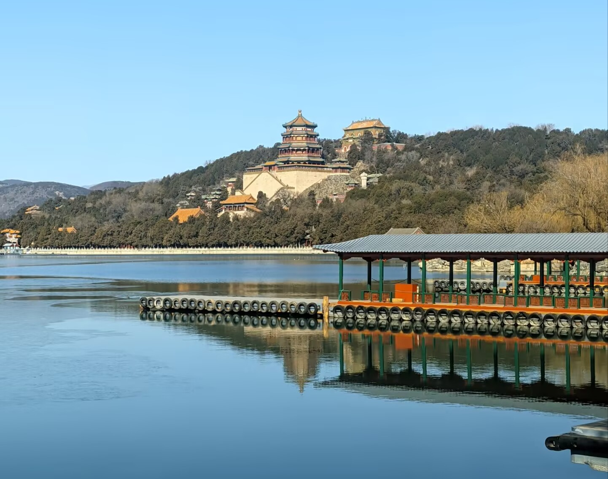
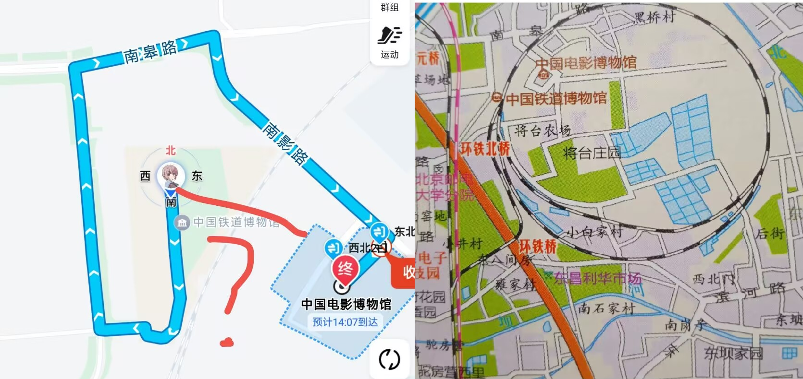
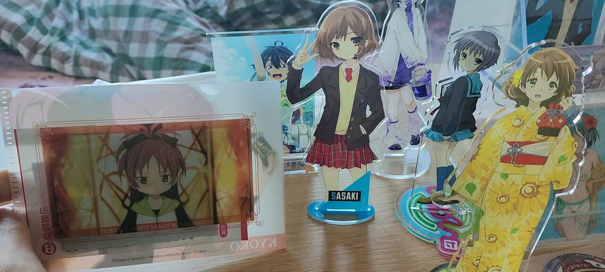

研一寒假结束前去了趟北京。对于宅了一整个本科最远只从合肥去到上海的我，算是一次颇为新鲜的旅行。

契机是 2024 年底跨年时在合肥包河万象汇听了 [MySalt_GirlsBand](https://space.bilibili.com/3537123244247191) 的演出，当时就喜欢上了这支北京乐队。然后得知她们参演 [北京 BanG Dream！新春庆典 SP Live](https://www.bilibili.com/opus/1017453868153307139)，正好我也想听 Poppin'Party 的 God Knows...，于是就决定去北京看 live。

来都来了，那自然是多规划几天。确定一下夕发朝至的火车票价格可以接受（往返约 500 元），再稍微对北京的景点和 ~~二次元周边店~~ 做了一点攻略后，就规划了三个白天的行程：看景点、逛街、看 live。

<!-- more -->

## Day 0

21:40 运转 Z227 次前往北京丰台。前身是 Z74 次，京沪十三猪之一。

> 京沪十三猪指 2004 年 4 月 18 日中国铁路第五次大提速后在京沪铁路上运行的 12 对直达特快列车以及 1 对按直达特快标尺开行的特快列车的合称，采用 AC380V 国产 25T 车底或进口 BSP 25T 车底，由东风 11G 型内燃机车牵引。

硬卧体验让我有些紧张，在火车上看了《PERFECT BLUE》。第一次看今敏的作品，深感其想象力之丰富。尝试入睡时总在半梦半醒间反复。窗外的华北平原在夜色中显得格外辽阔，偶尔有零星灯光掠过。这般景象倒应了“星垂平野阔”的意境，只是当列车以百余公里的时速疾驰时，不足一公里宽的黄河不过十几秒便呼啸而过，难有“月涌大江流”的实感。

本想根据手机时间提示看日出，但天刚蒙蒙亮便撑不住补觉了。07:46 抵达北京丰台站。

## Day 1

行程路线：北京丰台站 -> (地铁 10 号线转地铁 4 号线) -> 颐和园 -> (公交 74 路转地铁 12 号线转公交专 85 路) -> 铁道博物馆（东郊） -> (步行) -> 电影博物馆 -> (公交专 116 路转地铁 15 号线转地铁 5 号线) -> 立水桥地铁站附近住宿。

北京地铁的拥挤程度很高，尤其我还选择了早高峰的 10 号线。坐上地铁后，连着几站，都看见外面站台的人上不来车。可能因为我宅在安徽太久，一下子看见地铁上这么多北方面相的人有点不安 desu（单纯觉得不熟悉不适应）。

到颐和园地铁站后，本来打算吃顿肯德基早餐，一看是景点餐厅收费标准，一个套餐三十多，遂放弃。便利店买了一瓶拿铁和一瓶能量饮料，进园。不过果然头一天晚上硬卧休息不是很足，走路都轻飘飘的，好几次差点崴了脚。冬季的颐和园虽然没有夏天的绿意，但是也别有一番风味。

中午路过凤凰汇，华润系商场，还是可以的，卫生间很干净。来都来了，尝了一顿小大董的北京烤鸭，鸭皮实在太肥了，一个人吃半只勉强。

下午参观两座博物馆：

_环形铁路将我们分离，两个景点间嗯走了半个多小时_

铁道博物馆有很多实物火车及介绍，高铁馆好像还在装修。电影博物馆就实在比较普通，罗列了很多电影和剧情梗概，但是对没看过人来说，实在是没什么吸引力，并没有相应电影在电影史上的地位和影响力的介绍。另外，电影博物馆的咖啡/奶茶也卖得很贵，一杯生酪拿铁 45 元，喝不起。

不过这次去电影博物馆主要是奔着 IMAX GT 的荧幕来的，看了《哪吒 2》，虽然可能是对电影预期太高了，感觉比较普通。IMAX 介绍片头声画效果震撼，虽然之前在上海 MOViE MOViE 也看过一块二代 IMAX COLA 屏，与此相比也黯然失色。屏幕越大，视场角越大，越能沉浸感受到电影带来的震撼。

去酒店的路上愈发感受到北京的点状商业发展，街景虽大气却单调，实非适宜徒步探索之地。挤着晚高峰的 5 号线到了立水桥站，虽然后面只有三站就到终点站了，但是这三站就是传说中的天通苑，所以直到我下车时地铁还是被灌满的。

入住百元级廉价酒店，隔音欠佳但总体达标。出门吃了个麦当劳，现在似乎是限时的薯饼全天供应，薯饼太好吃了，我老想吃薯饼了。在商场还看到了合肥品牌詹记，稍感亲切。

## Day 2

清晨的北京对游客而言略显冷清。早餐又吃了一顿麦当劳，美式加整袋白砂糖。提完神后也快到午餐时间了，去吃了南门涮肉（河边店）。

十点半到的南门涮肉，没啥人，要是去上海的网红店怕不是一开门就一堆提前排队的进去了，江浙沪人均不用上班（）。麻酱调的很好吃，上面放了点香菜，拌开很香。本身就是标准的涮肉，试着先下了一盘羊尾油，好像是让锅润了一点。牛羊肉份量实在，各下了一盘就吃饱了。

之后的规划是转一些周边店。王府井 in88 -> 崇文门搜秀 -> animate -> 去附近商场看了一场《你的颜色》电影，晚餐老乡鸡 -> 北投，再吃一顿庆丰包子。

虽然是周五，但各商场人并不很多。我今天去的大部分店都比较普通，像是飞社长这种全国连锁店货感觉还没合肥好。电波宝箱很可以，in88 有一家，北投也有一家。这家店有很多京阿尼相关的 ip，也有很多限定的周边，比如中二病也要谈恋爱的限定原作插画集，冰菓、幸运星、京吹、利兹与青鸟等文件夹和盲抽。凉宫春日相关的从角川书库出的到京阿尼出的都有，第二家店还有个可爱的凉宫春日趴趴（展示用）。

在第一家花 15 元买了个魔法少女小圆的小文件夹盲抽，抽到了杏子，可爱。后来把这个小文件夹用来放这次北京之旅的各种门票和影票了。

在第二家花 75 元买了个佐佐木的立牌，字面意义上的很大。

搜秀的各种模型手办也值得一提，IP 比较广，除了日本的 ACGN 还有漫威，DC 等。以及还卖书和游戏卡带之类。

除此之外今天没逛到什么特别的周边店，所以下午临时决定去看《你的颜色》。看之前去旁边的多乐之日买了个日式芋泥包，好吃。电影本身也推荐看，青春电影。

这天回酒店路上看到 5 号线的人流直接玉玉了，遂决定换 430 路公交，虽然多坐了半个小时，但是有座。

## Day 3

Live 日！早上去银座 mall（话说你为什么也叫 ginza）吃了顿吉野家，然后去国贸看了看地标建筑大裤衩，时间就差不多到了。

> 全国首次邦邦十团 Cover 超大型 Live Only ——
> 这次是不落下邦邦任何一团的满配 live！🎶

真的爽到。118 元爽了七个小时，怎么会有这种好事（）。这个 LiveHouse 音响效果很好，大家也都肉眼可见的热情。这次 live 是无限制的，所以很多来打地下艺的老哥，弥漫在空气中的 kirakiradokidoki 气息，目眩神迷。

第一个上台的是 cover PPP 的南瓜飞行器（据说都是北大✌），经典选曲，最后还让全场一起唱 God Knows...我是唱爽了也 call 爽了，结果这个团结束就有点累了，之后频频跑出去呼吸新鲜空气（。）以及这次演出确实有老哥在现场晕倒了，缺氧大概。

上半场最后是 MySalt! cover 的 RAS。RAS 这些曲子简直天生为互动而写的，Unstoppable 开始进入状态，然后 R.I.O.T、Bonfire、Apocalypse、EXPOSE 'Burn out!!!'，幻觉来了我草。

正好说到蝶团。下半场的蝶意外的是小提琴独奏，[西便门拉弦子的](https://space.bilibili.com/349010135) 是英国皇家音乐学院交响乐团首席。

Cover MyGO!!!!! 的是 LinGo（今天的所有主唱都很拼命）。体力恢复了一点于是我跑到 LiveHouse 一楼去玩了。影色舞甩棒子，轮符雨也打爽了。结束后喊安可喊出来「僕は…」真的很激动，我一直是 ygfn 粉丝啊。

想感叹什么但感叹不出。以往来这种活动往往结束后都会更加的空虚，但这次却不是。只能感叹自己真是幸运。

回程的卧铺火车（Z225）睡得很好，早上醒来的时候天已经亮了。
