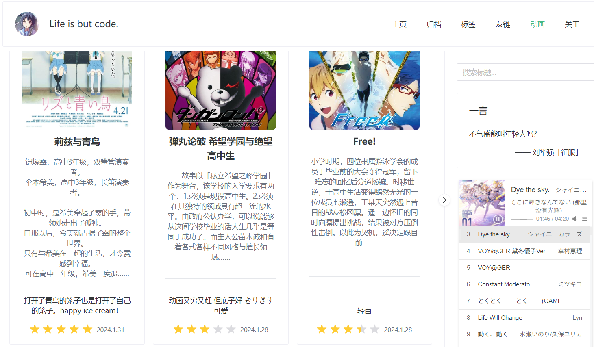

想做 Anime List 很久了，之前也考虑过 Notion 的方案，但是本人平常也不用 Notion，不想为了这个事情多用一个平台。最近发现自己使用的 [bangumi](https://bgm.tv) 有 API，于是就想到了用它来做 Anime List。

<!-- more -->

目前在博客导航栏选择动画即可进入 Anime List 页面。



编码过程得到了 windicss 这一原子 css 框架和 copilot 的大力帮助。

## copilot

你可以直接往代码里粘贴 [bangumi 接口](https://bangumi.github.io/api/) 的返回数据示例，然后敲一个 `interface Anime`，后面就是 copilot 发挥了。

```typescript
interface Anime {
  updated_at: string
  comment: string
  tags: { name: string; count: number }[]
  subject: {
    date: string
    images: {
      small: string
      grid: string
      large: string
      medium: string
      common: string
    }
    name: string
    name_cn: string
    short_summary: string
    tags: { name: string; count: number }[]
    score: number
    type: number
    id: number
    eps: number
    volumes: number
    collection_total: number
    rank: number
  }
  subject_id: number
  vol_status: number
  ep_status: number
  subject_type: number
  type: number
  rate: number
  private: boolean
}
```

## windicss

```html
<n-card
    v-for="anime in animeList"
    :key="anime.subject.id"
    content-style="display:flex;flex-direction:column;justify-content:space-between"
    style="height:100%"
>
    <div class="mb-4">
    
    <div class="mt-2">
        <p class="text-lg font-bold">
        {{ anime.subject.name_cn || anime.subject.name }}
        </p>
        <p class="text-sm text-gray-500 mt-4 whitespace-pre-line">
        {{ anime.subject.short_summary }}……
        </p>
    </div>
    </div>
    <hr>
    <div class="mt-2">
    <p v-if="anime.comment" class="mt-2 text-sm">
        {{ anime.comment }}
    </p>
    <div class="text-sm mt-4 flex justify-center">
        <n-rate :default-value="anime.rate / 2" readonly allow-half />
        <span class="text-gray-500 ml-2 text-xs mt-1">
        {{ timeToDate(anime.updated_at) }}
        </span>
    </div>
    </div>
</n-card>
```

写个样式非常方便，而且也可以 copilot 生成类名（

## 分页

bangumi 的这个 api 是分页的，考虑到本人目前没啥数据，可能以后也不会补标以前看过的动画，所以就先没写无限滚动了，直接所有数据拉下来。

```typescript
onMounted(async () => {
  let page = 0
  while (true) {
    const res = await fetch(
      `https://api.bgm.tv/v0/users/undef_baka/collections?subject_type=2&type=2&limit=50&offset=${page * 50}`,
    )
    try {
      if (!res.ok)
        throw new Error('Bangumi response was not ok')
      const data = await res.json()
      animeList.value = animeList.value.concat(data.data)
    }
    catch (e) {
      loading.value = false
      break
    }
    page++
  }
})
```