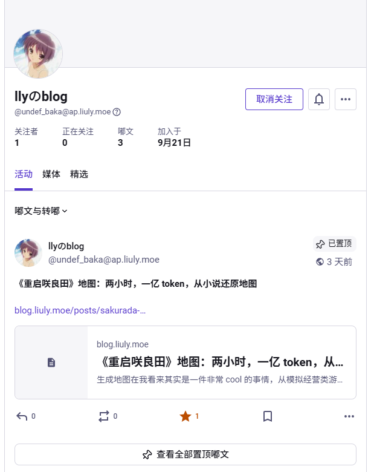
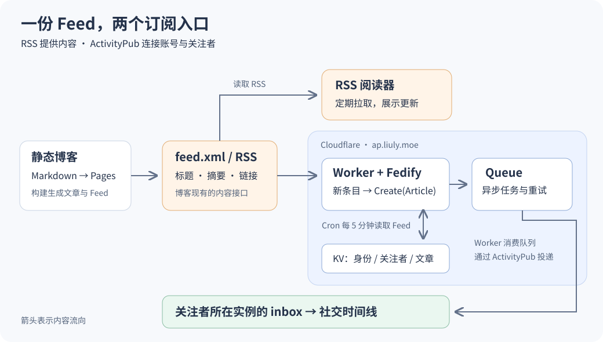
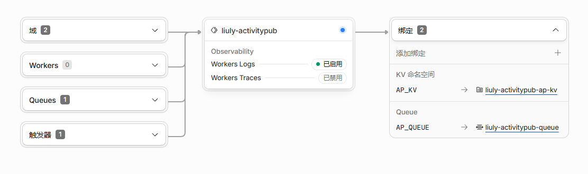

前几天听了[学校软件自由日的演讲](https://lug.ustc.edu.cn/news/2026/09/SFD-Preview/)，其中 Hanako 的《Mastodon 与 Matrix：当社交网络由社区运行》让我瘾上来了，遂打算整个小活把博客也接上 ActivityPub。

成果就是这个账号：`@undef_baka@ap.liuly.moe` 喵。

> ActivityPub 是一个去中心化社交网络的协议，Mastodon、Pleroma、Misskey 等平台都支持它。只要博客能提供 ActivityPub 接口，就可以让读者在这些平台上关注博客账号，收到新文章的动态。

选型上直接用 Cloudflare Workers，只是因为它太方便了，写完代码 `npx wrangler deploy` 推上去就能部署。后续维护也不用自己操心。

<!-- more -->

## 效果

下面是 Mastodon 上的效果：

这个账号背后就是我的静态博客。每篇新文章会变成动态出现在时间线上，点击「阅读原文」就会进到博客文章。固定选取最近三篇文章作为置顶集合。

> 这主要是因为 Mastodon 默认不会抓取站外用户的历史 Outbox（过往发布的内容），所以我们固定把最近三篇文章设置为置顶（pinned），让账号主页也能展示最近的内容。之后新文章会被推送到关注者的时间线。

## 从 RSS 到 ActivityPub

博客原本就有 [feed.xml](https://blog.liuly.moe/feed.xml)，里面已经包含了标题、链接、摘要和发布时间。接入 ActivityPub 时，直接复用这些信息就够了。

RSS 阅读器通常定期拉取 Feed，自己判断有没有新文章。[ActivityPub](https://www.w3.org/TR/activitypub/) 则让不同服务器上的账号可以互相关注，并把新动态投递到对方的收件箱（inbox）。在这里，Worker 一边充当 RSS 阅读器，一边充当 ActivityPub 的发布者：

这样完全不需要修改现有博客的写作和发布流程，只是相当于外置了一个模块来轮询 Feed 并把新文章投递给关注者。

同一份内容因此多了一个入口，除了现有的 RSS，也可以直接在社交时间线上订阅。

## Worker 实现

现在 Cloudflare 控制台里的结构是这样的：

代码使用 [Fedify](https://fedify.dev/) 处理 ActivityPub 协议，通过它的 Cloudflare 适配器接上 KV 和 Queue。整个服务的入口可以归纳成三个函数：

| 函数 | 触发条件 | 功能 |
| --- | --- | --- |
| `fetch()` | HTTP 请求 | 提供账号信息、文章对象，接收关注请求 |
| `scheduled()` | 每五分钟一次的 Cron | 读取 Feed，识别新文章并创建投递任务 |
| `queue()` | Cloudflare Queue 中的消息 | 执行 Fedify 的入站处理与出站投递任务 |

配套资源：`AP_KV` 保存账号密钥、关注者、文章副本和已处理标记；`AP_QUEUE` 承载异步任务、失败请求重试。[Cron Triggers](https://developers.cloudflare.com/workers/configuration/cron-triggers/) 负责定时唤起 Worker，[Queues](https://developers.cloudflare.com/queues/) 负责把任务交回 Worker 消费。

这张截图左边表示 Worker 的触发条件，右边表示 Worker 调用的资源。队列同时出现在左侧和右侧，就是因为同一个 Worker 既消费消息，也生产消息。

不得不说 Workers 的各种中间件做的太齐全了……虽然我的 DeepSeek 似乎对这些 API 还不太熟悉导致它自己 debug 了挺久的。

## 流程补充：由博客到账号

搜索 `@undef_baka@ap.liuly.moe` 时，对方实例先通过 WebFinger 找到账号地址 `/users/undef_baka`，再读取这个账号的头像、显示名、公钥和 inbox 等信息。

接下来的流程就很直观了：

1. 有人点击关注，对方实例发来 `Follow`，Worker 记录关注者并回一个 `Accept`。
2. Cron 发现新文章，把 Feed 条目转换成 `Article`，再包装成 `Create` 活动，交给队列投递到关注者所在的实例。
3. 对方取消关注时发来 `Undo(Follow)`，Worker 删除对应的关注记录。

完整实现放在了 [Gist](https://gist.github.com/liuly0322/a5d2b788482f53d3ca26ba1bb4848978)。
