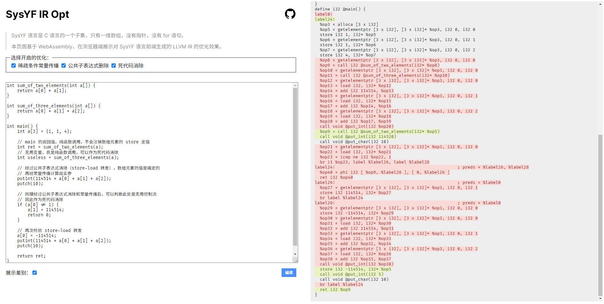

大三上学期匆匆忙忙结束了。其实每个学期结束时都会有写一篇「生活类」博客进行总结的冲动，不过奈何实在笔力有限，因此还是写一篇「技术类」博客记录下这个学期干的事情。

这篇博客将介绍我和队友们在编译原理 H 课程中最终完成的课程项目，一个 SysYF 语言（C 语言子集）的编译器中的稀疏条件常量传播优化 Pass 以及项目的 WASM 展示界面构建。


_我个人在该项目上花费时间。不确定图片会不会挂，总之目前是 119 小时。_

<!-- more -->


_这学期还看了很多番。安利《来自新世界》、《灵能百分百》，《斩服少女》，《SSSS.电光机王》。_

## Intro

编译器的工作阶段大致可以分为词法分析、语法分析、中间代码生成、中间代码优化和代码生成。

本项目最终完成了三种中间代码优化（稀疏条件常量传播、公共子表达式删除和死代码消除）。本文主要介绍稀疏条件常量传播优化及 C++ Pass 实现，以及如何使用 WASM 构建一个优化结果展示界面。



_[效果展示网页](https://liuly.moe/sysyf_compiler_codegen_opt/) | [GitHub 链接](https://github.com/liuly0322/sysyf_compiler_codegen_opt)_

简单起见，约定实现中只考虑一维数组，不考虑指针。因此对于数组定义 `int a[10]` 而言，`a + 1` 不是一个合法的运算。

## 稀疏条件常量传播

「稀疏」指优化在 SSA 图上进行。而 LLVM IR 正是 SSA 形式。对于变量的定值引用关系而言，SSA 图更为稀疏（简单）。这也是在 SSA 图上进行优化的优势。

常量传播使用「格」这一代数结构辅助判断变量在某一点的定值（即某指令的值）是否为常数。

具体来说，首先把指令根据它的值分为三类状态：

- TOP：指令的值未初始化。
- Constant：指令的值确定是某个常量。这是一类状态，包含了所有的常数。
- BOT：指令的值确定是未知的。

即下图所示：

```
   TOP
 /  |   \
c1 c2 .. cn
 \  |   /
   BOT
```

「格」要求任意两个元素都有最大下界和最小上界，对应两个元素的交操作和并操作。

对于上述的格，交操作（求两个元素的最大下界）如下定义：

- $TOP \cap X = X$
- $C_i \cap C_j = C_i$，当 $C_i = C_j$
- $C_i \cap C_j = BOT$，当 $C_i \ne C_j$
- $BOT \cap X = BOT$

这一代数结构的引入主要帮助我们判断 $\phi$ 指令的值。容易看出，$\phi$ 指令的状态即为它所有来源指令的值的状态的交。

此时，我们就可以写出一个简单的常量传播算法了。

初始时，所有指令的状态都被初始化为 TOP，而后向一个 `worklist` 中推入所有指令，并遍历：

- 对于可以常量折叠的指令（一元/二元运算或比较指令，且操作数均为常数），将指令状态标记为 Constant
- 如果某个指令的状态发生变化，则所有用到该指令的指令都推入 `worklist`，重新计算状态

由于指令状态变化一定是 TOP 到 BOT 的方向，因此至多只会变化两次（保证算法终止）。

上面的简单常量传播算法有一个缺陷：无法考虑到不可达控制流的影响。例如，考虑如下代码：

```c
int main() {
    int result = 0;
    if (1 < 0) {
        result = 2;
    }
    // result = phi(0, 2)
    return result
}
```

这里 `result = 2` 的赋值不可能发生。但是上述算法无法识别，仍然会认为出口处的 `result` 是 BOT 状态。

因此，一个可行的改进如下：

- 初始并不遍历所有指令，而是只遍历入口基本块的所有指令
- 额外增加 `cfg_worklist`，存储 `{pre_bb, bb}` 边（意味着 `bb` 由 `pre_bb` 可达）。每个基本块末尾如果是条件为常量的条件跳转语句，那么只用往 `cfg_worklist` 中推入一条边（而一般的条件跳转语句或无条件跳转语句需要推入所有可能的目的基本块）。
- $\phi$ 指令的状态是它所有 **可达** 来源的指令的状态的交。

基本算法代码：

```cpp
// 初始只标记入口基本块可达
cfg_worklist.emplace_back(nullptr, f->get_entry_block());

// 初始化为 TOP 状态
// 这里需要注意，函数参数和全局变量默认应该是 BOT 状态
for (auto *bb : f->get_basic_blocks())
    for (auto *expr : bb->get_instructions())
        value_map.set(expr, {ValueStatus::TOP});

// 维护两个队列
auto i = 0U;
auto j = 0U;
while (i < cfg_worklist.size() || j < ssa_worklist.size()) {
    while (i < cfg_worklist.size()) {
        auto [pre_bb, bb] = cfg_worklist[i++];

        // 每条边只用遍历一遍
        // 换句话说，只有新增的边才会触发遍历基本块全部指令
        if (marked.count({pre_bb, bb}) != 0)
            continue;
        marked.insert({pre_bb, bb});

        for (auto *inst : bb->get_instructions())
            instruction_visitor->visit(inst);
    }
    while (j < ssa_worklist.size()) {
        auto *inst = ssa_worklist[j++];
        auto *bb = inst->get_parent();

        // 只有指令可达，才需要遍历
        // 否则可能引发不必要的状态更新
        for (auto *pre_bb : bb->get_pre_basic_blocks()) {
            if (marked.count({pre_bb, bb}) != 0) {
                instruction_visitor->visit(inst);
                break;
            }
        }
    }
}

// 收尾工作，所有 CONST 状态的指令都替换为常数
// 并且对于条件为常量的条件跳转指令，改写为无条件跳转
// 这一改写主要是方便后续其他优化
replaceConstant(f);
```

指令的遍历：

```cpp
void InstructionVisitor::visit(Instruction *inst) {
    inst_ = inst;
    bb = inst->get_parent();
    prev_status = value_map.get(inst);
    cur_status = prev_status;

    if (inst->is_phi()) {
        visit_phi(static_cast<PhiInst *>(inst));
    } else if (inst->is_br()) {
        visit_br(static_cast<BranchInst *>(inst));
    } else if (inst->is_binary() || inst->is_unary()) {
        visit_foldable(inst);
    } else {
        cur_status = {ValueStatus::BOT};
    }
    if (cur_status != prev_status) {
        value_map.set(inst, cur_status);
        for (auto use : inst->get_use_list()) {
            auto *use_inst = dynamic_cast<Instruction *>(use.val_);
            ssa_worklist.push_back(use_inst);
        }
    }
}
```

这里 `visit_br` 会更新 `cfg_worklist`。`visit_phi` 和 `visit_foldable` 只需要计算指令新的状态即可。

## WASM

### Intro

WASM。即 WebAssembly，简单来说就是一种虚拟机字节码格式。现在主流浏览器都已支持这种字节码的运行。我们都知道 JavaScript 在浏览器中的运行就是先编译到字节码再执行的，那么这种新的字节码格式又有什么好处呢？它最大的优势就在于格式简单，方便从别的语言编译到 WebAssembly。一方面，这允许其他语言的库或程序直接在浏览器环境中被运行而无需移植到 JavaScript；另一方面，由于编译过程不在浏览器中进行，因此编译时间对用户来说是无感的，可以在编译时启用级别较高的优化，节省运行时间。目前，C++ 和 Rust 都有比较良好的 WebAssembly 生态及社区支持。

### 与 JavaScript 的交互

WebAssembly 与 JavaScript 实际交互的都是 `i32` 类型的整数。超过 32 位的数据会被拆分为多个 `i32` 类型的整数表示；而 32 位的其他数据可以自行约定类型信息（例如约定作为指针，这样就可以传递字符串，数组等大数据了）。一旦涉及到指针，就要考虑到内存管理的问题了：一般而言，WebAssembly 和 JavaScript 的数据交互都发生在 WebAssembly 的堆区，这块内存 WebAssembly 和 JavaScript 都可以访问到。WebAssembly 可以暴露自己的 `malloc` 和 `free` 函数，方便 JavaScript 进行内存分配和销毁。

### 与 CMake 项目

C++ 编译到 WebAssembly 一般依赖 [emscripten](https://emscripten.org/) 工具链。下面介绍本项目作为一个 CMake 项目如何移植到 WASM。

#### 暴露接口

根据需要约定即可。

```cpp
std::string result{};

extern "C" {
const char *compile(const char *str, int sccp, int cse, int dce) {
    IRBuilder builder;
    SysYFDriver driver;

    std::string filename{"tmp.sy"};
    // 标准库函数都可以使用。在浏览器运行时，这里使用的是内存文件系统
    FILE *fptr = fopen(filename.c_str(), "w");
    fputs(str, fptr);
    fclose(fptr);

    auto *root = driver.parse(filename);

    root->accept(builder);
    auto m = builder.getModule();

    // 设置优化，略
    ......

    passmgr.execute();
    m->set_print_name();

    result = m->print();
    // 返回指针
    return result.c_str();
}
}
```

`extern "C"` 是为了防止 C++ 的 name mangling 造成无法根据函数名定位函数签名。

#### CMake 文件

在原有基础上微调即可。

```cmake
# 方便通过命令行参数指定构建目标
option(BUILD_WASM "Build WASM output files" OFF)

# 根据构建目标设定不同的优化等级
if(BUILD_WASM)
  # WASM with -Oz
  set(CMAKE_CXX_FLAGS "${CMAKE_CXX_FLAGS} -Oz -Wall -pedantic")
elseif(NOT "${CMAKE_BUILD_TYPE}" MATCHES "Debug")
  # release mode with -O2
  set(CMAKE_CXX_FLAGS "${CMAKE_CXX_FLAGS} -O2 -Wall -pedantic")
else()
  # debug mode wich -O0 and -g
  set(CMAKE_CXX_FLAGS "${CMAKE_CXX_FLAGS} -O0 -Wall -g -pedantic")
endif()

if(BUILD_WASM)
  # 指定目标：compiler.js
  add_executable(
    compiler
    ${CMAKE_CURRENT_SOURCE_DIR}/src/wasm.cpp
  )
  # 重要：指定需要导出给 JavaScript 的函数
  target_link_options(compiler PRIVATE -sEXPORTED_FUNCTIONS=[_compile,_malloc,_free])
  # 同普通 CMake，配置链接库
  target_link_libraries(
    compiler
    SysYFPass
    SysYFIRBuilder
    IRLib
    Driver
  )
endif()
```

核心有两处：

- 配置优化等级。不开启优化会保留大量冗余代码。
- 设置导出函数。

编译脚本：

```shell
rm -rf build
mkdir build
cd build
emcmake cmake -DBUILD_WASM=ON ..
emmake make -j
```

相比普通构建流程，用 `emcmake` 和 `emmake` 包装了 `cmake` 和 `make`。

值得一提的是，emscripten 官方提供了 docker 镜像方便命令的执行，无需下载安装依赖。

```shell
cd SysYF_Pass_Student && docker run \
    --rm \
    -v $(pwd):/src \
    -u $(id -u):$(id -g) \
    emscripten/emsdk \
    sh build_wasm.sh
```

#### JavaScript 交互

核心逻辑很简单，JavaScript 在 WebAssembly 的堆区 malloc 一片空间，写入字符串，然后调用 `compile` 函数传入字符串指针编译，再根据返回的字符串指针作为编译结果，并 free 申请的空间。

```javascript
function compile(sccp, cse, dce) {
  const str = document.getElementById("sy_code").value;

  // malloc 并写入
  const strBuffer = new TextEncoder().encode(str);
  const strPointer = Module._malloc(strBuffer.length + 1);
  Module.HEAPU8.set(strBuffer, strPointer);
  Module.HEAPU8[strPointer + strBuffer.length] = 0;

  // 编译结果
  const outPointer = Module._compile(strPointer, sccp, cse, dce);

  // free 申请的空间
  Module._free(strPointer);

  // 实用函数，整合在了 compiler.js 中
  // https://emscripten.org/docs/api_reference/preamble.js.html
  return UTF8ToString(outPointer);
}
```

这样就移植好了。
