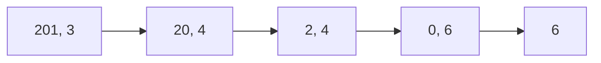
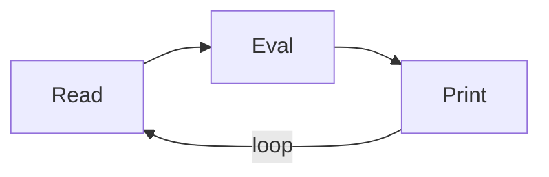

本文主要记录学习 [CS61A SU20](https://inst.eecs.berkeley.edu/~cs61a/su20/) 课程的一些感想

因为是课程笔记，所以基础知识不再赘述

实验，作业答案可见：[Writeups](https://github.com/xkz0777/CS61A-su20-writeups/tree/liuly)

## 函数式编程定义

函数 **可以** 被作为参数传递，这是和面向过程相比最大的不同

它是一种声明式编程范式，其中函数是让输入值经过表达式树转换到输出值的映射，而不是更新程序运行状态的一系列命令式语句

这是在强调函数式编程的**无副作用性**：函数式编程有时被视为纯函数式编程的同义词，后者将所有函数视为确定性的数学函数（纯函数）。当使用一些给定参数调用纯函数时，它将始终返回相同的结果，并且不受任何可变状态（或其他副作用）的影响

<!-- more -->

### lambda 表达式

可以看做一个匿名函数，从使用的角度来说，方便了函数的定义

### 高阶函数

(Higher-Order Functions) 指接受函数作为参数 **或** 返回值是函数的函数

### 闭包

一个函数可以在另外一个函数中定义

如果一个定义在别的函数内部的函数被调用，那么这个函数被称为闭包。闭包使得可以合法的在函数外部获取函数内部的变量

例如：

```javascript
function sumPrint(n) {
    console.log(n)
    const f = k => sumPrint(n + k)
    return f
}
```

其中 `f` 是一个 lambda 表达式。可以在控制台中调用：

```javascript
sumPrint(1)(4)(6)
```

得到：

```plaintext
1
5
11
```

顺利完成了求和工作。

其中 `f` 就体现出了闭包的作用，读取了 `sumPrint` 函数环境中的 `n`

闭包需要保证调用 f 时其父环境存在，所以在 `sumPrint` 函数 `return f` 之后该 `sumPrint` 的环境仍然存在，并不会被销毁。

利用闭包还可以模拟类：

```javascript
const account = (money) => {
  const withdraw = (num) => {
    if (money >= num) {
      money -= num
    }
    console.log(money)
  }
  return withdraw
}
```

可以创建账户，返回一个取钱的方法。

### 抽象

函数式编程的一个很大的好处就是它可以把不同的函数中相似的过程抽象出来进行封装。例如：

考虑连乘函数和连加函数，假设 `term` 是一个表示某个数列的函数，接受 `n` ，返回数列的第 `n` 项。

```python
def product(n, term):
    product, k = 1, 1
    while k <= n:
        product, k = product * term(k), k + 1
    return product

def summation(n, term):
    total, k = 0, 1
    while k <= n:
        total, k = total + term(k), k + 1
    return total
```

注意到 `summation` 和 `product` 大体结构是相似的。稍加封装：

```python
def accumulate(combiner, base, n, term):
    total, k = base, 1
    while k <= n:
        total, k = combiner(total, term(k)), k + 1
    return total
```

于是 `summation` 和 `product` 变得更加简洁：

```python
def summation_using_accumulate(n, term):
    return accumulate(add, 0, n, term)

def product_using_accumulate(n, term):
    return accumulate(mul, 1, n, term)
```

抽象的威力还在于它能解决一类问题。例如，我们考虑 $f^n(x)=f(f(f(f(\cdots f(x)))))$ ，$n$ 个 $f$ 表示函数的 $n$ 次迭代，这实际上也是一个累积的过程，所以也可以调用 `accumulate` ，得到：

```python
def compose(func1, func2):
    return lambda x: func1(func2(x))

def make_repeater(func, n):
    return accumulate(compose, lambda x: x, n, lambda x: func)
```

`compose` 是函数复合，于是 `make_repeater` 即可计算函数的 $n$ 次迭代，十分简洁优美。

## 尾递归

### 尾调用

尾调用 (tail call) 是尾递归的基础。尾调用是对于一次函数调用而言的：如果 `foo()` 中 对 `bar()` 的调用是最后一条语句（也就是要么运行完 `bar()` 后 `foo()` 就退出，要么 `bar` 是 `foo()` 的返回值），那么这次调用是尾调用。

尾调用的好处在于无需保存 `foo()` 的信息：运行完 `bar()` 之后，可以直接将值返回调用 `foo()` 的函数。

如果一个函数尾调用了自己，那么这个调用就是尾递归的。尾递归的好处在于：通常情况下，调用一个新的函数会需要开辟新的函数栈，但是尾递归调用因为原函数的函数栈中信息已经无用，所以递归调用可以直接在原函数环境的基础上继续运算，不需要开辟新的空间。

尾递归使得一些函数的空间复杂度可以从 $O(n)$ 优化到与循环相同的 $O (1)$ 级别。例如：

```python
def sum_digits_rec(n, digit_sum):
    if n == 0:  # border case
        return digit_sum
   	else:
        n, last = split(n)
        return sum_digits_rec(n, digit_sum + last)
```

这个函数用于利用计算一个正整数每个数位数字的和。按照通常的理解，这个函数对于长度为 $n$ 的整数会调用 $n$ 次，每个函数调用都会开辟新的空间，空间复杂度 $O (n)$ ，但如果进行了尾递归优化，每次可以不开辟新的空间，空间复杂度来到了喜人的 $O (1)$ 

考虑计算 `sum_digits_rec(2013)`



计算流程如图所示。

因此，在函数式编程中，递归可以成为替代循环的良好（也是最常见）手段

引用知乎上一个很好的回答：[什么是尾递归？ - 知乎](https://www.zhihu.com/question/20761771/answer/23254340) 来帮助理解

```javascript
function story() {
    // 从前有座山，山上有座庙，庙里有个老和尚，一天老和尚对小和尚讲故事：
    story() 
    // 尾递归，进入下一个函数不再需要上一个函数的环境了，得出结果以后直接返回。
}
function story() {
    //从前有座山，山上有座庙，庙里有个老和尚，一天老和尚对小和尚讲故事：
    story()
    // 小和尚听了，找了块豆腐撞死了 
    // 非尾递归，下一个函数结束以后此函数还有后续，所以必须保存本身的环境以供处理返回值。
}
```

### 尾递归与循环

通常而言，循环可以简单地转换成尾递归。只需要把循环中每次用于维持状态的变量写入递归函数的参数表中即可。例如，上面那个稍显复杂的尾递归计算所有数位数字之和的例子可以由如下的循环语句转换而来：

```python
def split(n):
    return n // 10, n % 10

def sum_digits_iter(n):
    digit_sum = 0
    while n > 0:
        n, last = split(n)
        digit_sum += last
    return digit_sum
```

### 应用

考虑常见语言，C++ 编译器可以（但标准中并未要求）实现编译期间对尾递归的优化。所以以下的程序在编译选项设置得当的情况下不会造成栈溢出：

```cpp
#include <iostream>

int print(int a) {
	std::cout << a;
	return print(a + 1);
}

int main() {
	print(0);
}
```

测试环境 `gcc version 11.2.0 (Ubuntu 11.2.0-7ubuntu2)` ，编译选项开启 -O2 后程序可以一直运行。

而 python 当前版本每次调用函数一定会新建一个环境，不会对尾递归进行优化（这似乎是因为 python 希望报错时保留完整的函数栈信息）

在一些偏向纯函数式的语言（如 Haskell，Scheme）中尾递归优化几乎是必须的：它们通常都会使用递归来代替循环。

在后文的 Scheme 解释器部分，将介绍如何实现一个支持尾递归优化的解释器。

## 数组

很多时候，对于一个数组而言，我们希望将所有元素一一传递给某个函数，然后收集输出。

数组遍历有的时候就是在做这样的事情。我们现在用函数式编程的角度来看待这一问题，介绍一些在数组遍历时十分实用的高阶函数。

### Map

python 中 map 的基本语法如下：

```python
map(function_to_apply, list_of_inputs)
```

会返回一个 map 对象（实际 map 类继承了 iterator 类，是一个迭代器）。可以通过 list 的构造函数转化成列表。

例如：

```python
items = [1, 2, 3, 4, 5]
squared = list(map(lambda x: x**2, items))
# [1, 4, 9, 16, 25]
```

JavaScript 中的 map 语法则更加直接：

```javascript
const array1 = [1, 4, 9, 16];

// pass a function to map
const map1 = array1.map(x => x * 2);

console.log(map1);
// expected output: Array [2, 8, 18, 32]
```

数组通过 map 方法返回一个新的数组。

如果不需要使用返回值（返回的数组），那么一般而言不使用 map 方法

### Filter

顾名思义，filter 创建一个函数返回 true 的元素列表。python 示例如下：

```python
number_list = range(-5, 5)
less_than_zero = list(filter(lambda x: x < 0, number_list))
print(less_than_zero)

# Output: [-5, -4, -3, -2, -1]
```

JavaScript 示例：

```javascript
const words = ['spray', 'limit', 'elite', 'exuberant', 'destruction', 'present'];

const result = words.filter(word => word.length > 6);

console.log(result);
// expected output: Array ["exuberant", "destruction", "present"]
```

### Reduce

Reduce 是一个非常有用的函数，用于在数组上执行一些计算并返回 **一个** 结果。它对数组中的相邻元素 ''滚动'' 计算。例如，如果需要计算整数列表的乘积：

```python
from functools import reduce

product = reduce((lambda x, y: x * y), [1, 2, 3, 4])
# Output: 24

product = reduce((lambda x, y: x * y), [1, 2, 3, 4], 5)
# Output: 120 = 5 * 1 * 2 * 3 * 4
```

有点类似于 Verilog HDL 中的归约运算符，但显然更加强大。最后一句是设置初值的示例。

JavaScript 中的 reduce：

```javascript
const array1 = [1, 2, 3, 4];
const reducer = (previousValue, currentValue) => previousValue + currentValue;

// 1 + 2 + 3 + 4
console.log(array1.reduce(reducer));
// expected output: 10

// 5 + 1 + 2 + 3 + 4
console.log(array1.reduce(reducer, 5));
// expected output: 15
```

### 列表推导式

(List Comprehension)

在 python 中，对数组进行操作有更为简便的方法：列表推导式。

List Comprehension 是 map() 和 filter() 的一种替代品。它遵循数学上集合构建的形式，提供了一种创建列表的简洁方法。语法如下：

```python
[expression for item in list if conditional]
```

对 list 中的每个 item 而言，如果 conditional 条件满足，就将 expression 值加人数组。

很容易看出，省略 conditional 或者 expression 取 item，列表推导就会退化为 map 或 filter

列表推导式使用得当可以轻松完成一些复杂的目标。例如得到 0 到 100 的所有偶数：

```python
[2 * i for i in range(51)]
```

又例如我想得到一个数组中所有 25 的因子：

```python
numbers = [1,3,4,5,6,7,10]
[n for n in numbers if 25 % n == 0]
```

输出 `[1, 5]`

因此可以设计一个获取一个数所有因子的函数：

```python
factors = lambda n: [i for i in range(1, n + 1) if n % i == 0]
```

### python 中的迭代器

python 之所以 map 和 reduce 操作设计的稍显繁琐，很大一部分原因正如上文在 map 中所述，是 python 希望这些列表操作的高阶函数能返回一个迭代器对象。

迭代器这个概念在很多语言中都有，但是 python 中这些列表操作的高阶函数（map, reduce, zip, sum, all, any 等）返回的迭代器（以及别的一些常见的自带迭代器，比如 range）的特别之处在于它们是懒加载的：意思是并不会一次性算出返回的列表，而只是每次需要用到迭代器的时候往后计算一个值。

这么说可能有点抽象，下面举一个实际一点的例子：

```python
def sum_from_a_to_b(a, b):
    return sum(range(a, b + 1))
```

这个函数用于计算从 a 到 b 的自然数之和。单从代码的字面意思理解，我们可能会认为这段代码先生成 `range(a, b + 1)` ，一个长为 b - a + 1 的数组，然后再对这个数组应用 sum 方法。如此一来，空间复杂度为 $\Theta(b-a)$ 的线性复杂度。

但实际上 python 在运行代码的时候不会这样处理。而是首先 sum 函数需要获取第一个值，于是 range 才返回第一个值 a，随后 sum 需要获取第二个值，range 再返回第二个值 a + 1，以此类推。不难发现这等效于下面的代码：

```python
def sum_from_a_to_b(a, b):
    sum = 0
    while a <= b:
        sum += a
        a += 1
    return sum
```

空间复杂度为非常漂亮的 $\Theta(1)$ 常数级别。

## 编辑距离

~~插播一道算法题~~

来自于 [Project2 - Cats](https://inst.eecs.berkeley.edu/~cs61a/su20/proj/cats/) ，Problem 7。实际就是在求两个字符串直接的编辑距离，与 [Leetcode 72](https://leetcode-cn.com/problems/edit-distance/) 相同，题目如下：

给你两个单词 word1 和 word2，请你计算出将 word1 转换成 word2 所使用的最少操作数。

你可以对一个单词进行如下三种操作：

- 插入一个字符
- 删除一个字符
- 替换一个字符

编辑距离实际上有几种不同的定义，差异在可以对字符串进行的处理。在莱文斯坦距离中，可以删除、加入、取代字符串中的任何一个字元，这也就是本文讨论的编辑距离。常常提到编辑距离时，指的就是莱文斯坦距离。

### 问题分析

很容易想到的是暴力检查所有可能的编辑方法，取最短的一个。但这样计算复杂度会达到指数级别，并且我们只需要找到编辑距离（最短序列的长度），不需要找到所有编辑序列。

问题的核心在于如何简化这一问题。举个例子，purng 和 purring，前者相比后者缺少了 r 和 i 两个字符，编辑距离为 2。用搜索的观点看待，我们可能会认为应该枚举增加 r 增加 i 和增加 i 增加 r 这两种方式，但这两种方式结果是一致的：编辑操作之间顺序的交换并不会影响编辑的结果。因此，我们希望“统一”这两种操作。

这一点 git 的 diff 可以给我们带来很好的参考。 [来自知乎](https://zhuanlan.zhihu.com/p/34640058)：

```plaintext
编辑序列, - 代表删除 / + 代表插入(注意空行）
------------------------------------------
 |#include <iostream>          
 |using namespace std;
-|
-|int main() { 
+|void hello() {
 |    cout << "hello world" << endl;
 |}
 |
+|int main() {      
+|    hello();
+|}
------------------------------------------
```

git 的 diff 是行与行之间的比较，且没有替换操作。但一目了然的是，对于一个编辑序列，我们可以将每个编辑操作按照它在原文本修改的位置进行排序，这样一来编辑操作进行的先后顺序也就无关紧要了。

以 ckiteus 和 kittens 为例，写出编辑距离对应的编辑序列：

```plaintext
编辑序列, - 代表删除 / + 代表插入 / r 代表替换
------------------------------------------
-|c
 |k 
 |i
 |t
+|t
 |e
r|n (<--u)      
 |s
------------------------------------------
```

我们想找到两个字符串的编辑距离，只需要对这个编辑距离对应的编辑序列分类讨论：

- 编辑序列以 `-` 开头：同上序列所示，此种情况下，剩下的操作实际是把 kiteus 编辑成 kittens，所以 ckiteus 和 kittens 的编辑距离 = kiteus 和 kittens 的编辑距离 + 1
- 编辑序列以 `+` 开头：以 ctopu 和 octopus 为例，编辑序列中 `+|o` 之后的操作对应 ptopu 和 ptopus 的编辑距离。所以所求 = ctopu 和 ctopus 的编辑距离 + 1
- 编辑序列以 `r` 开头：以 oampud 和 campus 为例，编辑序列中 `r|c (<--o)` 之后的操作对应 ampud 和 ampus 的编辑距离。所以所求 = ampud 和 ampus 的编辑距离 + 1
- 编辑距离以空操作开头。则直接忽略这一字符，去往下一个即可。

以上操作可以用函数递归调用表示。分别枚举这几种情况，补上 base case 即可。

于是 Cats 中 `meowstake_matches` 的代码呼之欲出：

```python
def meowstake_matches(start, goal):
    """A diff function that computes the edit distance from START to GOAL."""

    if start == '' or goal == '':	# base case
        return max(len(start), len(goal))

    else:
        if start[0] == goal[0]:
            return meowstake_matches(start[1:], goal[1:])
        add_diff = meowstake_matches(start, goal[1:])
        remove_diff = meowstake_matches(start[1:], goal)
        substitute_diff = meowstake_matches(start[1:], goal[1:])
        return min(add_diff, remove_diff, substitute_diff) + 1
```

（实际 Cats 代码由于还有 limit 参数，与这略有不同）

### 动态规划

上面的代码实际涉及了很多重复计算：同一个 `start[i1:len1]` 和 `goal[i2,len2]` 可以由 `start[i1 - 1:len1]` 和 `goal[i2 - 1,len2]` 由三种不同方式得到。累计起来考虑，时间复杂度达到了指数级别。我们采用动态规划解决这一问题。这里我们采用备忘录，对已经搜索好的结果进行记录：

```python
def meowstake_matches(start, goal):
    """A diff function that computes the edit distance from START to GOAL."""
    memo = dict()

    def recur(start, goal):
        if start == '' or goal == '':  # base case
            return max(len(start), len(goal))

        else:
            if memo.get((start, goal)):
                return memo.get((start, goal))
            skip = 1 if start[0] != goal[0] else 0
            add_diff = recur(start, goal[1:]) + 1
            remove_diff = recur(start[1:], goal) + 1
            substitute_diff = recur(start[1:], goal[1:]) + skip
            memo[(start, goal)] = min(add_diff, remove_diff, substitute_diff)
            return memo[(start, goal)]

    return recur(start, goal)
```

这里直接丢了个字典，理论上字典查找的时间复杂度也是 $O(1)$ ，但如果更要追求效率，那可以采用递推的方法计算 dp 数组。此时，为了方便对齐下标起见，我们考虑两个字符串的子串：`word1[0:i]` 和 `word2[0:j]` ，把它们的编辑距离记为 `m[i][j]` ，则类似讨论编辑序列的最后一项操作，可以得到 dp 关系式。

当 `word1[i-1] == word2[j-1]` ：

$$m[i][j] = m[i-1][j-1]$$

否则：

$$m[i][j] = min(m[i-1][j-1], m[i][j-1], m[i-1][j]) + 1$$

据此可以编写出通过 Leetcode 72 的 cpp 版本动态规划代码：

```cpp
class Solution {
public:
    int mDistance(string word1, string word2) {
        int len1 = word1.size(), len2 = word2.size();
        int m[501][501];
        // i, j refer to pick how many chars from word1 and word2
        for (int i = 0; i <= len1; i++) {
            m[i][0] = i;
        }
        for (int j = 0; i <= len2; i++) {
            m[0][j] = j;
        }
        for (int i = 1; i <= len1; i++) {
            for (int j = 1; j <= len2; j++) {
                if (word1[i - 1] == word2[j - 1]) {
                    m[i][j] = m[i - 1][j - 1];
                } else {
                    m[i][j] = min(m[i - 1][j - 1], m[i][j - 1], m[i - 1][j]) + 1;
                }
            }
        }
        return m[len1][len2];
    }
};
```

## Scheme 解释器

本部分记录 CS61A 课程的精华（？）Scheme 解释器的编写（使用 Python）。

su20 学期有一个 Challenge 版本，提供的代码较少，这里选择 [Challenge 版本](https://inst.eecs.berkeley.edu/~cs61a/su20/proj/scheme_stubbed/)

本次实验中可交互的语言解释器的主体框架是 REPL 模式：



本次实验已经提供了读入用户输入后的分词（tokenization）和词法分析（lexical analysis）部分的实现，也就是说我们需要完成的部分的输入仅有以下几种可能：

- number: int or float
- symbol: string
- boolean: bool
- unspecified: None

（右边是输入的 Python 类型）

而无须担心分词处理，例如如何把 1.3 识别成小数。

### Read

~~处理 Scheme 输入就是在做括号匹配~~

此部分要求将 Tokens 的输入转化成合法的 Scheme 表达式。

这里通过两个互相递归调用对方的函数：`scheme_read` 和 `read_tail` 实现。前者用于从 Tokens 的 Buffer 中读取一个表达式，后者则读到第一个右括号就停止，返回读到的表达式。

```python
def scheme_read(src):
    """Read the next expression from SRC, a Buffer of tokens.

    >>> scheme_read(Buffer(tokenize_lines(['nil'])))
    nil
    >>> scheme_read(Buffer(tokenize_lines(['1'])))
    1
    >>> scheme_read(Buffer(tokenize_lines(['true'])))
    True
    >>> scheme_read(Buffer(tokenize_lines(['(+ 1 2)'])))
    Pair('+', Pair(1, Pair(2, nil)))
    """
    if src.current() is None:
        raise EOFError
    # BEGIN PROBLEM 1/2
    "*** YOUR CODE HERE ***"
    first_token = src.pop_first()
    if first_token == 'nil':
        return nil
    elif first_token not in DELIMITERS:
        return first_token
    elif first_token == '(':
        return read_tail(src)
    else:
        raise SyntaxError('unexpected token: {0}'.format(first_token))
    # END PROBLEM 1/2


def read_tail(src):
    """Return the remainder of a list in SRC, starting before an element or ).

    >>> read_tail(Buffer(tokenize_lines([')'])))
    nil
    >>> read_tail(Buffer(tokenize_lines(['2 3)'])))
    Pair(2, Pair(3, nil))
    """
    try:
        if src.current() is None:
            raise SyntaxError('unexpected end of file')
        # BEGIN PROBLEM 1
        "*** YOUR CODE HERE ***"
        if src.current() == ')':
            src.pop_first()
            return nil
        return Pair(scheme_read(src), read_tail(src))
        # END PROBLEM 1
    except EOFError:
        raise SyntaxError('unexpected end of file')
```

### Eval

在读取完 tokens 生成表达式后，接下来要做的就是语法分析，确定具体如何执行（或者这里翻译成计算可能更为贴切）表达式。

主体仍然是两个函数的互相调用：`Scheme_eval` 和 `Scheme_apply`

前者顾名思义，是计算表达式值的主要函数：

```python
def scheme_eval(expr, env, _=None):  # Optional third argument is ignored
    """Evaluate Scheme expression EXPR in environment ENV.

    >>> expr = read_line('(+ 2 2)')
    >>> expr
    Pair('+', Pair(2, Pair(2, nil)))
    >>> scheme_eval(expr, create_global_frame())
    4
    """
    # atom, 原子，直接计算即可
    if self_evaluating(expr):
        return expr
    elif scheme_symbolp(expr):
        return env.lookup(expr)

    # combination 特殊形式或者函数调用
    if not scheme_listp(expr):
        raise SchemeError('{0} is not an expression'.format(expr))
    first, rest = expr.first, expr.rest
    if scheme_symbolp(first) and first in SPECIAL_FORMS:
        return SPECIAL_FORMS[first](expr, env)
    else:                                                    # call
        operator = scheme_eval(first, env)
        args = rest.map(lambda x: scheme_eval(x, env))
        return scheme_apply(operator, args, env)
```

对于原子，可以直接计算出它们的值（原子也正是这么定义的），可能是字面常量或者是变量，如果是变量直接到环境中找到绑定的值即可。

对于特殊形式 (if, and, begin...) 而言，分别对应着不同的处理逻辑，出于简洁考虑，这里用一个字典映射到对应的处理函数并调用。

如果计算出了一个操作符 (operator) ，那么在计算完操作数 (oprands) 后需要交给 `scheme_apply` 来模拟函数调用操作：

```python
def scheme_apply(procedure, args, env):
    """Apply Scheme PROCEDURE to argument values ARGS (a Scheme list) in
    environment ENV."""
    validate_procedure(procedure)
    if isinstance(procedure, BuiltinProcedure):
        return procedure.apply(args, env)
    elif isinstance(procedure, LambdaProcedure):
        # formals 与 args 的值相对应，再创建新环境
        formals = procedure.formals.to_list()
        args = args.to_list()
        if len(formals) != len(args):
            raise SchemeError('Incorrect number of arguments to function call')

        curr_envi = Frame(env) if isinstance(
            procedure, MuProcedure) else Frame(procedure.env)
        for formal, arg in zip(formals, args):
            curr_envi.define(formal, arg)

        expr = procedure.body
        while expr.rest is not nil:
            scheme_eval(expr.first, curr_envi)
            expr = expr.rest
        return scheme_eval(expr.first, curr_envi, True)
```

Scheme 中，用户自定义的函数都是 lambda 函数，所以只需要分别处理内置函数的调用和 lambda 函数的调用即可。后者需要创建新的环境。

至此主体部分很愉悦的就结束了。下面介绍一些有意思的功能的实现。

### Mu

Scheme 中，函数作用域默认是 lexical scope，也就是函数调用时的环境取决于定义的位置。这里是实现了一个新的 `MuProcudure` ，函数调用时的环境取决于调用的位置。

其实只有环境的评估不同，所以直接偷懒一点让 `MuProcedure` 继承 `LambdaProcedure` 然后在上面的 `apply` 函数中加一个逻辑

```python
curr_envi = Frame(env) if isinstance(procedure, MuProcedure) else Frame(procedure.env)
```

就好了。

### 尾递归

为了支持尾递归，我们可能需要进行的是更广义的尾调用优化。这里参考官方文档可能是一个有效的方式：[R6RS 的文档](http://www.r6rs.org/final/html/r6rs/r6rs-Z-H-14.html#node_sec_11.20)

Scheme 中对尾调用引入了一个 tail context 的概念，这个概念是自顶向下递归定义的。对于每个控制计算顺序的过程，都有自己的 tail context，也就是这个过程中最后计算的部分

例如，对于 `(if (cond) (a) (b))` 而言，`a` 和 `b` 都会是最后计算的（因为只择其一），所以都是 tail context

而对于 `(begin (a) (b) (c))` 而言，只有 `c` 是最后计算的，所以 `c` 是 tail context

最主要的，由于函数调用是 lambda 表达式的调用，所以 `(lambda (formals) (a) (b) ... (x))` 中的 `x` 也是 tail context

这就启示了我们如何编写支持尾递归的解释器：对于所有 tail context，我们都采取“懒求值”策略，返回的是 tail context 的表达式和当前环境，之后再对新的环境和新的表达式求值。如果说原先的尾递归是通过 DFS 逐层深入到最底层后再返回结果，现在的尾递归就相当于维护一个长度始终为 1 的 BFS 队列（只保存每次新加入的 Thunk 结点，之前的结点不会再参与计算），因而只占用常数空间

注意到这样事实上囊括了所有可能的尾调用。所以甚至以下互相的递归调用也是可以被优化的（指不会内存占满）：

```scheme
(define (a x)
    (b x))

(define (b x)
    (a x))

(a 0)
```

有了思路之后实现起来就比较简单了。

```python
class Thunk():
    def __init__(self, expr, env):
        self.expr = expr
        self.env = env


def optimize_tail_calls(prior_eval_function):
    def optimized_eval(expr, env, tail=False):
        if tail and not scheme_symbolp(expr) and not self_evaluating(expr):
            return Thunk(expr, env)

        result = Thunk(expr, env)
        while isinstance(result, Thunk):
            result = prior_eval_function(result.expr, result.env)
        return result
    return optimized_eval


scheme_eval = optimize_tail_calls(scheme_eval) # !!!
```

这里把原先的 `scheme_eval` 替换成 `optimized_eval` ，当显式指定 `tail=True` 时，也就是计算到 tail context 时，返回一个 Thunk 对象。这里不必要深究 Thunk 的含义，可以简单理解成这是一个保存了当前要计算的表达式及其所在环境的结构体。

`eval` 只需要循环计算到返回对象不是 Thunk 对象了即可。尾调用的优化是在函数调用，也就是 lambda 表达式的调用过程中实现的，在返回新的 Thunk 对象后，原函数环境不再需要，会自动回收。
