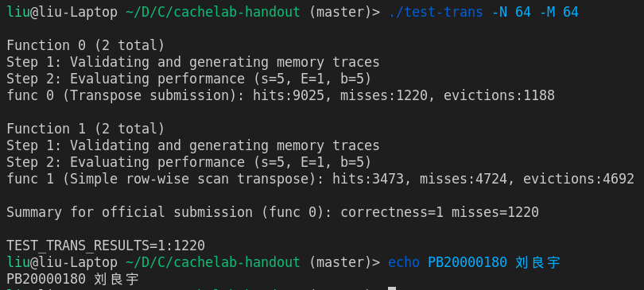

博客摘几篇自己做的 CSAPP 发发（自认为可能有点参考价值）

全部代码可以见 [GitHub 仓库](https://github.com/liuly0322/CSAPP-LABS)

本篇是 Cache Lab

<!-- more -->

## Part A

此部分需要实现一个缓存的模拟器，先放上最后通过的结果：


代码文件具体见附件，这里只梳理整体思路

### LRU 缓存

实现在了另外一个文件 `csim_lru.h` 中

基本原理是双向链表加上哈希表，以便实现 $O(1)$ 的查询及增加操作，具体算法就不赘述了

不过其实测试集 E 都比较小，就性能而言选用该数据结构意义不是特别大，而由于较多的内存分配操作，可能性能不如遍历数组读取

但封装 LRU Cache 的好处还是存在的：便于简化代码结构， `csim.c` 仅 70 余行

### 命令行参数读取

调用库函数 `getopt` 即可

```cpp
int read_opt(int argc, char** argv) {
    int op;
    while ((op = getopt(argc, argv, "hvs:E:b:t:")) != -1) {
        switch (op) {
            case 'v':
                break;
            case 's':
                s = atoi(optarg);
                break;
            case 'E':
                E = atoi(optarg);
                break;
            case 'b':
                b = atoi(optarg);
                break;
            case 't':
                trace_file_path = optarg;
                break;
            default:
                return 0;
        }
    }
    return 1;
}
```

这里图省事就没写 `-h` 和 `-v` 选项了

### 文件读取

```cpp
FILE* fp;
fp = fopen(trace_file_path, "r");

char oper[256];
long address;
int size;
while (fscanf(fp, "%s %lx,%d", oper, &address, &size) == 3) {
    if (oper[0] == 'I')
        continue;

    int group_idx = (address >> b) & ((1 << s) - 1);
    int tag = (int)(address >> (b + s));

    findCache(tag, caches[group_idx]);
    if (oper[0] == 'M')
        findCache(tag, caches[group_idx]);
}
```

直接使用 `fscanf` 读取每一行，掩码读取组索引和标记即可

### 访问 Cache

实际上缓存模拟器核心的就是这一点，因为该模拟器实际并不关心数据具体是什么，所以 `L` 和 `S` 都只是更新一下缓存里的某一块的访问时间，而 `M` 只要重复两次即可

```cpp
void findCache(int tag, LRUCache* cache) {
    if (lRUCacheGet(cache, tag)) {
        hit++;
        return;
    }

    miss++;
    if (!lRUCachePut(cache, tag)) {
        eviction++;
    }
}
```

具体逻辑也很简单，如果缓存命中，增加 `hit`，否则相当于需要把数据加载到缓存内，则增加 `miss`，并根据是否发生了驱逐判断 `eviction` 是否需要增加

## Part B

本部分是利用缓存命中的原理优化矩阵转置算法

实际上有以下测试点：

- 32 x 32，满分要求：miss 次数小于 300
- 64 x 64，满分要求：miss 次数小于 1300
- 61 x 67，满分要求：miss 次数小于 2000。

### case1

该 case 考虑 32 x 32

首先对实验参数分析：

`tracegen.c` 内：

```cpp
static int A[256][256];
static int B[256][256];
```

$offset = ( 2^8 )^2\times 4=2^{18}$

相当于两个数组 "对齐" ，因此 A[0] 和 B[0] 同组，以此类推

而 $s=5, E=1, b=5$

即一次可以载入 $2^5/4=8$ 个 int

不难想到 8 \* 8 分块：

```cpp
void transpose_submit(int M, int N, int A[N][M], int B[M][N]) {
    for (int i = 0; i < N; i += 8) {
        for (int j = 0; j < M; j += 8) {
            for (int k = i; k < i + 8; k++) {
                for (int s = j; s < j + 8; s++) {
                    B[s][k] = A[k][s];
                }
            }
        }
    }
}
```

除了含有对角线的小 8 \* 8 分块，别的块应该都是不会产生 miss 的

但是还是不能满分，实际测试 344 次 miss

那么哪里可以改进呢？主要还是源于对角线块的 miss 过多，缓存会在 A, B 内容间不断切换。所以可以考虑每次先存下 A 的一行来替换，这样就不会重复载入 A 的一行内容 (相当于利用寄存器做 l1 的高速缓存)

```cpp
for (int i = 0; i < 32; i += 8) {
    for (int j = 0; j < 32; j += 8) {
        for (int k = i; k < i + 8; k++) {
            int a0 = A[k][j];
            int a1 = A[k][j + 1];
            int a2 = A[k][j + 2];
            int a3 = A[k][j + 3];
            int a4 = A[k][j + 4];
            int a5 = A[k][j + 5];
            int a6 = A[k][j + 6];
            int a7 = A[k][j + 7];
            B[j][k] = a0;
            B[j + 1][k] = a1;
            B[j + 2][k] = a2;
            B[j + 3][k] = a3;
            B[j + 4][k] = a4;
            B[j + 5][k] = a5;
            B[j + 6][k] = a6;
            B[j + 7][k] = a7;
        }
    }
}
```

得： 

顺利满分通过这一测试点

### case2

该 case 考虑 64 x 64

64 x 64 的问题在于每 $32/(64/8)=4$ 行就会产生相同的组索引。所以原先的 8 x 8 分块在内部也会产生 miss

为了达到满分，我们先来计算一下理论的 miss 数最小值（也就是至少需要载入多少次缓存），应该是 $2\times 64 \times 64 / 8 = 1024$

也就是说，除去给对角线特殊块留的容错，应该尽量使每片内存都只被缓存载入一次

还是取 A 和 B 的 $8\times 8$ 分块，这次我们先研究如何解决这个子问题

不妨考虑先取 A 矩阵的上 $8\times 4$ 元素，移到右边：

```
12345678    11115555
12345678--->22226666
12345678--->33337777
12345678    44448888
........    ........
```

这个时候可以认为 A 矩阵上方 $8\times 4$ 元素信息已经读取完毕

此时，A 矩阵可以读取下方 $8\times 4$ 元素了

但是注意这个时候 B 还不能轻举妄动，因为 B 的每一行都应只被缓存载入一次，所以只有在这一行被更新为转置状态后才能将这一行逐出缓存

思考如何解放 B 的第一行：显然需要使用寄存器。用一些寄存器读取 $A[i][0], 4\le i \le 7$，再把 B 的第一行后 4 位数据写入别的寄存器内，此时即可利用这些寄存器，在补全 B 的第一行的同时，不失去 B 原先的数据。把这些数据（恰好应该是转置后第五行的值）再保存到第五行，第五行也就补全了

B 的其他行同理

对每一个 $8\times 8$ 块都使用这个策略即可，代码如下

外层是循环每一块：

```cpp
for (int i = 0; i < 64; i += 8) {
    for (int j = 0; j < 64; j += 8) {
        ... // 内部处理
    }
}
```

接下来对于每一块内部：

```cpp
for (int k = i; k < i + 4; k++) { // 首先移动上 8 * 4
    int a0 = A[k][j];
    int a1 = A[k][j + 1];
    int a2 = A[k][j + 2];
    int a3 = A[k][j + 3];
    int a4 = A[k][j + 4];
    int a5 = A[k][j + 5];
    int a6 = A[k][j + 6];
    int a7 = A[k][j + 7];
    B[j][k] = a0;
    B[j + 1][k] = a1;
    B[j + 2][k] = a2;
    B[j + 3][k] = a3;
    B[j][k + 4] = a4;
    B[j + 1][k + 4] = a5;
    B[j + 2][k + 4] = a6;
    B[j + 3][k + 4] = a7;
}

for (int k = j; k < j + 4; k++) {
    // 逐个从缓冲区驱逐 B 的 0, 1, 2, 3 行
    // 并替换成 4, 5, 6, 7 行
    int a0 = B[k][i + 4];
    int a1 = B[k][i + 5];
    int a2 = B[k][i + 6];
    int a3 = B[k][i + 7];

    int a4 = A[i + 4][k];
    int a5 = A[i + 5][k];
    int a6 = A[i + 6][k];
    int a7 = A[i + 7][k];

    // 替换完后就可以驱逐了
    B[k][i + 4] = a4;
    B[k][i + 5] = a5;
    B[k][i + 6] = a6;
    B[k][i + 7] = a7;

    // 迎来新的行，补全它
    B[k + 4][i] = a0;
    B[k + 4][i + 1] = a1;
    B[k + 4][i + 2] = a2;
    B[k + 4][i + 3] = a3;
    B[k + 4][i + 4] = A[i + 4][k + 4];
    B[k + 4][i + 5] = A[i + 5][k + 4];
    B[k + 4][i + 6] = A[i + 6][k + 4];
    B[k + 4][i + 7] = A[i + 7][k + 4];
}
```

顺利满分通过



### case3

该 case 考虑 61 x 67

好消息在于行数不是 2 的次幂形式，所以仍然可以 $8*m$ 分块

宏定义一下 `Y_67` 后进行测试：

```cpp
for (int i = 0; i < 61; i += 8) {
    for (int j = 0; j < 67; j += Y_67) {
        if (i + 8 <= N && j + Y_67 <= M) {
            for (int s = j; s < j + Y_67; s++) {
                int a0 = A[i][s];
                int a1 = A[i + 1][s];
                int a2 = A[i + 2][s];
                int a3 = A[i + 3][s];
                int a4 = A[i + 4][s];
                int a5 = A[i + 5][s];
                int a6 = A[i + 6][s];
                int a7 = A[i + 7][s];
                B[s][i] = a0;
                B[s][i + 1] = a1;
                B[s][i + 2] = a2;
                B[s][i + 3] = a3;
                B[s][i + 4] = a4;
                B[s][i + 5] = a5;
                B[s][i + 6] = a6;
                B[s][i + 7] = a7;
            }
        } else {
            for (int k = i; k < i + 8 && k < 61; k++) {
                for (int s = j; s < j + Y_67 && s < 67; s++) {
                    B[s][k] = A[k][s];
                }
            }
        }
    }
}
```

实际测试发现居然 $Y\_67=1$ 时 miss 最少，可能是因为这个时候已经充分利用了读取 B 时候的局部性

于是得到了一个答案：

```cpp
for (int i = 0; i < 61; i += 8) {
    for (int j = 0; j < 67; j++) {
        if (i + 8 <= N && j < M) {
            int a0 = A[i][j];
            int a1 = A[i + 1][j];
            int a2 = A[i + 2][j];
            int a3 = A[i + 3][j];
            int a4 = A[i + 4][j];
            int a5 = A[i + 5][j];
            int a6 = A[i + 6][j];
            int a7 = A[i + 7][j];
            B[j][i] = a0;
            B[j][i + 1] = a1;
            B[j][i + 2] = a2;
            B[j][i + 3] = a3;
            B[j][i + 4] = a4;
            B[j][i + 5] = a5;
            B[j][i + 6] = a6;
            B[j][i + 7] = a7;
        } else {
            for (int k = i; k < i + 8 && k < 61; k++) {
                B[j][k] = A[k][j];
            }
        }
    }
}
```

满分通过：


Cache Lab 总结果：


总得分 $53/53$
