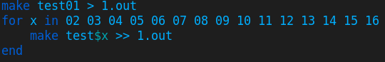
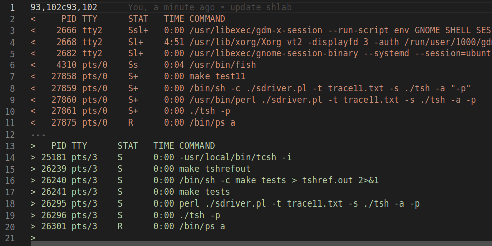

博客摘几篇自己做的 CSAPP 发发（自认为可能有点参考价值）

全部代码可以见 [GitHub 仓库](https://github.com/liuly0322/CSAPP-LABS)

本篇是 Shell Lab

<!-- more -->

本次实验的要求是实现一个支持任务控制的 Unix shell 程序

程序的框架已经给出，只需要补充一些功能性的函数

由于整体是一个编程性质的实验，所以这里只在贴上最后结果后，讲一些实验中值得注意的函数

## 评测

可能由于每次运行的 pid 都有所不同，并且也无法保证 `/bin/ps` 行为相同，本实验没有给出一键测试 shell 正确性的程序

但对于每个评测点，都给出了 `tsh` 和 `tshref` 生成运行结果的程序

所以只要批量生成结果后手动比较即可

`tshref` 的结果已经给出，在 `tshref.out` 文件中，下面我们写一个脚本批量生成 `tsh` 的运行结果 (fish 脚本，语法与 posix 有所不同)



然后手动比较文件

（因为 pid 都在括号内，所以首先用正则表达式把 pid 统一替换成 10000）


随后比较：

```bash
diff 1.out tshref.out > out.diff
```

查看发现只有 `ps` 运行结果不同，而运行行为达到预期



因此实验完成

## eval

补全如下：

```cpp
void eval(char* cmdline) {
    char* argv[MAXARGS];
    int bg;
    pid_t pid;

    bg = parseline(cmdline, argv);
    if (argv[0] == NULL)
        return;

    if (!builtin_cmd(argv)) {
        if ((pid = fork()) == 0) {
            setpgid(0, 0);
            if (execve(argv[0], argv, environ) < 0) {
                printf("%s: Command not found\n", argv[0]);
                exit(0);
            }
        }

        // 此处是父进程
        addjob(jobs, pid, (bg == 1 ? BG : FG), cmdline);
        if (!bg) {
            waitfg(pid);
        } else {
            printf("[%d] (%d) %s", pid2jid(pid), pid, cmdline);
        }
    }

    return;
}
```

和书上给出的例程差不多，主要区别如下：

- `setpgid(0, 0);` 使得能正常接受别的 `shell` 发送的终止信号，否则自己的所有子进程都会被终止
- 前台进程的阻塞用的是 `waitfg`，后面实现 `fg` 命令也需要用到这一函数

理论上来说这里需要考虑屏蔽信号，实际上，现代计算机多核 CPU 并行运行各个进程，在进程数小的情况下很难因为并发遇到执行时序的问题，不过严谨考虑还是加锁为好，这里作为一个 toy 程序就没加了

## do_bgfg

这里的 `do_xx` 似乎是这种解释器程序普遍的命名习惯，代表执行什么什么内置指令

`bg` 和 `fg` 要实现的是对进程运行状态的转换

```cpp
void do_bgfg(char** argv) {
    int id;
    struct job_t* job;

    // 这里根据参数判断合法性，获取 job
    ......

    job->state = (argv[0][0] == 'b' ? BG : FG);
    kill(-job->pid, SIGCONT);
    if (argv[0][0] == 'b')
        printf("[%d] (%d) %s", job->jid, job->pid, job->cmdline);
    else
        waitfg(job->pid);

    return;
}
```

注意前台进程需要等待即可

## waitfg

很实用的 `helper` 函数

```cpp
void waitfg(pid_t pid) {
    struct job_t* job = getjobpid(jobs, pid);
    while (job->state == FG) {
        sleep(1);
    }
    return;
}
```

按照实验说明的推荐，采用轮询加上休眠的方式即可，这样对这一进程的负担也比较小

## sigint & sigtstp

接下来是几个信号处理时的异步回调函数

```cpp
void sigint_handler(int sig) {
    pid_t f_pid = fgpid(jobs);
    if (f_pid) {
        kill(-f_pid, sig);
    }
    return;
}
```

```cpp
void sigtstp_handler(int sig) {
    pid_t f_pid = fgpid(jobs);
    if (f_pid) {
        kill(-f_pid, sig);
    }
    return;
}
```

这两个函数比较类似，接收到键盘的终止 / 暂停信号后发送给前台进程的进程组，所以用 `-f_pid`

## sigchld

这一部分用于处理子进程的中断 / 暂停信号

```cpp
void sigchld_handler(int sig) {
    pid_t pid;
    int status;

    while ((pid = waitpid(-1, &status, WNOHANG | WUNTRACED)) > 0) {
        if (WIFSTOPPED(status)) {       // 暂停信号
            printf("Job [%d] (%d) stopped by signal %d\n", pid2jid(pid), pid,
                   WSTOPSIG(status));
            getjobpid(jobs, pid)->state = ST;
        } else {
            if (WIFSIGNALED(status)) {  // 退出信号
                printf("Job [%d] (%d) terminated by signal %d\n", pid2jid(pid),
                       pid, WTERMSIG(status));
            }
            // 子进程退出信号，以及正常运行结束
            deletejob(jobs, pid);
        }
    }
    return;
}
```

注意由于 unix 信号的阻塞机制，这里需要用 `while` 处理所有的僵死进程

## debug 细节

由于是编程实验，这一部分记录实验过程中遇到的有意思的问题以及解决方案

### 信号处理

在 `sigchld_handler` 函数中，一开始仿照书本 (注：第二版书)，采用的条件是

```cpp
while ((pid = waitpid(-1, &status, 0)) > 0) {
    ......
}
```

但是会出现奇怪的 bug，终止进程输出的提示均为 `[0] (0)`

实际上书本的写法是有些问题的：这样做虽然会回收所有的僵死进程，但是 `waitpid` 的默认行为会不断等待活跃进程，直到活跃进程僵死才会返回

而我们虽然希望信号处理函数能够回收所有的进程，但我们也不希望信号处理处理函数会一直阻塞，直到所有进程运行完毕才继续执行，这样的话之后连前台进程都不存在了，自然也就获取不到前台进程的 `pid` 了，故 shell 的显示就会出现问题。理想情况下，应该是一次信号处理函数处理完当前所有僵死进程后就退出

换言之，这里的 `waitpid` 应该是一个同步函数而非异步函数

（吐槽一下，高级语言的同步异步函数写多了再看 C 语言这种面向底层的语言确实有点小头疼）

为了修正这一问题，可以通过设置 `waitpid` 的 `options` 参数改变 `waitpid` 的默认行为

修改后如下：

```cpp
while ((pid = waitpid(-1, &status, WNOHANG | WUNTRACED)) > 0) {
    ......
}
```

`WNOHANG` 选项使得这一函数变为同步函数，如果没有僵死进程就立刻返回

`WUNTRACED` 选项使得这一函数能够处理暂停的进程

### printf

可能在阅读上面代码时，读者会觉得 `sigchld_handler` 的信号处理很不优雅， `printf` 这种根据信号类型来打印的函数为什么不放在具体的信号处理函数里，而是选择放在一个大的回收子进程的函数内呢？

从功能上来说，是因为如果 shell 中运行的子进程收到终止 / 暂停信号而终止，我们希望 shell 程序也能提示用户。而信号处理函数只能处理 shell 进程自身收到的信号，适用范围就窄了。如果把打印写在信号处理函数内，信号依旧会得到处理，但是会在 `test16` 中因为没有子进程终止信号的提示，输出与 `tshref` 不一致

值得一提的是，这里有一个很有意思的安全问题，由信号处理函数中的 `printf` 引发。我们现在所写的 `sigchld_handler` 事实上也是不安全的，C 语言中信号处理函数中能安全调用的函数是有限的，可以在 [这个网站](https://man7.org/linux/man-pages/man7/signal-safety.7.html) 查阅

而 `printf` 函数并不在此列，这是因为 `printf` 为了确保线程安全会在写入到文件（这里是写入到标准输出这一文件描述符）时给文件加一个锁，但是注意：这个 `shell` 程序在主体控制流中也有 `printf` 函数的调用（例如打印进程的提示消息），考虑现在发生了这样的一个调用，并且在从打印提示消息到给文件描述符解锁的过程中，恰好程序收到一个终止信号，于是信号处理函数被调用，进程会阻塞在给文件描述符解锁之前，转而去执行信号处理函数中的 `printf` ，而这次的调用在执行到准备打印时，却会发现标准输出被加锁了（因为还没能成功解锁），故会停下来等候。但信号处理函数已经阻塞了进程执行正常控制流，自然也就一直等不到谁能给标准输出解锁了：这就造成了程序的死锁

严格来说，我们这个 "toy shell" 目前还是一个非常不健壮的状态。这种类似的信号处理更合理也更普遍的方式是使用管道来完成，不过这就大大超出了本实验的范畴，故不在此介绍

至此，Shell Lab 的实验圆满结束
