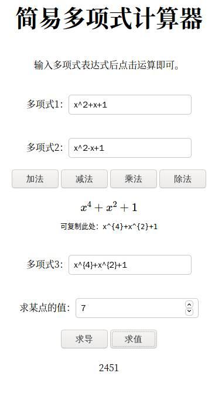

本文将简要介绍一元稀疏多项式计算器的 C++ 链表实现，并介绍将这一项目简易搭建成网页的流程。

[本实验源代码](https://github.com/liuly0322/USTC-CS-COURSE-HW/tree/main/%E6%95%B0%E6%8D%AE%E7%BB%93%E6%9E%84/hw1-%E5%A4%9A%E9%A1%B9%E5%BC%8F%E8%AE%A1%E7%AE%97%E5%99%A8)

成品：



[成品网页](http://home.ustc.edu.cn/~liuly0322/homework/poly/)

<!-- more -->

## 后端实现

### 链表算法

首先要介绍的就是如何用链表计算一元稀疏多项式。

首先建立结点类和多项式（链表）类，然后考虑需要编写的方法：

```cpp
class Node {	// 结点
public:
	Node* next;
	double coef;	// 系数
	int expn;		// 指数
	Node() :next(nullptr) {}
	Node(double c, int e) :coef(c), expn(e), next(nullptr) {}
	~Node() {}
};

class Poly {		// 多项式 (假定指数非递增)
public:
	Node* next;
	Poly() :next(nullptr) {}
	~Poly() {}		// 析构，需要释放内存
    void insert(Node& node) {}			// 结点插入到多项式里
	Poly& operator+(const Poly& p) {}
	Poly& operator-(const Poly& p) {}
	Poly& operator*(const Poly& p) {}

    void copy(const Poly& p) {}			// 释放原有空间并深拷贝 p
	void operator+=(const Poly& p) {}
	void operator-=(const Poly& p) {}
	Poly& operator/=(const Poly& p) {}

	double getValue(double x) {}
	void diff() {}

	void show() {}
    int length() {}
};
```

加法，减法，乘法可以直接返回一个新的多项式对象。除法有商和余数两个对象，相对比较复杂，这里是重载了 `/=` 运算符，使自己变成商，返回余数。求值操作直接返回值，微分操作则直接对当前多项式微分。

这里加法，减法，乘法，除法都返回的是对象的引用，原因是如果返回对象，那么比如 `ans = p1 + p2;` 这一语句中 `p1 + p2` 就会创建出一个临时对象，然后被析构，导致 ans 接收到的多项式所指向的结点已经被回收。

这一问题可以通过重载拷贝构造函数来解决：把多项式的拷贝改成深拷贝，即可使得 `ans` 会新从堆中申请空间来存放多项式。但由于本次实验只涉及到单独的加减乘除，并不严格要求返回的是对象而不能是对象的引用，所以为了节省内存拷贝的开销，就没有采用重载拷贝构造函数的方式处理。

接下来，依次编写加减乘除求值微分即可。这一块主要是注意细节，反而没啥特别值得记录的。

### php 调用 C++

因为要部署在网页上，这里采用了比较简单的一种方式，直接利用 php 调用 C++ 。利用了 php 的 `system` 命令，可以执行指定的命令并获取标准输出。那么，我们只需要让 C++ 处理命令行输入，再把 C++ 源码编译成程序，即可通过 php 调用。

#### 接口编写

不妨做出一些约定：

- argv[1] 为 指定的操作（op）

- 对于两个多项式输入而言：argv[2] 为第 1 个多项式数字个数，argv[3] 为第 2 个多项式数字个数，后续为具体数字

- 对于单个多项式输入而言：argv[2] 为多项式数字个数，argv[3] 为在哪一点求值（对于求导操作，值任意），后续为具体数字

其中，具体数字是 `c1 e1 c2 e2 ...` 形式，表示 $c1x^{e1}+c2x^{e2}+\cdots$

于是就可以根据 `op` 值调用相应的读入函数：

```cpp
void readPolyCommand(Poly& p1, Poly& p2, int argc, char** argv) {
	int num1 = atoi(argv[2]), num2 = atoi(argv[3]);	// 两行的数字数，0 表示空
	Node temp;	// 为了插入到链表内建立临时变量
	for (int i = 1; i < num1; i += 2) {
		temp.coef = atof(argv[i + 3]);
		temp.expn = atoi(argv[i + 4]);
		p1.insert(temp);
	}
	for (int i = 1; i < num2; i += 2) {
		temp.coef = atof(argv[i + num1 + 3]);
		temp.expn = atoi(argv[i + num1 + 4]);
		p2.insert(temp);
	}
}

void readPolyCommand(Poly& p, int argc, char** argv) {
	int num = atoi(argv[2]);	// 数字数，0 表示空
	Node temp;	// 为了插入到链表内建立临时变量
	for (int i = 1; i < num; i += 2) {
		temp.coef = atof(argv[i + 3]);
		temp.expn = atoi(argv[i + 4]);
		p.insert(temp);
	}
}
```

这里用到了 `cstdlib` 库内的 `atoi` 和 `atof` 函数，作用是把字符串转为 `int` 型或 `double` 型。

在读入完成后，根据 `op` 值确定进行的操作，调用相应的函数即可。

#### 编译及命令行调用

服务器上直接使用 g++ 编译即可：`g++ -o calPoly main.cpp`

```php
<?php
header("Access-Control-Allow-Origin: http://home.ustc.edu.cn");
$op = $_GET['op'];
$p1 = $_GET['p1'];
$p2 = $_GET['p2'];
$p3 = $_GET['p3'];
$value = $_GET['value'];
$count1 = $_GET['count1'];
$count2 = $_GET['count2'];
$count3 = $_GET['count3'];
if ($op == '0') {
    $p = './calPoly 0 ' . $count1 . ' ' . $count2 . ' ' . $p1 . ' ' . $p2;
} elseif ($op == '1') {
    $p = './calPoly 1 ' . $count1 . ' ' . $count2 . ' ' . $p1 . ' ' . $p2;
} elseif ($op == '2') {
    $p = './calPoly 2 ' . $count1 . ' ' . $count2 . ' ' . $p1 . ' ' . $p2;
} elseif ($op == '3') {
    $p = './calPoly 3 ' . $count3 . ' ' . $value . ' ' . $p3;
} elseif ($op == '4') {
    $p = './calPoly 4 ' . $count3 . ' 0 ' . $p3;
} elseif ($op == '5') {
    $p = './calPoly 5 ' . $count1 . ' ' . $count2 . ' ' . $p1 . ' ' . $p2;
}
$last_line = system($p, $return_val);
```

然后 php 根据前端传入的请求，简单做一个字符串拼接后调用 C++ ，发回结果即可。

## 前端界面

### 接口调用

参照上文， `op` 表示请求的操作，`p1,p2,p3` 分别是三个输入框对应的多项式，`value` 是在哪一点求值。

在调用后端接口前，有一个很重要的操作：需要先把输入的多项式处理成 `c1 e1 c2 e2 ...` 形式。

```javascript
function getInput(index) {
  let s = document.getElementById(`p${index}`).value;
  if (s == "0" || s == "") {
    // 如果是 0 多项式
    return {
      leng: 0,
      s: "",
    };
  }
  s = s.replace(/{|}/g, ""); // 便于处理 tex
  let array = s
    .replace(/-/g, "+-")
    .replace(/\^\+/g, "^")
    .replace(/^\+/, "")
    .split("+"); // 加号分割每一项
  let ans = "";
  const length = array.length * 2;
  array.forEach((item) => {
    //对每一个 item, 希望格式为：'num1 num2 '
    if (item.indexOf("x") == -1) {
      // 常数项
      ans += `${item} 0 `;
    } else {
      // 先考虑要不要补系数
      item = item.replace(/^-?x/, (s) => `${s.slice(0, s.length - 1)}1x`);
      if (item.indexOf("x") == item.length - 1) {
        // 一次项，需要补次数的 1
        ans += `${item.slice(0, item.length - 1)} 1 `;
      } else {
        item = item.replace(/x\^/, " ");
        ans += item + " ";
      }
    }
  });
  return {
    leng: length,
    s: ans,
  };
}
```

约定该函数返回格式：

```javascript
return {
  leng: length, // 多项式长度（数字个数）
  s: ans, // 符合格式的多项式字符串
};
```

核心思路是通过 `+` 号把多项式分割成一个个单项式的和，然后再逐个对单项式处理。

取得合法的多项式数字字符串后就可以 `fetch` 调用接口，获得返回数据了。

### MathJax 渲染数学公式

~~这部分主要是吹一下 MathJax~~

首先需要在界面中引入：

```html
<script>
  window.MathJax = {
    tex: {
      inlineMath: [
        ["$", "$"],
        ["\\(", "\\)"],
      ],
      processEscapes: true,
    },
    options: {
      skipHtmlTags: ["script", "noscript", "style", "textarea", "pre", "code"],
    },
  };
</script>
<script
  src="https://cdn.jsdelivr.net/npm/mathjax@3/es5/tex-mml-chtml.min.js"
  async=""
></script>
```

接下来我们需要将后端提供的返回值转化成数学公式：

```javascript
const getOutput = (data) => {
  if (data === "0") return `$${data}$`;
  let array = data.split(" ");
  const terms = (array.length - 1) / 2;
  let res = "";
  for (let i = 0; i < terms; i++) {
    // array[2 * i] 是系数，array[2 * i + 1] 是指数
    if (array[2 * i][0] != "-") {
      // 系数区分正负
      array[2 * i] = "+" + array[2 * i];
    }
    if (array[2 * i + 1] == "0") {
      res += array[2 * i];
      continue;
    }
    if (array[2 * i + 1] == "1") {
      if (array[2 * i] == "+1" || array[2 * i] == "-1") {
        res += array[2 * i][0] + "x";
        continue;
      }
      res += array[2 * i] + "x";
      continue;
    }
    if (array[2 * i] == "+1" || array[2 * i] == "-1") {
      res += array[2 * i][0] + `x^{${array[2 * i + 1]}}`;
      continue;
    }
    res += array[2 * i] + `x^{${array[2 * i + 1]}}`;
    continue;
  }
  return `$${res[0] == "-" ? res : res.slice(1)}$`;
};
```

比较冗杂，因为边界情况有点多。主要是常数项不应该出现指数 `0` ，系数也不应该是 `1` 或 `-1` 。

获取完数学公式后，需要操作 DOM 把公式填入答案区，由于我们页面中的数学公式是动态产生的，因此每次产生后都需要通知 MathJax 重新渲染一下，这可以通过调用 MathJax 自己的方法 `MathJax.typeset()` 完成。

至此，这个简易的一元稀疏多项式计算器就做好了。
