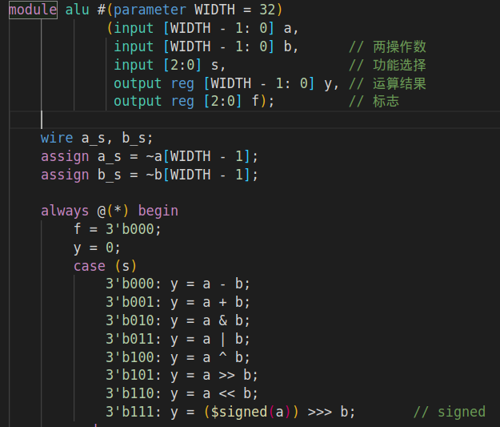
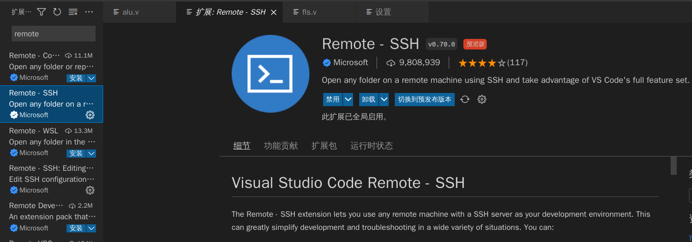
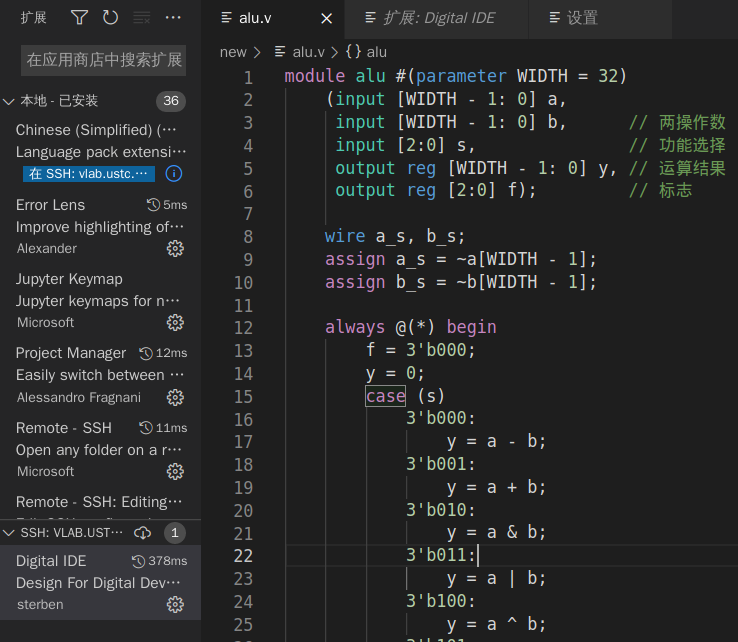
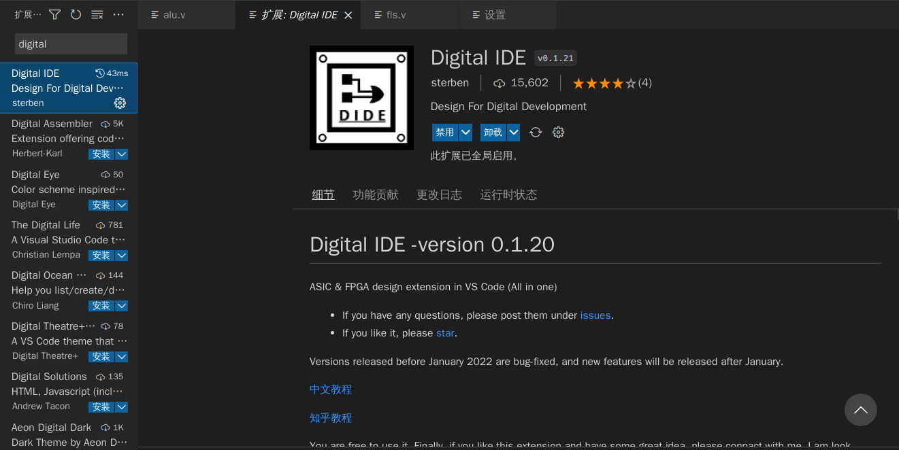
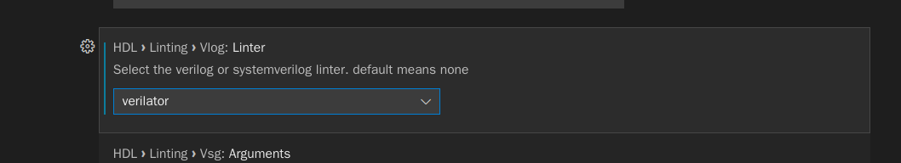
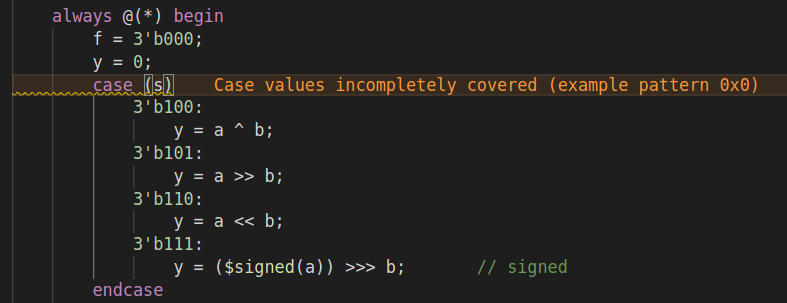
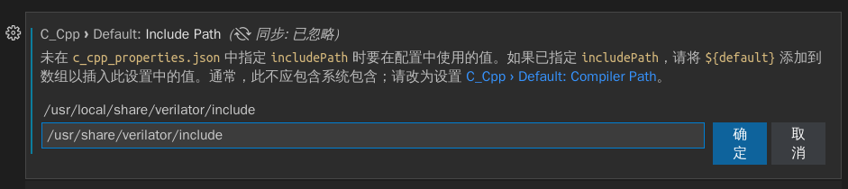
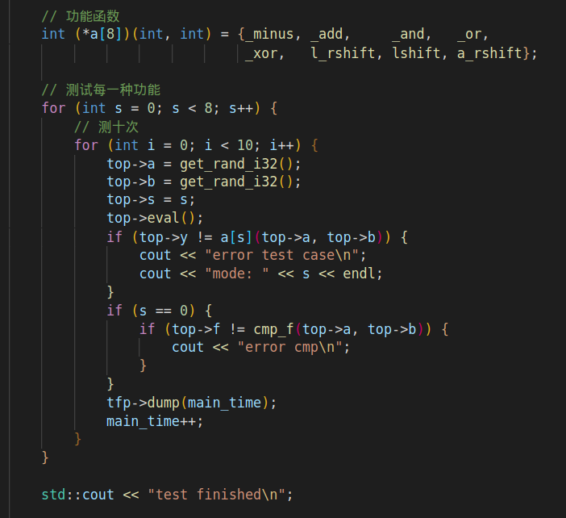
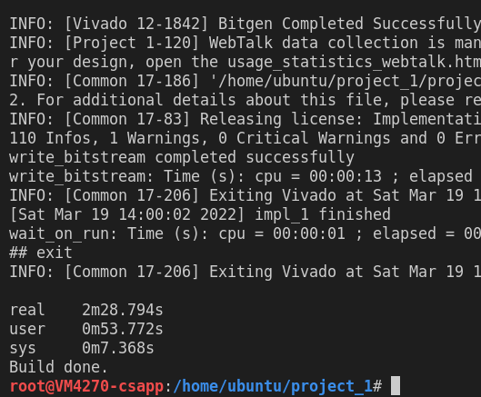

本篇博客将带来优雅的 Vscode 编写数字电路实验 / 计算机组成原理实验的 Verilog 一键式配置方案，让你编写代码全程远离 Vivado（~~新建工程还是要见一面的~~）

主要还是介绍一些名词和工具，读者看上去了哪些可以自己挑



<!-- more -->

## Vscode 插件

首先可能需要连接远程的 Vlab 服务器，这个时候需要使用 Vscode-remote 插件



这个插件主要作用就是能在本地通过 SSH 连接操作 Vlab 虚拟机

具体配置过程不再赘述，配置完之后可以很方便的浏览远程文件



这个时候已经能愉快的在 Vscode 上写 Verilog 了，但是仅仅能写肯定不够，我们还需要一个 linter(检查语法) 还有一个 formatter(代码格式化)

这里推荐一个插件：Digital IDE



插件来自 [ysy-phoenix](https://github.com/ysy-phoenix) 的推荐，在此感谢

配置完之后应该已经默认有代码格式化和端口的各种提示信息了，上图的代码就是这个插件格式后的成果

但 linter 还需要额外配置，这里我们打开插件的设置：



个人感觉 Verilator 更好用，当然 Vlab 虚拟机上默认是没有自带的，不过 Ubuntu 通过包管理器安装还是很方便的：

```bash
apt update				// 这一步为了确保软件包是最新的
apt install verilator	// 安装
```

两下就好了，之后写代码时一保存文件就可以自动帮你检查语法错误了：



（这里报错会显示在一行上是因为装了另一个插件 Error Lens，很美观，亲测好用）

## 干掉 Vivado 之仿真篇

仿真需要看波形，这个时候一个推荐是 `gtkwave`，Ubuntu 下同样通过包管理器安装即可

因为这个不能在没有图形界面的 Vlab 上运行，所以下文给出的仿真推荐都是配在本地环境的：

### Icarus Verilog

大名鼎鼎的一个仿真工具，简称 iverilog, 如果你用 Ubuntu 的包管理器装它还会自动帮你装上 gtkwave（~~捆绑消费~~）

Digital IDE 自带了对于 Icarus Verilog 的快速仿真支持，见 [它的文档](https://zhuanlan.zhihu.com/p/365805011)

### Verilator

这里还是要安利 Verilator，因为用它做仿真可以 **不写 Verilog** ，Verilator 会生成高层次的 C++ 代码模拟模块的行为，然后你只需要用 C++ 编写 top 模块进行测试就行了

很大的好处在于 C++ 作为高级语言很明显比 Verilog 的 testbench 写起来灵活

Ubuntu 包管理器装的版本比较旧，如果想要最新版可以自己下载它的 GitHub 仓库按照说明编译，不过这样就麻烦一点了

具体使用方式可以参考 [这篇文章](http://www.sunnychen.top/2019/07/25/%E8%B7%A8%E8%AF%AD%E8%A8%80%E7%9A%84Verilator%E4%BB%BF%E7%9C%9F%EF%BC%9A%E4%BD%BF%E7%94%A8%E8%BF%9B%E7%A8%8B%E9%97%B4%E9%80%9A%E4%BF%A1/) ，~~对着复制粘贴就行~~

如果你发现 Vscode 找不到头文件 `verilated.h` ，那就找到这个设置（直接在 Vscode 的设置里搜索即可），路径添加以下两个中的一个（根据你自己的情况而定，自己看哪个目录能进，如果是包管理器装的应该是下面那个路径）



然后就可以愉悦的编写 C++ 代码仿真了，以下是一个对 ALU 模块 100% 覆盖率的测试示例：



根据上面那篇链接里教程的步骤，即可判断仿真结果是否正确，并生成波形

## 干掉 Vivado 之比特流

写完代码我们还需要 Vivado 这个~~工具人~~帮我们生成比特流

但每次打开 VNC 操作 Vivado 显然太过笨重，这个时候我们可以利用 Vivado 自带的 TCL 命令行工具来构建项目

这里直接贴一个 Vlab 能用的脚本（如果在本地跑可能需要一些修改）[作者链接](https://github.com/WuTianming)

```bash
#!/bin/bash

echo "Initiating project build ..."

ProjName=$(find . -type f -iname "*.xpr")
if [ -z "$ProjName" ]; then
    echo "xpr file not found. Exiting"
    exit 1
fi
echo "Found project file ${ProjName}."

echo "Creating build script ..."
cat - > automation_genbitstream.tcl << EOF
set_param general.maxThreads 2
open_project ${ProjName}

reset_run synth_1
launch_run synth_1
wait_on_run synth_1
open_run synth_1
# report_timing_summary
launch_run -to_step write_bitstream impl_1
wait_on_run impl_1
# open_run impl_1
# report_timing_summary
# report_utilization > utilization.txt

quit
EOF

cat - > wrapper.tcl << EOF
if {[catch {source automation_genbitstream.tcl} errorstring]} {
    puts "Error - $errorstring"
    exit 1
}
quit
EOF

cat - > build_remote.sh << EOF
#!/bin/bash

# source /extra/vivado2016/Vivado/2016.3/settings64.sh
source /opt/vlab/path.sh

if ! time vivado2019 -mode tcl -source wrapper.tcl; then
	grep --color=always "ERROR" vivado.log
fi
rm -f *.log *.jou
printf "\a"
EOF

echo "Running job ..."
bash build_remote.sh
echo "Build done."

rm automation_genbitstream.tcl wrapper.tcl build_remote.sh
```

放在和 xpr 文件同一个目录（也就是项目目录下即可）

怎么运行脚本这里不再赘述



可以很漂亮的在命令行里得到结果并看到各种 report

具体设置可以自己看脚本被注释掉的一些部分

至此我们成功构建了一套还算趁手的 Verilog 开发工具链
