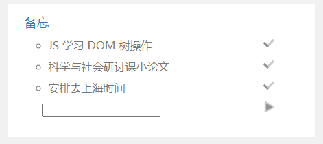
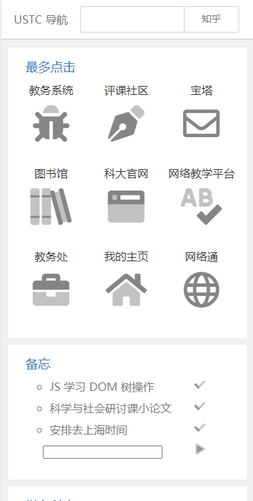
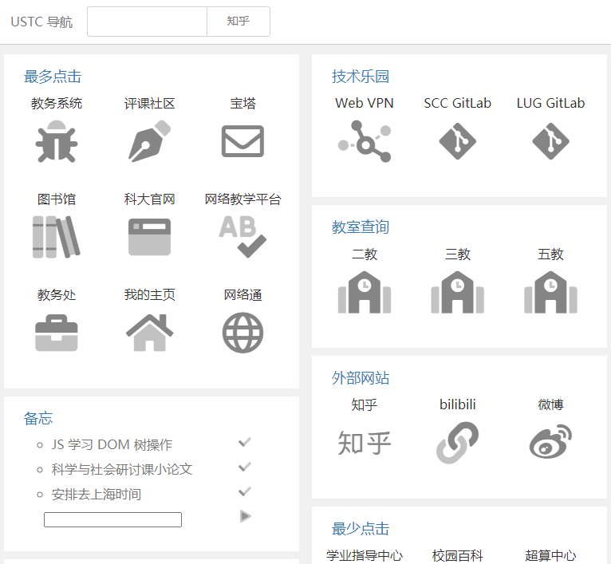
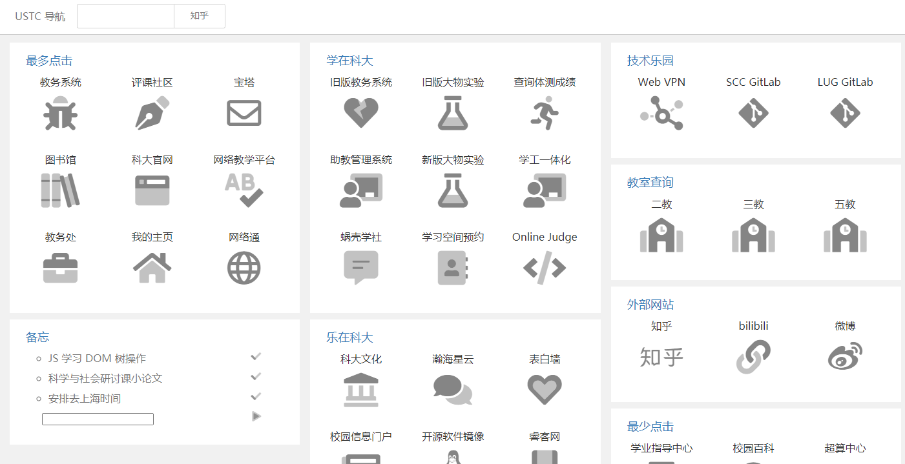

本博客将介绍简易备忘系统的前后端分离实现。



由于本人此时只学了一点点前端，后端的 php 都是凭感觉查的文档，本篇博客仅记录学习及实现过程，可能代码确实写的很烂（）

## 问题分解

本人的备忘功能是打算放在自己的一个静态导航网页上的，由于网页的其他部分都是静态的，且部署在学校的服务器上（不提供后端程序运行），再加上本人目前主要在学前端，因此这里打算使用前后端分离的方式完成，只需要后端提供好接口，前端再调用就可以了。

于是问题主要被分解成了：

- 前端 html 和 css 的实现
- 通过 js 调用后端接口
- 后端 php 接口的实现

下面将逐一介绍。

<!-- more -->

## 前端 html 和 css 的实现

本人的网页主要由 [USTC 导航](https://ustc.life/)修改而来。采用了列布局：

```css
.main {
  margin: 10px;
  overflow: hidden;
  columns: 3 350px;
}
```

以到达自适应效果。





于是对于备忘，增加一个 main-block 即可。（这样就会自动适应）

```html
<div class="main-block">
  <span class="block-title">备忘</span>
  <ul id="todo-list"></ul>
</div>
```

ul 中的内容要等待 js 添加。

## 通过 js 调用后端接口

首先要完成的是从后端读取备忘信息。

那么需要约定数据格式。这里约定 json 格式。

大体如下：

```json
{
  "length": 3,
  "events": [
    { "content": "事件 1" },
    { "content": "事件 2" },
    { "content": "事件 3" }
  ]
}
```

然后就可以获取信息，并显示到网页上。获取信息通过 fetch，这是一个新标准的前端与后端通信的 js 函数。

```javascript
function getTodoList() {
  fetch("http://...")
    .then((response) => response.json())
    .then((data) => {
      const ul = document.getElementById("todo-list");
      for (let i = 0; i < data.length; i++) {
        //主体备忘内容
        const li = document.createElement("li");
        const iDel = document.createElement("i");
        iDel.className = "fad fa-check";
        iDel.onclick = function () {
          //按钮绑定删除备忘事件
          fetch(`http://.../del.php/?i=${i}`);
          ul.innerHTML = "";
          setTimeout("getTodoList()", 100);
        };
        li.innerHTML = data.events[i].content;
        li.appendChild(iDel);
        ul.appendChild(li);
      }

      const input = document.createElement("input");
      input.setAttribute("type", "text");
      ul.appendChild(input);
      const upload = document.createElement("i"); //上传确认按键
      upload.className = "fad fa-play";
      upload.onclick = function () {
        fetch(`http://.../add.php/?content=${encodeURIComponent(input.value)}`);
        ul.innerHTML = "";
        setTimeout("getTodoList()", 100);
      };
      ul.appendChild(upload);
    })
    .catch(console.error);
}
getTodoList();
```

这个时候前端界面就完成了。这里用到了三个接口，一个是获取信息，一个是删除备忘，一个是增加备忘。

分别对应的是同一个目录下的 `index.php, del.php, add.php`。

## 后端 php 接口的实现

这里代码本人随便写的，指导思想能 work 就行（

在 `index.php, del.php, add.php` 的目录下，存储文件 `memo.txt` 用于存储 json 字符串。

随后就是一堆文件读写和字符串处理：

`index.php` ：

```php
<?php
header("Access-Control-Allow-Origin: *");
$myfile = fopen("memo.txt", "r") or die("Unable to open file!");
echo '{' . fread($myfile,filesize("memo.txt")) . '}';
fclose($myfile);
?>
```

直接发送文件内容。

`add.php` ：

```php
<?php
header("Access-Control-Allow-Origin: *");
$content = $_GET['content'];
$content = urldecode($content);
$str = "";
$count=0;

$myfile = fopen("memo.txt", "r") or die("Unable to open file!");
//通过统计行数获取当前数量
while(!feof($myfile)){
    fgets($myfile);
    $count++;
}
$count-=2;   //增加后数量
fclose($myfile);

$file = fopen("memo.txt", "r") or die("Unable to open file!");
// 接下来需要字符串拼接
$str=$str . '"length":' . $count . ',' . PHP_EOL . '"events": [' . PHP_EOL;
fgets($file);
fgets($file);
for($i=0;$i<$count-1;$i++){   // 前面的拼接
    $str=$str . fgets($file);
}
if($count!=1){	//如果数量不为 0，前一行最后要补逗号
    $str=chop($str);
    $str=$str . ',' . PHP_EOL;
}
$str=$str . '{"content":"' . $content . '"}' . PHP_EOL . ']';
fclose($file);

//接下来写入文件
$filewrite = fopen("memo.txt", "w") or die("Unable to open file!");
fwrite($filewrite,$str);
fclose($filewrite);
?>
```

将新的备忘内容追加到最后一行。

`del.php` ：

```php
<?php
header("Access-Control-Allow-Origin: *");
$index = $_GET['i'];
$str = "";
$count=0;
$myfile = fopen("memo.txt", "r") or die("Unable to open file!");
//现在已经在文件头，考虑定位到第 i 项并删除

//通过统计行数获取当前数量
while(!feof($myfile)){
    fgets($myfile);
    $count++;
}
$count-=4;   //即为删除后数量
fclose($myfile);

$file = fopen("memo.txt", "r") or die("Unable to open file!");
// 接下来需要字符串拼接
$str=$str . '"length":' . $count . ',' . PHP_EOL . '"events": [' . PHP_EOL;
fgets($file);
fgets($file);
for($i=0;$i<$index;$i++){
    $str=$str . fgets($file);
}
fgets($file);	//要删除的行，读取一遍跳过拼接即可
for($i=0;$i<$count-$index;$i++){   // 还剩余多少条
    $str=$str . fgets($file);
}
if($count==$index){	//如果删除的是最后一条，前面的逗号需要去除
    $str=chop($str,',' . PHP_EOL);
    $str=$str . PHP_EOL . ']';
} else {
    $str=$str .  ']';
}
fclose($file);

//接下来写入文件
$filewrite = fopen("memo.txt", "w") or die("Unable to open file!");
fwrite($filewrite,$str);
fclose($filewrite);
?>
```

能用就行（

## 跨域通信

可能有人以及注意到了我上面 php 文件里的 `header("Access-Control-Allow-Origin: *");`

\* 可换成指定域名，指定特定的 Origin 才可以跨域请求本 php 文件。

这里涉及到跨域的概念，感兴趣的可以自己百度（
