本报告是 2021 秋季学期数据结构 Lab1 离散事件模拟的选题之一：航空客运订票系统的实验报告。

实验最终成品可以参考已经部署至网页上的：[航空客运订票系统](http://home.ustc.edu.cn/~liuly0322/homework/flight/)

实验源代码可以见附件，也可以见 [github 链接](https://github.com/liuly0322/Flight-Server) （包含项目具体部署方法）

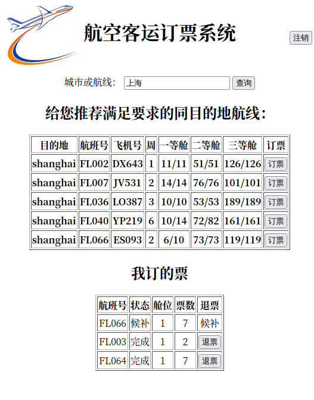

<!-- more -->

## 实验要求

### 一、问题描述：

航空客运订票的业务活动包括：航线查询、客票预定和办理退票等。试设计一个航空客运订票系统、以使上述业务可以借助计算机来完成。

### 二、基本要求

- 每条航线所涉及的信息有：终点站名、航班号、飞机号、飞行周日（星期几）、乘员定额、余票量、已订票的客户订单（包括姓名、订票量、舱位等级 1，2 或 3）以及等候替补的客户名单（包括姓名、所需票量）；

- 作为示意系统，全部数据可以只放在内存中；

- 系统能实现的操作和功能如下：

  - 查询航线：根据旅客提出的终点站名输出下列信息：航班号、飞机号、星期几飞行、最近一天航班的日期和余票额；

  - 承办订票业务：根据珂护提出的要求（航班号、订票数额）查询该航班票额情况，若有余票，则为客户班里订票手续，输出作为好；若已满或者余票少于订票额，则需要重新询问客户要求。若需要，可等级排队侯补；

  - 承办退票业务：根据客户提供的情况（日期、航班），为客户办理退票手续，然后查询该航班是否有人排队侯补，首先询问排在第一的客户，若所退票额能满足他的要求，则为他办理订票手续，否则一次询问其他排队侯补的客户

### 三、输入输出

题目中没有规定。这里介绍本程序的输入输出。

本程序采用前后端分离的方式设计，服务端程序主要读取客户端的 GET 和 POST 请求。

#### 接口约定

如果通过 POST 请求传入 admin 参数，表示可能是在尝试管理员登录。此时，如果 admin == password（写死在服务端程序里的密码），那么就允许管理员登录。默认管理员登录的操作是保存当前状态到文件中，如果还有查询参数 s，那么就返回查询航班 s 的所有订票用户以及候补用户名单。

否则均为 GET 请求：传入 s 则表示查询城市 / 航线。此时，可能有 grade 和 num 参数来表示是否要求满足某一等舱的余票数不少于指定值（若用户订票要求不能满足，需要调用这个方法给用户推荐满足条件的线路）

否则：

- state == 1 则请求注册

  需求参数：username,password

  返回值：true/false（用户名被占用）

- state == 2 则请求登录

  需求参数：username,password

  返回值：true/false（是否账户密码匹配）

- state == 3 则获取自己记录

  需求参数：username,password

  返回值：每一行都是订票的信息，包含 id，是否完成，以及航班信息

- state == 4 则进行订票

  需求参数：username,password,flight,grade,num

  返回值：成功或失败

- state == 5 则强制订票

  需求参数：username,password,flight,grade,num

  返回值：无所谓，订完票直接刷新界面

- state == 6 则退票

  需求参数：username,password,id

  返回值：同上

## 设计思路

### 前端部分


前端部分比较简单，动态数据都是通过 `axios.js` 请求后端后再解析返回的字符串得到。

由于后端 C++ 没有找到好用的解码 URL 编码的库，所以这里还用到了一个汉字转拼音的 js，用于前端处理用户请求的城市。

### 后端部分

主体程序基于开源的 [TinyWebServer](https://github.com/qinguoyi/TinyWebServer) 项目（原程序主要实现了发送 html, js, css, jpg, png 等文件的功能），这里先对本程序的后端整体结构做一个解释：

（没有详细展开的部分是没有对原项目修改的部分）

```
.
├── bin             // 程序
│   ├── log
│   └── server
├── build           // 编译
│   └── Makefile
├── data       		// 航空系统数据文件
│   ├── flights.txt
│   └── users.txt
├── code            // 后端代码
│   ├── buffer
│   ├── config
│   ├── http		// http 连接
│   │   ├── httpconn.cpp
│   │   ├── httpconn.h
│   │   ├── httprequest.cpp
│   │   ├── httprequest.h
│   │   ├── httpresponse.cpp
│   │   ├── httpresponse.h
│   │   └── readme.md
│   ├── log
│   ├── main.cpp
│   ├── pool
│   ├── readme.md
│   ├── server
│   ├── ticket		// 订票系统
│   │   ├── flight.cpp
│   │   ├── flight.h
│   │   ├── mqueue.h
│   │   ├── ticket.cpp
│   │   └── ticket.h
│   └── timer
├── LICENSE
├── Makefile
└── readme.md
```

在 `code/http` 目录中包含了对 Http 请求的解析，处理，和返回。

这里对 `httprequest.cpp` 进行了修改，使得支持了 GET 请求查询参数的解析，对 `httpresponse.cpp` 进行了修改，使得其可以单独返回字符串。

在 `httpconn` 类中实现了对参数的截取判断。如果是 POST 请求，或者是 GET 请求且有查询参数，那么就调用该类中的一个静态成员 `static Ticket ticket;` （一个静态的订票类，在初始化时会读取 data 文件夹中的数据以初始化订票系统），然后返回字符串给前端。

订票系统的主体部分是在 `code/ticket` 目录中。

里面有队列模板 `mqueue.h` 供调用：

```cpp
template <class T>
struct QNode {
    T data;
    struct QNode<T>* next;
};

template <class T>
class mQueue {
   private:
    struct QNode<T>* front;  // 队头
    struct QNode<T>* rear;   // 队尾
    // 队头是一个空结点
    // 队尾指向最后一个元素结点

    int size;  // 队长

   public:
    mQueue();
    mQueue(const mQueue<T>& Q);
    ~mQueue();
    void enQueue(T& x);  // 入队
    T deQueue();         // 出队
    T getFront();        // 获取队头元素
    bool isEmpty();      // 判空
    int length();        // 返回长度
};
```

而 `flight.h` 中定义了用户类，航班类以及表示订单的结构体。

用户类：

```cpp
class Passenger {
   public:
    string username;    // 名字
    string password;    // 密码
    Passenger* next;    // 链表用
    Order* order_list;  // 用户对应的订票链表

    Passenger();
    Passenger(string& name, string& pass);
    ~Passenger();

    void InsertOrder(Order& order);  // 将订票插入到结点里

    string MyTick();  // 获取本人所有订单情况

    void Book(Order& order);  // 订票
    void Refund(int id);      // 退票
};
```

航班类：

```cpp
class Flight {
   private:
    string destination;     // 目的地
    string flight_num;      // 航班号
    string plane_num;       // 飞机号
    int work_day;           // 星期几（一到七）
    int max_people[3];      // 最大乘坐人数
    int now_ticket[3];      // 余票量
    Order* have_ordered;    // 已订票客户的链表
    mQueue<Order> wait[3];  // 三个舱的候补队列

    Passenger* users;  // 所有用户
    static int id;     // 用于记录 id（全局分配）

    void SaveOrderList();
    void SaveWaitingList();

    void InitOrderList();
    void InitWaitingList();

    Passenger& FindUser(string& s);

   public:
    Flight* next;  // 指向下一个航班

    Flight();
    Flight(std::ifstream& in, Passenger* p);
    ~Flight();

    void save(std::ofstream& out);

    // 订票
    bool Book(string& name, int grade, int num, bool force);

    // 退票
    void Refund(int id);

    // 验证票够不够
    bool Verify(int grade, int num);

    string& GetFlight();
    string& GetDestination();
    string show();
    string ShowBook();
};
```

订单的结构体：

```cpp
struct Order {
    string name;
    string flight_num;
    bool finished;  // 是否购入
    int id;         // 订单的 id
    int grade;      // 几等仓 (0,1,2)
    int order_num;  // 订票数
    Order* next;    // 链表用
};
```

这两个类提供了一些基本的订票退票的方法，供给上层的 `ticket` 类（订票系统类调用）。

订票系统类定义如下：

```cpp
class Ticket {
   private:
    Passenger* users;  // 用户对应的链表
    Flight* flights;   // 航班的顺序表

    void UsersInit();
    void FlightsInit();

    void UsersSave();
    void FlightsSave();

   public:
    Ticket();
    ~Ticket();

    void Save();  // 将当前状态写入到文件里

    bool Login(string& name, string& pass);  // 返回是否登陆成功
    bool Regi(string& name, string& pass);  // 失败可能是用户名占用等

    // 订票
    bool Book(string& name, string& flight, int grade, int num, bool force);
    // 退票
    void Refund(string& name, int id);

    // 查询该用户当前订票情况
    string MyTick(string& name);

    // 查询城市或航班号所有线路
    string query(string& s);
    string query(string& s, int grade, int num);

    // 查询某航线所有订票用户
    string AdminQuery(string& s);
};
```

## 关键代码讲解

### 系统初始化及文件读写

本系统在初始化时会从 `./data/flights.txt` 和 `./data/users.txt` 中读取航班和用户信息。基本格式如下：

flights.txt:

```

qingdao FL000 OH421 4 14 90 135 14 90 135
beijing FL001 YX399 2 16 95 118 16 95 118
shanghai FL002 DX643 1 11 51 126 11 51 126
shanghai FL003 OB890 5 9 50 135 9 50 135
shenyang FL004 MN489 4 16 71 109 16 71 109
xiamen FL005 XK069 6 9 59 192 9 59 192
```

确保最后一行没有 `\n` 结尾即可（为了防止 EOF 判断产生错误）。第一行可以没有空行，但是保存文件时会添加上空行。

users.txt:

```

xiaohong qwerty
xiaoming fine
```

同理。

文件的读写主要采用文件流 ifstream（输入）和 ofstream（输出）

输入的基本模板如下：

```cpp
std::ifstream in(location);	// 文件地址
if (in.is_open()) {
    while (in.peek() != EOF) {
        in >> ...;	// 读入
    }
}
```

输出的基本模板如下：

```cpp
std::ofstream out(location);
if (out.is_open()) {
    out << ...;	// 输出
    out.close();
}
```

文件的保存需要管理员操作（见 [管理员操作](#管理员操作) ）

每个航班（例如 FL000），保存时会产生两个文件：FL000_O.txt 和 FL000_W，分别记录订上票的用户信息和候补用户的信息。

基本格式：

```

xiaoming 0 7
```

分别是用户名，舱位等级，票数。

### 接口处理

优先级比较高的是先判断是不是管理员登录，是不是查询操作（查询城市或航班不需要用户登录）。

如果以上都不是，那么就是登录用户的操作。首先读取可能需要的键值，然后依据 [接口约定](#接口约定) ，对于成功登录的用户，调用相应的操作函数，并返回值（如果需要）。

```cpp
std::string HttpConn::processRequest() {
    // 对于 admin 登录
    if (request_.GetPost("admin") == "password") {
        std::string s = request_.GetPost("s");
        if (s.empty()) {  // 如果没有传入查询参数
            ticket.Save();
            return "文件已保存";
        } else {
            return ticket.AdminQuery(s);
        }
    }

    // 对于查询操作
    std::string s = request_.Get("s");
    if (!s.empty()) {
        // 这个时候可能有 grade 和 num 传入
        std::string grade = request_.Get("grade");
        std::string num = request_.Get("num");
        if (grade.empty() || num.empty())
            return ticket.query(s);
        // 否则需要将 grade 和 num 转换成整数
        int grade_ = atoi(grade.c_str());
        int num_ = atoi(num.c_str());
        if (grade_ < 0 || grade_ > 2 || num_ < 1)
            return "";
        return ticket.query(s, grade_, num_);
    }

    int state = atoi(request_.Get("state").c_str());  // 操作
    std::string username = request_.Get("username");  // 账户名
    std::string password = request_.Get("password");  // 密码
    std::string flight = request_.Get("flight");      // 航班号
    int grade = atoi(request_.Get("grade").c_str());  // 几等仓
    int num = atoi(request_.Get("num").c_str());      // 订票数量
    int id = atoi(request_.Get("id").c_str());        // 退票 id

    if (state == 1) {
        if (ticket.Regi(username, password)) {
            return "注册成功";
        } else {
            return "注册失败，可能是用户名相同";
        }
    }

    if (!ticket.Login(username, password)) {
        return "登录失败";
    }

    if (state == 2)
        return "登录成功";

    if (state == 3)
        return ticket.MyTick(username);

    if (state == 4) {
        if (grade < 0 || grade > 2 || num < 1)
            return "";
        if (!ticket.Book(username, flight, grade, num, false)) {
            // 没定上票，需要推荐
            return "订票失败";
        }
    } else if (state == 5) {
        if (grade < 0 || grade > 2 || num < 1)
            return "";
        ticket.Book(username, flight, grade, num, true);
    } else if (state == 6) {
        ticket.Refund(username, id);
    }

    return "";
}
```

### 用户账户系统

用户的账号，密码存储在同一结构体当中，以一个单链表连接所有用户的账户密码信息。

```cpp
class Passenger {
   public:
    string username;    // 名字
    string password;    // 密码
    Passenger* next;    // 链表用
    Order* order_list;  // 用户对应的订票链表

    Passenger();
    Passenger(string& name, string& pass);
    ~Passenger();

    void InsertOrder(Order& order);  // 将订票插入到结点里

    string MyTick();  // 获取本人所有订单情况

    void Book(Order& order);  // 订票
    void Refund(int id);      // 退票
};
```

### 订单管理

#### 订单标识

每个订单有唯一标识 id，实现这一点的方法是 id 作为静态类成员，每次给订单分配完 id 后就自增。

#### 订票

为了让查询航班和查询用户都能迅速查询到订票订单，订票订单在内存中有两份：一份在航班订票信息的单链表上，一份在用户订票信息的单链表上。

进行订票操作时，`Ticket` 类调用对应航班的订票方法，航班订票后会将信息复制一份，给对应的用户。

```cpp
bool Ticket::Book(string& name,
                  string& flight,
                  int grade,
                  int num,
                  bool force) {
    for (auto p = flights->next; p; p = p->next) {
        if (p->GetFlight() == flight) {
            return p->Book(name, grade, num, force);
        }
    }
    return false;
}
```

&nbsp;

```cpp
bool Flight::Book(string& name, int grade, int num, bool force) {
    if (max_people[grade] < num ||
        (now_ticket[grade] < num && !force))  // 不够卖
        return false;
    auto p = new Order();
    p->name = name;
    p->flight_num = flight_num;
    p->id = id++;
    p->grade = grade;
    p->order_num = num;
    if (now_ticket[grade] >= num) {  // 余票还够
        p->finished = true;
        FindUser(name).Book(*p);
        now_ticket[grade] -= num;
        p->next = have_ordered->next;
        have_ordered->next = p;
    } else {
        p->finished = false;
        FindUser(name).Book(*p);
        wait[grade].enQueue(*p);
        delete p;
    }
    return true;
}
```

这里返回值是 bool，是为了表示用户订票需求能否被满足，若不能被满足，则前端会发送请求，查询能满足用户要求的线路。

#### 退票

退票操作利用了订单的唯一标识 id。首先根据 id，分别在用户的订票链表和航班的订票链表中删除订单，再考察删去这一订单后，候补队列的需求是否能被满足。

```cpp
void Ticket::Refund(string& name, int id) {
    for (auto user = users->next; user; user = user->next) {
        if (user->username == name) {
            // 找到用户了，下面开始找 id
            for (auto order = user->order_list->next; order;
                 order = order->next) {
                if (order->id == id) {
                    // 找到 id 了，再找到对应的航班去退票
                    for (auto flight = flights->next; flight;
                         flight = flight->next) {
                        if (flight->GetFlight() == order->flight_num) {
                            // 找到航班了，去退票
                            user->Refund(id);
                            flight->Refund(id);
                            return;
                        }
                    }
                }
            }
        }
    }
}
```

&nbsp;

```cpp
// 乘客退票
void Passenger::Refund(int id) {
    for (auto p = order_list; p->next; p = p->next) {
        if (p->next->id == id) {
            auto temp = p->next->next;
            delete p->next;
            p->next = temp;
            return;
        }
    }
}
```

&nbsp;

```cpp
// 航班退票
void Flight::Refund(int id) {
    // 航线已订票的链表中需要删除这一项
    int grade = 0;
    for (auto p = have_ordered; p->next; p = p->next) {
        if (p->next->id == id) {
            grade = p->next->grade;
            now_ticket[p->next->grade] += p->next->order_num;
            auto temp = p->next->next;
            delete p->next;
            p->next = temp;
            break;
        }
    }
    // 检查队列，看看能不能解决一些需求
    while (!wait[grade].isEmpty()) {
        auto order = new Order(wait[grade].getFront());
        if (now_ticket[order->grade] >= order->order_num) {
            // 一方面是直接以现在的 id 插入到订票列表里
            now_ticket[order->grade] -= order->order_num;
            order->next = have_ordered->next;
            have_ordered->next = order;
            // 一方面是要把用户链表里的 finished 状态改掉
            for (auto p = FindUser(order->name).order_list->next; p;
                 p = p->next)
                if (p->id == order->id) {
                    p->finished = true;
                    break;
                }
            wait[grade].deQueue();
        } else {
            break;
        }
    }
}
```

#### 获取用户所有订单

遍历该用户订票链表的所有订单，并返回即可。

```cpp
string Ticket::MyTick(string& name) {
    for (auto p = users->next; p; p = p->next) {
        if (p->username == name) {
            // 这就是需要找的用户
            return p->MyTick();
        }
    }
    return "";
}
```

&nbsp;

```cpp
string Passenger::MyTick() {
    string res;
    for (auto p = order_list->next; p; p = p->next) {
        res += p->flight_num + ' ' + (p->finished ? "1 " : "0 ") +
               std::to_string(p->id) + ' ' + std::to_string(p->grade) + ' ' +
               std::to_string(p->order_num) + '\n';
    }
    return res;
}
```

### 管理员操作

管理员可以通过发送 POST 请求查询一个航班的所有订票客户信息，或者将当前订票系统所有信息保存到文件里。

默认是保存文件，如果发送了 s 参数，那么就将其作为航线处理，查询对应航线所有订票用户。

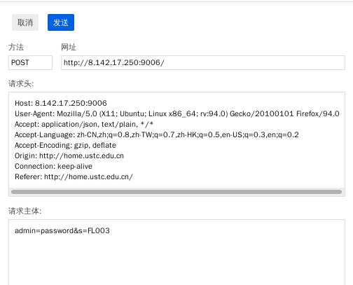

查询结果：

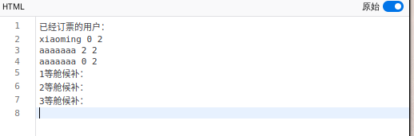

## 调试分析

### 时间复杂度分析

#### 文件读取和保存

这一项的复杂度只有在系统初始和关闭的时候需要考虑。

初始化读取文件每个订单都需要寻找对应的用户，所以总复杂度为 $O(\ users \ + \ flights\ +\ users\ \times\ orders\ )$

文件的保存是遍历操作，复杂度为 $O(\ orders\ +\ users\ )$

#### 查询航班

遍历所有航班的单链表，复杂度 $O(\ flights\ )$

#### 用户查询

遍历所有用户的单链表，再返回所有订单，复杂度 $ O(\ users\ +\ orders\ )$

#### 用户订票，退票

遍历航班链表和用户链表。复杂度 $O(\ users\  +\  flights\ )$

### 空间复杂度分析

基本没有涉及到什么算法，主要是增删查改，所以空间复杂度大致为总数据大小 $O(\ flights\ +\ orders\ +\ users\ )$

### 调试问题

#### 多文件调试

首先介绍涉及到多个 cpp 文件共同需要编译的时候调试的基本策略。

编译可以使用 Makefile，这一点在原来的 TinyWebServer 项目中已经写好了 Makefile 配置文件。而对于调试 (g++ 配合 gdb) 而言，需要确保 Makefile 文件里设置了 `-g` 选项，且最好关闭 O2 优化。

在使用 VSCode 进行项目调试的时候，还需要额外进行配置：

工作目录下的 `.vscode/launch.json` 中的 `configurations/program` 需要配置成自己编译出的程序的目录。

然后即可使用 VSCode 一键调试。

#### 文件读取

C++ 中，对于文件读取可以使用 fstream 库中提供的库函数和文本流类，可以对文本进行流式的输入输出读写。

这里需要注意的是判断文件结束：直觉上我们可能会使用 EOF 写出：

```cpp
while (!in.eof()) {
    in >> a;		// a is a string
    std::cout << a;	// here do something with a
}
```

这样的代码，但实际上这种代码运作起来是不会符合我们预期的：EOF 只有在文件读完 **之后** 才会产生，所以这样的代码最后会得到一个空的 a。

为了解决这个问题，可以采用 `.peek()` 判断，它会取输入流的下一个字符。

也就是可以把代码改换成：

```cpp
while (in.peek() != EOF) {
    in >> a;		// a is a string
    std::cout << a;	// here do something with a
}
```

即可达到我们预期的目的。

#### 队列模板

队列采用了下列结构实现：

队首始终不存储元素，队尾指向最后一个元素


采用这种储存方式的队列，初始时元素个数为 0，rear 和 front 重合。


因此，若删除结点时，删除后队列长度为 0，需要重新把 rear 指向 front。

## 代码测试

### 用户注册登录

注册界面如下：


错误提示：

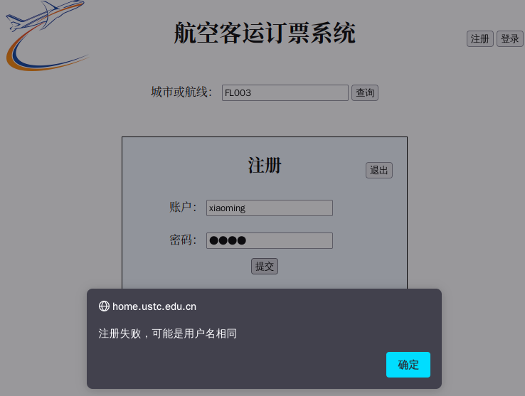

成功提示：

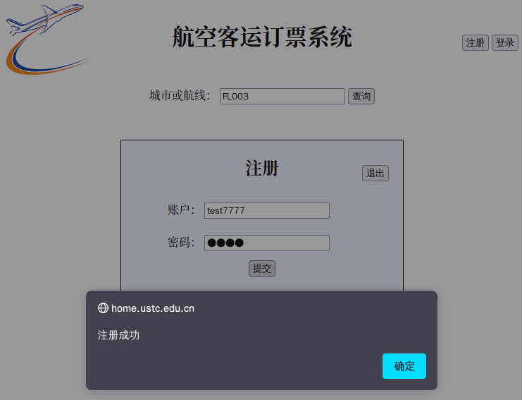

并将自动登录。

也可手动输入账户密码登录。

### 搜索功能

登录后可以搜索终点站或者航班号订票：

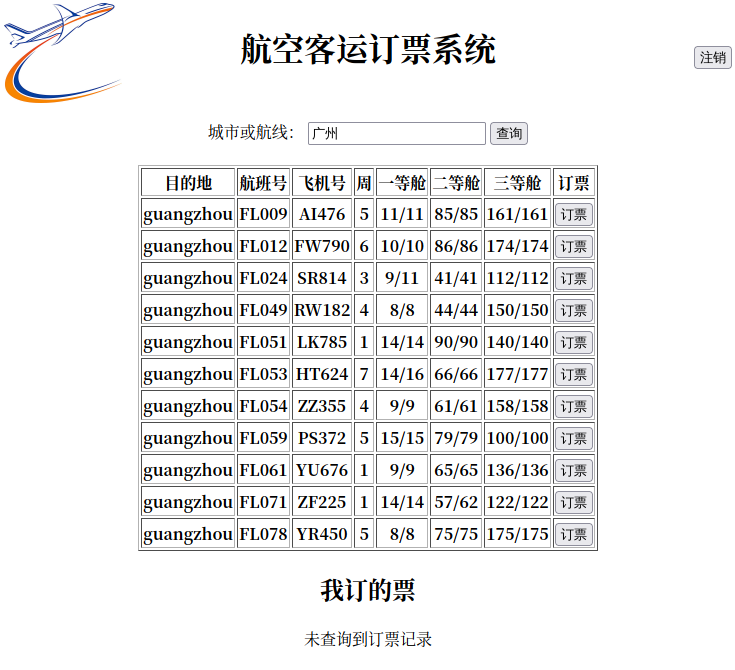

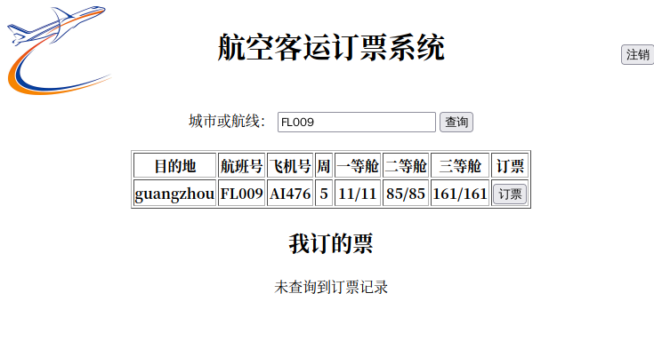

### 订票

点击订票进入订票界面：

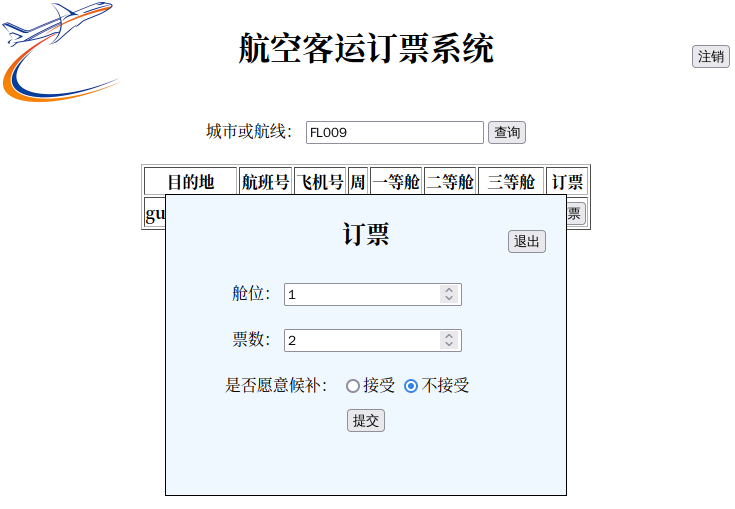

可以选择舱位和票数。是否愿意候补决定了是否会考虑加入候补队列。

下面尝试订几张票：

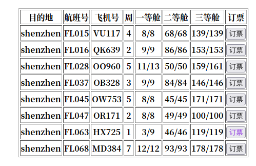

这里尝试对 FL063 订票一等舱 5 张，条件不满足，推荐同目的地的其他航班：

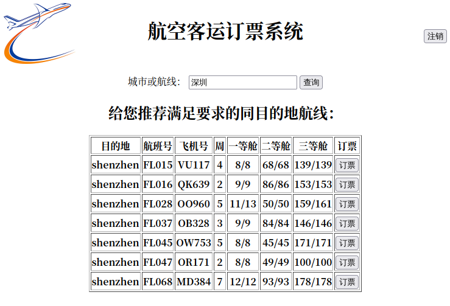

所有订单会显示在最下方“我订的票”处。

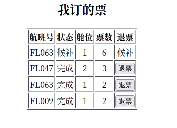

### 退票和候补

对于非候补状态的票，点击退票即可完成退票操作。

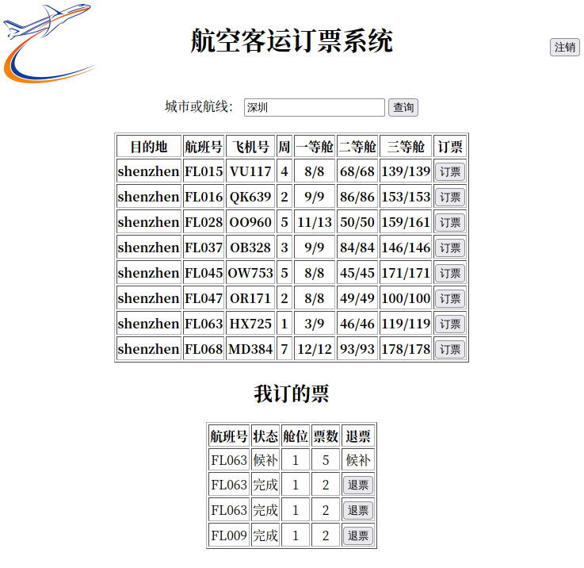

这里我们退掉 FL063 的一个一等舱两张票的订单，则状态变为：

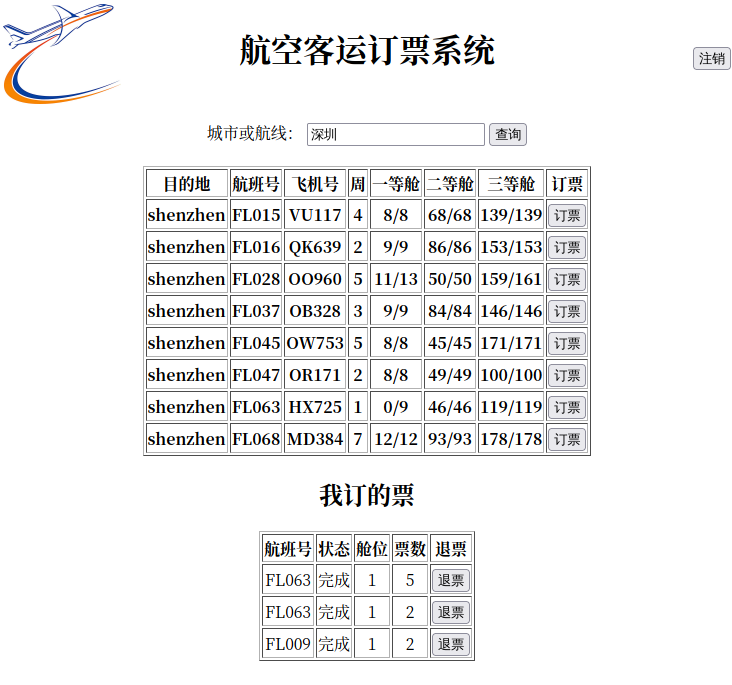

### 管理员操作

管理员查询已经在 [管理员操作](#管理员操作) 中演示过。这里不再重复。这里演示保存文件功能。

发送 POST 请求：

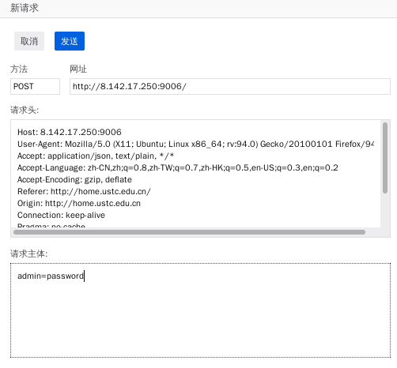


观察前后文件的变化。

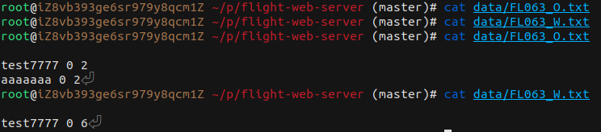

## 实验总结

### 收获

#### 队列和链表

加深了对这两种数据结构的认识（~~实际是写链表用 auto 用的很爽~~）

#### 网络通信

本次实验对 C++ WebServer 进行了源码修改，基本了解清楚了一次 HTTP 通信的请求及响应部分如何组成，也对线程池等概念有了初步认识（~~虽然本航空订票系统并没有这么复杂，且由于互斥锁作用范围比较大可能基本辜负了原来服务器程序这么多优化~~）

### 不足

#### 类耦合过度

本实验中用户类和航班类耦合得太深，很遗憾截止实验报告完成，还没有想出一个能优雅地分离这两个类的方法。主要原因在于每个订单结点需要同时出现在用户的订票链表和航班的订票链表中。

这样做就导致有些类的方法调用实现的不是很自然，例如对于订票操作，Ticket 类并不能按照直觉调用 Flight 和 Passenger 类的 Book 方法，而必须调用 FLight 的 Book 方法，再由 FLight 的 Book 方法调用对应 Passenger 的 Book 方法，插入订单结点。

#### 前端界面

前端写的比较糙，表格对移动端适配的不是很好，或许有机会应该试试直接用 `div` 块级元素布局。

## 附录

```
.
├── back-end				// 后端
│   ├── build				// 编译
│   │   └── Makefile
│   ├── code				// 后端代码
│   │   ├── buffer			// 服务器相关代码
│   │   ├── http			// 服务器相关代码
│   │   ├── log				// 服务器相关代码
│   │   ├── main.cpp		// 服务器相关代码
│   │   ├── pool			// 服务器相关代码
│   │   ├── server			// 服务器相关代码
│   │   ├── timer
│   │   └── ticket			// 订票系统
│   │       ├── mqueue.h	// 队列模板
│   │       ├── flight.h	// 航班，用户类
│   │       ├── flight.cpp
│   │       ├── ticket.h	// 订票系统类
│   │       └── ticket.cpp
│   ├── data				// 订票系统数据文件
│   │   ├── flights.txt
│   │   └── users.txt
│   └── Makefile
└── front-end				// 前端文件
    ├── axios.min.js		// 接口请求
    ├── index.html			// 主 html 文件
    ├── logo.png			// logo
    ├── main.css			// 主 css 文件
    ├── main.js				// 主 js 文件
    └── pinyin.js			// 汉字转拼音

```
