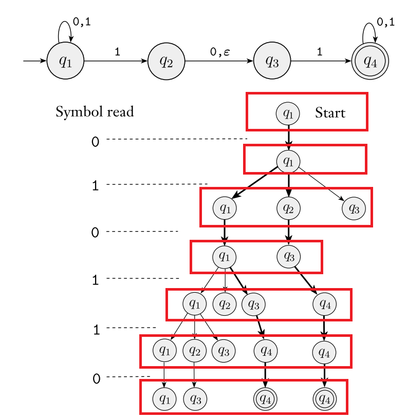

这学期（2025 春）在上《形式语言与计算复杂性》课程（COMP6106P01）。黄文超老师授课时细节讲述的非常严谨认真，我听课时也产生了一些有趣的（可能上课没有讲到的）直观想法（以及一些私货），所以写一些笔记作为记录。

<!-- more -->

## 绪论

### 课程概述

作为本文开头，还是对这门课程做一个概述。本门课程实际是计算理论的一个入门。计算理论关心的是，给定一个计算模型（比如我们的计算机），我们能够用这个模型解决什么问题，以及这些问题的解决方案的复杂性如何。

解决问题的复杂性可以用时间复杂度等手段描述，这就是 complexity 关心的事情。研究复杂度的好处我们已经在上学期的《算法设计与分析》课程学到。如果一个问题是 NPC：

- 那你应该知道它很难，可以不用花时间再去尝试设计一个多项式时间的算法了。
- 你可以借鉴已有的 NPC 问题的近似算法，设计一个实践中可接受的算法。

然而，并非所有的问题都可以用我们的电脑解决，一些问题在理论上就是不可计算的（无法设计一个算法能在有限时间内解决）。这就又带来两件事情：

- 我们的电脑对应的计算模型（图灵机），到底能解决什么问题？
- 其他的计算模型呢？有没有更弱或者更强的计算模型，使得解决的问题集合不同？分别能解决什么问题？

关心我们的电脑能解决什么问题很重要。本门课程先从一些更弱的计算模型（被形式化为自动机，如 DFA，PDA）开始，先研究这些自动机能解决什么问题，然后再研究图灵机。

### Terminology 与类型

定义了一些基本概念：

>  - Set
>  - Sequences and Tuples
>  - Functions and Relations
>  - Graphs
>  - Strings and Languages
>  - Boolean Logic

这里有趣的是它们基本都是构造性的。比如：

$$
G = (\{1, 2, 3, 4, 5\}, \{(1, 2),(2, 3),(3, 4),(4, 5),(5, 1)\})
$$

这件事情可以写成：

```typescript
type Node = number
type Edge = [Node, Node] // 表示 tuple
type Graph = [Set<Node>, Set<Edge>]

const nodes = new Set([1, 2, 3, 4, 5])
const edges = new Set([
  [1, 2],
  [2, 3],
  [3, 4],
  [4, 5],
  [5, 1]
])
const G: Graph = [nodes, edges]
console.log(G)
```

这里数学对象的定义和程序中的对象对应得很好。数学对象的类型在程序语言中也有对应的类型。

在后面的课程中，使用类型的观点来看待数学对象也会使得理解更加容易。这是因为我们后续会研究一些复杂的对象，比如“所有正则语言的集合”，然而某个正则语言本身又是一个字符串的集合。为了区分开这些不同层次的对象，**可以采用类型的方式来区分**。例如，某个正则语言就是一个 `Set<string>`，而“所有正则语言的集合”就是 `Set<Set<string>>`。

明确了这些对象的类型，我们就可以**更好地理解这些对象具备的操作**。还是以正则语言为例。既然正则语言是一个 `Set`，那它自然就具备集合的操作，比如并集、交集、补集等。在正则语言一节我们就要研究并集操作（其他操作也有其意义，比如 [Brzozowski derivative](https://en.wikipedia.org/wiki/Brzozowski_derivative)）。并且我们根据集合论的直觉就知道，两个正则语言的并集定义应该是：

```typescript
function union(L1: Set<string>, L2: Set<string>): Set<string> {
  return new Set([...L1, ...L2])
}
// union({'a', 'b'}, {'b', 'c'}) = {'a', 'b', 'c'}
console.log(union(new Set(['a', 'b']), new Set(['b', 'c'])))
```

> 本门课程之外，类型在编程中还有更多的作用，和更多数学上的对应。例如本文用来举例的 TypeScript 就支持 [Algebraic Data Types](https://en.wikipedia.org/wiki/Algebraic_data_type)，可以实现类型之间的并集、笛卡尔积等操作。此时可以把某个类型看成一类对象的集合。

## 正则语言

### 总结

研究自动机能解决什么问题，就是要研究自动机能接受什么语言。这一节我们研究了有限状态自动机。

- 我们把 DFA 能解决的问题（接受的语言）称为正则语言；
- 这样就把有限状态自动机能力的边界转换为了正则语言表达能力的边界；
- 我们定义了正则表达式，它从 $\{\}, \{\varepsilon\}, \{a\}\ (a \in \Sigma)$ 出发，通过正则表达式的运算（并、串接、闭包）递归定义：
  - 一方面证明正则表达式表达的语言都是正则语言；
  - 另一方面证明正则语言都可以用正则表达式表达；
  - 这就说明正则表达式和正则语言的等价。
- 结论：DFA 的能力和正则表达式的能力是等价的。

用正则表达式描述 DFA 的能力，好处是更加直观，也更加方便我们研究。例如，有了这个描述，我们要判断 DFA 能不能解决某个 decision problem，就只要判断这个问题的语言是不是正则语言，或者能不能用正则表达式描述。

> 这里的 decision problem 要求是判断某个 `string` 在不在一个特定的 `Set<string>` 中。虽然看起来约束很强，但往往我们都能将其他的 decision problem 归约到这种形式。而更一般地，其他 search problem 和 optimization problem 又常常可以归约到 decision problem。所以这里研究 decision problem 是很有意义的。

主线已经清晰，补充一些细节。

### 正则操作 - 并

正则操作就是正则表达式的构造过程（或者叫构造子）。现在要干的事情是：

> 说明正则表达式能够表达的语言都是正则语言；

递归证明，只要说明正则操作应用在正则语言上是封闭的。这就是证明封闭的动机。

并集操作对于语言如下定义：

$$
L_1 \cup L_2 = \{x \mid x \in L_1 \text{ or } x \in L_2\}
$$

证明的核心思路我们已经有了识别 $L_1$ 和 $L_2$ 的 DFA，那么我们可以让它们**同时运行**，只要有一个接受，那么 $x$ 就在 $L_1 \cup L_2$ 中。

因为要同时运行，所以新的 DFA 的状态要同时保存两个 DFA 的状态。这样的状态可以通过直积构造：$Q = Q_1 \times Q_2$，转移函数 $\delta((q_1, q_2), a) = (\delta_1(q_1, a), \delta_2(q_2, a))$ 等显然。

### 正则操作 - 连接和闭包

现在要证明连接和闭包操作在正则语言上也封闭：

$$
\begin{align*}
L_1 \cdot L_2 &= \{xy \mid x \in L_1, y \in L_2\}\\
L_1^* &= \{x_1x_2\cdots x_k \mid k \ge 0, x_i \in L_1\}
\end{align*}
$$

这里要开的支线就比较大了。我们不好直接构造出 DFA 来证明，因此采用的策略是引入一个比 DFA 更强的 NFA，证明已知 $L_1$ 和 $L_2$ 对应的 DFA（那它们自然也是 NFA），我们可以构造出 $L_1 \cdot L_2$ 和 $L_1^*$ 对应的 NFA，再把 NFA 转换到 DFA，就完成了构造。

这里定义好后需要注意一个记号的问题，那就是 $\{\}$ 和 $\{\varepsilon\}$ 的区别。$\{\}$ 表示空集，而 $\{\varepsilon\}$ 表示只有空串的集合。按照集合演算，自然可以理解下面的结果：

$$
\begin{align*}
\{1\}^*\{\varepsilon\} &= \{1\}^*\\
\{1\}^*\{\} &= \{\}\\
\{\}^* &= \{\varepsilon\}
\end{align*}
$$

### NFA to DFA

课程的算法把 NFA 分成两类，分别讨论了存在 $\varepsilon$-transition 和不存在 $\varepsilon$-transition 的情况。这里的观察是我们可以看图简单理解这个算法：



NFA 可以看成数个（进程？）同时在活跃。假设 NFA 有 $N$ 个状态。

注意到，某个时刻，如果两个 NFA 进程处在相同的状态，那么它们的后续演变是完全一致的，我们就可以把它们合并。那么图中的每一层只要用 `Set<State_of_NFA>` 就可以表示，这个 `Set` 是 NFA 的状态集的幂集的一个元素，取值个数显然是有限的，所以可以对应到 DFA 的状态。

可以想象，NFA 在运行过程中，其不确定性体现在每次可能会发生分裂。然而如何分裂却是确定的，所以我们可以用当前 NFA 所有能到达的状态来作为 DFA 的状态，并进行转移。

### DFA to Regexp

这里我们说明：

> 另一方面，说明所有正则语言都可以用正则表达式描述；

那只要给出 DFA 到正则表达式的转换算法就可以了。上课的算法是引入 GNFA，然后消除状态的算法。这里的观察是，我们可以不采用 GNFA。

> 完整的想法可以参考 [Brzozowski algebraic method](https://cs.stackexchange.com/a/2392)，下面给出一个直观的理解。

将 DFA 的所有状态标号为 $1, 2, \cdots, n$，那么我们可以令 `R[k][i][j]` 表示一个能判定所有从 $i$ 状态到 $j$ 状态，并且中间经过结点（不包括 $i$ 和 $j$）的下标最大为 $k$ 的正则表达式。

按照定义：

$$
R[0][i][j] = \bigcup_{a \in \Sigma, \delta(i, a) = j} a
$$

递推关系：

$$
R[k][i][j] = R[k-1][i][j] \cup (R[k-1][i][k] \cdot R[k-1][k][k]^{*} \cdot R[k-1][k][j])
$$

换言之，我们每次在 `R[k-1][i][j]` 的基础上，松弛新加入的状态机结点 $k$。

这样，最终的正则表达式：

$$
R = \bigcup_{j \in F} R[n][q_0][j]
$$

显然每一步都是正则表达式的并、串接、闭包操作，所以最终的结果也是正则表达式。

### 非正则语言

这一部分是想举例说明什么样的语言不是正则语言，并且证明。比如 $B = \{a^n b^n \mid n \ge 0\}$。

稍微思考一下这个问题会发现，这个语言的特点是 $a$ 和 $b$ 的数量是相等的。然而 DFA 状态是有限的，所以这里有个非常简单的证明：

假设存在一个能接受 $B$ 的 DFA，状态数为 $n$。我们投喂给它一个 $aaa...$ 的前缀。假设投喂完 $k$ 个 $a$ 后，DFA 的状态是 $q_k$。当 $k = n$ 时，连同初始状态 $q_0$，DFA 一共经过了 $n+1$ 个状态，那么必然存在两个状态相同，也就是存在 $i < j \leq n$，使得 $q_i = q_j$。

这就出现了矛盾：

- 因为 $q_i$ 由投喂 $i$ 个 $a$ 得到，所以再投喂 $i$ 个 $b$ 就应该转移到接受状态；
- 但是因为 $q_i = q_j$，所以再投喂 $i$ 个 $b$ 不足以转移到接受状态。

这就说明不存在接受 $B$ 的 DFA，所以 $B$ 不是正则语言。

### pumping lemma

> 上课的思路是先给出 pumping lemma 的结论，然后再证明。但这么做不太直观，所以这里展示怎么在不知道 pumping lemma 的情况下推导出它。

把上面所说的证明过程一般化：

假设 $A$ 是一个正则语言，它的 DFA 状态数为 $n$。则任意 $s \in A$，如果 $|s| \ge n$，则自动机在被投喂前 $n$ 个字符后经过了 $n+1$ 个状态。根据抽屉原理可设 $q_i = q_j (i < j \leq n)$。

$i$ 和 $j$ 作为字符串下标，我们把 $s$ 分成三部分：$s = xyz$：

- $x = s[0: i]$；
- $y = s[i: j]$；
- $z = s[j: n]$。

由 $s \in A$ 得 $\forall k \ge 0, xy^kz \in A$。

结论（pumping lemma）：如果 $A$ 是正则语言，它的 DFA 状态数为 $n$，则任意 $s \in A, |s| \ge n$，都有 $s$ 可以被分成三部分 $xyz$，满足 $|xy| \leq n$，$|y| \ge 1$，且 $\forall k \ge 0, xy^kz \in A$。

> $|xy| \leq n$ 和 $|y| \ge 1$ 等价于 $i < j \leq n$。

可以试着用 pumping lemma 来说明上一节的 $B$ 不是正则语言。只需要取出一个 $s = a^nb^n = xyz$，因为 $|xy| \leq n$，所以 $y$ 中只包含 $a$，那么 $xy^2z$ 中 $a$ 的数量会超过 $b$ 的数量，所以不在 $B$ 中，矛盾。

## 上下文无关语言

### 总结

在正则语言中，我们考虑了机器 DFA 和它接受的语言正则语言，并且把正则表达式和正则语言等价。

然而这一节，我们先介绍一种能生成语言的文法：上下文无关文法（CFG）。我们定义它能生成的语言就是上下文无关语言（CFL）。然后再给出机器 PDA，最后说明 PDA 能接受的语言和 CFL 的等价。

### Ambiguity

前面 CFG 的一些定义没什么问题，略过。

这里讨论了 CFG 的二义性问题，例如对于：

$$
S \to S + S \mid S \times S \mid a
$$

则 $a + a \times a$ 有两种解析方式。这里的解析方式指的是语法树的差别（根结点是作为一个乘法结点还是加法结点，这会带来语义上的不同），而无关推导时先展开哪个产生式，所以定义了最左推导的概念，明确二义性指的是语法树不唯一。

### Chomsky Normal Form

CNF（Chomsky Normal Form）是 CFG 的一个规范（暂译）形式。这一章暂时没用，但 Decidability 和 Time Complexity 的讨论会用到。它只允许下面的产生式：

$$
\begin{align*}
A &\to BC\ (A, B, C \in V, B \neq S, C \neq S)\\
A &\to a\ (a \in \Sigma) \\
S &\to \varepsilon
\end{align*}
$$


为了把任意的 CFG 规范到 CNF，需要对原来的产生式进行变换。需要特别注意，我们现在要对产生式本身操作，所以下文用 $u$ 和 $v$ 表示 **产生式中的字符串**，而非 CFG 的终结符。举例，对产生式 $A \to abABab$，如果写成 $A \to uBv$，那么 $u = abA, v = ab$。

这里需要一个观察。对于 $A \to u$，$|u| \ge 2$，转换到 CNF 是 trivial 的。设 $|u|=k$，记 $u=u_1u_2\cdots u_k$，那么我们可以构造 $A \to u_1A_1, A_1 \to u_2A_2, \cdots, A_{k-2} \to u_{k-1}u_k$。如果 $u_i$ 是非终结符，那对应的产生式自然符合 CNF；如果 $u_i$ 是终结符，那么我们可以替换 $A_i \to U_iA_{i+1}, U_i \to u_i$，这样也符合 CNF。

那么我们只要特别处理 $|u|<2$ 的情况。分类，$|u|=0$ 就是 $\varepsilon$ 产生式，$|u|=1$ 且不符合 CNF 的情况就是 $A \to B$。所以要先消去这两类产生式。

> 注意产生式的形式化定义就是一个元组 $(\alpha, \beta)$，其中 $\alpha$ 是非终结符，$\beta$ 是字符串。$\beta \in (V \cup \Sigma)^{*}$，所以 $\beta$ 可以是空串，此时记作 $\alpha \to \varepsilon$。所以尽管 $\varepsilon \notin \Sigma$，但是 $\varepsilon$ 产生式是合法的。

具体细节：

- 起始变量 $S$ 不允许出现在右部。所以补充新的起始变量 $S' \to S$；
- 消除 $A \to \varepsilon$。我们想把这个产生式消除，就要把 $\varepsilon$ 传播掉。需要传播的产生式一定是 $A$ 在右侧。考虑 **所有** 的 $R \to uAv$：
  - 消除 $A \to \varepsilon$；
  - 若 $u$ 或 $v$ 不是空串，则 **增加** $R \to uv$；
  - 若 $u$ 和 $v$ 都是空串，则 **增加** $R \to \varepsilon$，除非 $R \to \varepsilon$ 已经被消除过；
  - 直到没有 $\varepsilon$ 产生式为止；
- 消除 $A \to B$。这次的思路是把 $B$ 短路掉。考虑 **所有** 的 $B \to u$：
  - 消除 $A \to B$；
  - **增加** $A \to u$，除非 $A \to u$ 已经被消除过（例如 $u = C$，但之前消除过 $A \to C$）；
  - 直到没有 $A \to B$ 产生式为止；
- 此时任意产生式 $A \to u$，$|u| \ge 2$。转换到 CNF 是 trivial 的。

### PDA

给 DFA 拓展上了栈。显然栈也要有一个字母表 $\Gamma$，这里的字母表是栈的字母表。

PDA 在状态转移的同时，还会对栈进行操作。

状态转移函数有两种记法：

- $\delta: Q \times (\Sigma \cup \{\varepsilon\}) \times \Gamma \to 2^{Q \times \Gamma^{*}}$
- $\delta: Q \times (\Sigma \cup \{\varepsilon\}) \times (\Gamma \cup \{\varepsilon\}) \to 2^{Q \times (\Gamma \cup \{\varepsilon\})}$

课本上是第二种，但实际上第一种更加自然（我没有考证出处，下文称为 Wiki 记法）。先讲解课本的形式：

- $\Sigma \cup \{\varepsilon\}$ 意味着某一时刻，可以选择读入一个字符，也可以不读入字符；
- $\Gamma \cup \{\varepsilon\}$ 意味着某一时刻，可以读取栈顶元素（新的状态是 $2^{Q \times (\Gamma \cup \{\varepsilon\})}$ 的元素，所以这里栈操作可以同时有两种：更新栈顶元素，栈顶元素出栈）；也可以不读取（同理此时栈操作有两种：不变，压栈）。

其中 $\Sigma \cup \{\varepsilon\}$ 带来的不确定性是我们后面会反复体会到的。然而 $\Gamma \cup \{\varepsilon\}$ 未必需要：

- 可以给栈一个初始的 $Z \in \Gamma$，这样就可以保证栈不为空；
- 不读取栈顶元素时的操作可以合并到读取时的操作中。这里的观察是，上述四种操作，我们都可以统一成先将栈顶的 $A$ **弹出**，再 **压入** $u \in \Gamma^{*}$。
  - 更新栈顶元素就是把 $A$ 弹出压入 $u=B$；
  - 栈顶元素出栈就是把 $A$ 弹出压入 $u=\varepsilon$。
  - 不读取时的栈顶元素不变，就是对任意 $A \in \Gamma$，把 $A$ 弹出压入 $u=A$；
  - 不读取时的栈顶元素压栈，就是对任意 $A \in \Gamma$，把 $A$ 弹出压入 $u=AB$（假设栈从左到右增长）。

所以你会发现这个书上记法确实 taste 不好，更新栈有更自然的表达方式。当然你也会发现更改成 Wiki 记法后 PDA 看起来更强了一点，因为可以一次压入多个符号了。但显然同样的事情第一种记法也能做到，只是需要多次转移，所以能力上是等价的。

### PDA 和 CFG 的等价

说明等价性，一方面是给出 CFG，要构造一台 PDA。和编译原理的 LL parser 很类似，只不过 PDA 更强，可以同时展开多条分支：

- 压入 $Z$；
- 压入 CFG 的起始变量 $S$；
- 重复 **弹出** 栈顶元素：
  - 若拿到 $A$，那么非确定性地替换成它所有的产生式 **压入**；
  - 若拿到 $a$，读取输入。若不匹配，就失败；否则继续。
- 如果已读入所有输入串，且栈为 $Z$，那么接受。

你可以发现用上文提到的 Wiki 记法表达起来很容易。当然考试需要按照书上的记法 (๑･▱･๑)

另一方面是给出 PDA，要构造出 CFG。需要初始先对 PDA 做一些调整，我们会在遇到时说明。

注意本文 DFA2Re 的算法是给出了一个拓展，能给出 DFA 任意两个状态间的正则表达式。这里也是类似的，对于任意 $p, q \in Q$，我们指派一个变量 $A_{pq}$，我们希望它表示（也就是能派生且仅能派生出）从 $p$ 到 $q$（这里额外要求开始和结束时栈为空）的所有字符串。这样一来，变量 $A_{q_0, q_{\text{accept}}}$ 就是我们要的 CFG 的开始变量。

> 调整一：需要调整 PDA，使得它只有一个接受状态 $q_{\text{accept}}$。我们可以把所有原有的接受状态都连到 $q_{\text{accept}}$ 实现。

> 调整二：需要确保到达 $q_{\text{accept}}$ 前栈为空。 

具体思路：

- 构造出 $A_{pq}$ 满足的一系列产生式；
- 证明 $A_{pq}$ 派生的字符串都能让 PDA 从 $p$（空栈）到 $q$ 转移（空栈）。
- 证明如果一个字符串能让 PDA 从 $p$（空栈）到 $q$ 转移（空栈），那么它一定能由 $A_{pq}$ 派生。

构造如下：

- $A_{pp} \to \varepsilon$；
- $A_{pq} \to A_{pr}A_{rq}$；
- $A_{pq} \to aA_{rs}b$。

第一条是平凡的。后两条是从 $p$ 到 $q$ 的第一个入栈符号 $u$ 出栈时机考虑的。

如果 $u$ 中间就出栈了，意味着中间栈就空了，那么自然能拆分出子问题。我们枚举所有的 $p, q, r$，添加上这样的产生式。

如果 $u$ 中间没出栈，枚举所有的 $a, b \in \Sigma_{\varepsilon}$, $r, s \in Q$，如果确实有 $(r, u) \in \delta(p, a, \varepsilon)$，$(q, \varepsilon) \in \delta(s, b, u)$，那么我们就添加上这样的产生式。

> 调整三：需要确保 PDA 的每次转移要么入栈一个符号，要么出栈一个符号。这样可以确保 $u$ 存在，也可以将转移操作和入栈/出栈操作对应起来，方便下面的归纳证明。

下面进行等价性证明：

> 证明 $A_{pq}$ 派生的字符串都能让 PDA 从 $p$（空栈）到 $q$ 转移（空栈）。

归纳证明。如果是一步派生，显然只有 $\varepsilon$，是成立的。之后对派生步数（推导次数）做归纳。显然当推导次数 $k > 1$ 时，第一步推导要么是 $A_{pr}A_{rq}$，要么是 $aA_{rs}b$，都可以应用归纳假设。

> 证明如果一个字符串能让 PDA 从 $p$（空栈）到 $q$ 转移（空栈），那么它一定能由 $A_{pq}$ 派生。

归纳证明。这次是对转移次数归纳。如果 $0$ 步转移，那么就是 $\varepsilon$，是成立的。之后做归纳。第一步转移（必然是入栈）的符号要么中间就被弹出，要么直到最后才被弹出，都可以把字符串拆分，应用归纳假设。

### 非上下文无关语言

这里的直觉是，如果一个上下文无关语言能接受任意长度的字符串，那么在一定长度后，为了接受这个字符串，一定有某个产生式的推导过程中又推导了出了自己（递归）。

我们先对这个长度有个直觉的感受。对于没有递归的情况：

$$
\begin{align*}
A &\to BB\\
B &\to CC\\
C &\to DD\\
D &\to d
\end{align*}
$$

它的增长速度是 $2^n$。但显然，没有递归的话我们总是能把长度 bound 住。所以我们认为，存在一个 pumping length，对于长度超过 $p$ 的字符串，一定有某个产生式的推导过程中又推导了出了自己。当然这里不仅要递归，而且要求递归至少增加了某个字符，也就是 $R \to uRv, |uv| > 0$。

可以假设，中间递归的产生式类似 $R\to uRv \mid x$（递归可能不会直接出现，而是间接的，这里并不是严格的证明）。那么有最内部 $uxv$ 无递归，$|uxv| \leq p$。

把上面的思路整理一下就是 CFG 的 pumping lemma：

> 如果 $A$ 是一个上下文无关语言，那么存在一个 pumping length $p$，对于任意 $s \in A, |s| \ge p$，都存在 $s = uvxyz$，满足 $|vxy| \le p, |vy| > 0$，且 $\forall k \ge 0, uv^kxy^kz \in A$。

### DPDA、DCFL

我又要再黑一遍书上的 PDA 记法了，根据书上的定义，需要下面四个转移函数结果只有一个不为空（否则有不确定性）：

$$
\delta(q, a, x), \delta(q, a, \varepsilon), \delta(q, \varepsilon, x), \delta(q, \varepsilon, \varepsilon)
$$

换成 Wiki 记法的话，就是要求：

$$
\delta(q, a, x), \delta(q, \varepsilon, x)
$$

中只有一个不为空。

## 丘奇-图灵论题

### 图灵机

理解定义：

- 把 PDA 的栈拓展为 **无限** 的纸带（内存）；
- 相对 PDA，输入字符串被放在纸带上，而不是顺次读入。初始时纸带上只有输入字符串，其余部分是空白字符 $\sqcup \notin \Sigma$, $\sqcup \in \Gamma$, $\Sigma \subseteq \Gamma$；
- $\delta: Q \times \Gamma \to Q \times \Gamma \times \{L, R\}$，每次根据当前状态和纸带上的字符，决定下一步的状态、写入的字符、磁头移动方向（要么向左要么向右移动一格）；
- $q_0$ 是初始状态，$q_{\text{accept}}$ 是接受状态，$q_{\text{reject}}$ 是拒绝状态。

> *[Advice to a Beginning Graduate Student](https://www.cs.cmu.edu/~mblum/research/pdf/grad.html)*
> STUDYING:
> You are all computer scientists.
> You know what FINITE AUTOMATA can do.
> You know what TURING MACHINES can do.
> For example, Finite Automata can add but not multiply.
> Turing Machines can compute any computable function.
> Turing machines are incredibly more powerful than Finite Automata.
> Yet the only difference between a FA and a TM is that
> the TM, unlike the FA, has paper and pencil.
> Think about it.
> It tells you something about the power of writing.
> Without writing, you are reduced to a finite automaton.
> With writing you have the extraordinary power of a Turing machine.

Configuration（格局/配置）指明了图灵机当前的（运行）状态。它由当前状态、纸带内容、纸带上的读写头位置组成。

- 自动机都可以有这样的配置，例如 PDA 的一个配置由当前状态、栈内容、剩余的输入串组成；
- 因为图灵机计算能力相当于通用计算机（除开无限纸带），所以我们可以把每台图灵机都看成一个程序，带有某个具体配置（运行状态）的图灵机看成一个进程。

图灵机不保证能进入 $q_{\text{accept}}$ 或 $q_{\text{reject}}$。换言之，图灵机的运行结果有三种：接受、拒绝、循环（不停机）。

不停机可以被形式化为不存在这样的 $n$，使得图灵机在 $n$ 步转移后进入 $q_{\text{accept}}$ 或 $q_{\text{reject}}$。当我们谈论图灵机 **循环** 时，就是在说不停机。

一个方向是，我们只考虑要么输出接受，要么输出拒绝的图灵机。这样的图灵机被称为 **Deciders**。每个 Decider 可以 decide 对应的语言。如果一个语言 $L$ 能被某个 Decider decide，那么 $L$ 是 **decidable**（或 **Turing-decidable**）的。

另一个方向是，对于某个图灵机 $M$，它所接受的字符串也构成一个语言。称这个语言能被 $M$ recognize（识别），记作 $L(M)$。

如果一个语言 $L$ 能被某个图灵机 recognize，那么 $L$ 是 **Turing-recognizable** 的。

根据定义，显然有所有 decidable 的语言都是 Turing-recognizable 的，反之则不一定。下一章将会具体讨论 Turing-recognizable 但不 decidable 的语言。

### 图灵机变种

这一节我们先介绍多纸带图灵机和非确定性图灵机。它们看似是对图灵机的拓展，但我们会证明图灵机可以 **模拟** 它们，所以它们的能力和图灵机是等价的。

这里有一个细节的问题，那就是机器的等价是通过两个机器 recognize 的语言相同来定义，因为 recognize 相比较 decide 更具有一般性。然而我们将看到，我们的构造过程也能用来说明，如果一个多纸带图灵机/非确定性图灵机能 decide 某个语言，那么对应的图灵机也能 decide 这个语言。

换言之，我们最后能同时得到关于 Turing-recognizable 和 Turing-decidable 的结论。以非确定性图灵机为例：

- $L$ is Turing-recognizable $\iff$ 某个非确定性图灵机 recognizes $L$；
- $L$ is Turing-decidable $\iff$ 某个非确定性图灵机 decides $L$。

前者对应图灵机，后者对应其他计算模型（这里的例子是对图灵机的某种拓展）。这就说明它们的能力是等价的。

简单介绍模拟过程。

多纸带图灵机：允许图灵机同时操作多条纸带。同时显然应该允许磁头不变，否则就是简单的状态笛卡尔积无实际意义。模拟思路就是在图灵机的纸带上引入分隔符号，这样就可以同时保存多条纸带，然后模拟多纸带图灵机的转移函数。需要注意如果增长到分隔符号所处位置，就要把分隔符号和后面的内容一起向右移动一格。这样就能模拟多纸带图灵机了。

非确定性图灵机：允许图灵机在某个时刻有多个转移。这样一来就形成一个状态树，任务就是搜索状态树上有没有 $q_{\text{accept}}$。我们可以用 BFS。这里比较节约的实现是，用一个纸带保存初始输入、一个纸带保存当前所在状态树结点的路径、一个纸带用于模拟当前结点对应的非确定性图灵机的状态。这样，我们只需要从短到长遍历所有路径，直到找到 $q_{\text{accept}}$。

同理，我们还可以模拟 enumerator。这是一个能输出字符串的图灵机，它可能会一直输出，也可能会停下来。它输出的所有字符串的集合称为它枚举的语言。可以证明它枚举的语言和图灵机识别的语言是等价的。

### 算法的定义

我们还可以再考虑很多计算模型，但是最终会惊奇地发现，只要这些计算模型满足一定的要求（例如一步只能做有限的工作），那么它们都能被图灵机模拟。换言之，在一种机器上能实现的算法，在另外一种机器上也应当能实现（考虑上文关于 decidable 的表达）。

> 丘奇-图灵论题就是在说，任何「通过直观的有效方法进行的计算」，都能被某个图灵机或者等价的计算模型模拟。这个问题无法被正式证明，因为它的表述本来就不形式化。但我们相信这一点。这个论题是在丘奇提出的 lambda calculus 被证明和图灵机等价后提出的。并且那时人们也发现，它们的计算能力和 μ-递归函数也是等价的。

既然我们已经相信了这个论题，那么我们在研究 **算法（某个机器能做成的事情）** 时，就可以可靠的 **把图灵机作为一个算法实现的模型** 使用，因为我们相信它已经足够强大。

当然，很多时候我们不想直接描述图灵机的具体所有状态和转移，这样低层次的编程很折磨。所以我们抽象出更多的描述层次：

- formal description: 严格定义图灵机的状态和转移函数等；
- implementation description：使用自然语言描述图灵机怎么移动磁头、读写纸带；
- high-level description：使用自然语言描述算法的步骤。

每一个层次的描述都不需要关注更底层的细节。书上给出了一个判断图联通性的算法的例子，给出了它的 high-level description 和一些 implementation description，并且介绍了一些书写约定。例如 high-level description 可将输入 **对象** $O_1, O_2, \dots, O_k$ **编码** 成 **字符串** $\langle O_1, O_2, \dots, O_k \rangle$，按照不同 stage 描述算法。

## 可判定性

Decidability 显然是一个很有用的性质，它告诉我们某个问题能不能被设计一个总是给出正确的 yes-or-no 答案的算法。如果一个问题不可判定，那么就该考虑近似或者概率性算法了，或者把问题简化。它直观的告诉了我们什么样的问题是计算上可行的。

从另一个角度考虑，假设语言 $L$ 不是 decidable 的，那么 $L$ 和 $\overline{L}$ 中至少有一个不是 Turing-recognizable 的，证明略。换言之，给定一个不可判定的语言，我们就能构造出一个不图灵可识别的语言。所以研究可判定性很有意义。

> 这里可以引入 co-Turing-recognizable 的概念。定义 $L$ 是 co-Turing-recognizable 的，如果 $\overline{L}$ 是 Turing-recognizable 的。显然 $L$ 是 decidable 当且仅当 $L$ 既是 Turing-recognizable 又是 co-Turing-recognizable 的。

### 可判定的语言

$A_{DFA}, A_{NFA}, A_{REX}, A_{CFG}$

可以先从一般性的角度理解。如果说某个“机器” $M$ 能决定一个语言 $L$，这意味着存在一个算法（或者说决策过程），它对任意输入字符串 $w$ 都能在有限时间内正确回答 "$w \in L$" 或 "$w \notin L$" 的问题。换句话说，$M$ 总是停止并给出一个明确答案。

而图灵机作为通用计算模型，能够模拟任何这种决策过程。也就是说，给定一个能决定某语言的机器 $M$ 和一个字符串 $w$，我们可以构造一个图灵机 $T$ 来模拟 $M$ 的决策过程。由于 $M$ 总是会停机（即总是作出决定），图灵机 $T$ 也能在有限时间内停机并给出正确答案。例如图灵机可以模拟 DFA 的状态转移过程，所以 $A_{DFA}$ 是可判定的。

需要注意的是，虽然 DFA 作为确定性机器可以决定某个语言，但是 NFA 本身并不能：它可以一直进行 $\varepsilon$ 转移而不停止。然而在前面的章节我们并没有考虑停机性，这是因为 NFA 总是可以被转换成一个等价的 DFA，而 DFA 可以决定语言。这就是书上证明 $A_{NFA}$ 可判定的思路。正则表达式可以被转换为等价的 NFA，所以 $A_{REX}$ 也是可判定的。

PDA 也有 $\varepsilon$ 转移，所以无法直接说明 $A_{CFG}$ 可判定。这里就用「上下文无关语言」一章提到的 Chomsky Normal Form 来说明。我们可以把任意 CFG 转换成 CNF。而 CNF 对于长度为 $n$ 的字符串一定是需要推导 $2n-1$ 步（除了 $n=0$ 可以简单考察是否有 $S \to \varepsilon$ 产生式）。这样我们就可以枚举所有 $2n-1$ 步的推导，检查是否能推导出 $s$。所以 $A_{CFG}$ 也是可判定的。

顺便得到一个简单的推论，每个上下文无关语言都是可判定的。

$E_{DFA}, E_{CFG}, EQ_{DFA}$

这里是一些技巧性的东西。

- $E_{DFA}$：给定一个 DFA $M$，判断它接受的语言是否为空。我们可以根据转移函数遍历所有状态，检查是否有接受状态可达；
- $E_{CFG}$：给定一个 CFG $G$，判断它生成的语言是否为空。这里类似 LR 分析，我们可以先标记所有的终结符可规约到，然后遍历所有产生式，逐步标记可规约到的非终结符，最后检查 $S$ 是否可规约到。

$EQ_{DFA}$：给定两个 DFA $A, B$，判断它们接受的语言是否相同。就是在问：

$$
L(C) = (L(A) \cap \overline{L(B)}) \cup (\overline{L(A)} \cap L(B))
$$

是否为空。只要说明正则语言对交并补运算封闭，就得到 $L(C)$ 是正则语言，则根据 $E_{DFA}$ 可判定，$EQ_{DFA}$ 也是可判定的。

然而 $EQ_{CFG}$ 不可判定，将会在下一章证明。

### 不可判定性

我们首先给出不可判定语言的存在性证明，然后具体讨论一个不可判定的语言 $A_{TM}$。

存在性证明（这里对数学上的概念不再介绍）：

- 图灵机是可数的（每个图灵机都可以被编码）；
- 语言是不可数的；
- 则必然存在不 Turing-recognizable 的语言。

证明语言不可数可以使用 Cantor's diagonal argument。假设语言是可数的，那么就可以列出所有的语言 $L_1, L_2, \dots$。因为字符串是可数的，所以可以列出所有的字符串 $s_1, s_2, \dots$。我们可以构造一个新的语言 $L$，使得 $L$ 不在这个列表中。具体方法是，对于每个 $i$，如果 $s_i \in L_i$，那么 $s_i \notin L$；否则 $s_i \in L$。这样就构造出了一个不在列表中的语言，得到矛盾，所以语言是不可数的。

|    | s₁ | s₂ | s₃ | s₄ | ... |
|----|----|----|----|----|-----|
| L₁ | 0  | 0  | 1  | 1  | ... |
| L₂ | 0  | 1  | 0  | 1  | ... |
| L₃ | 1  | 1  | 1  | 0  | ... |
| L₄ | 0  | 0  | 1  | 0  | ... |
| ...| ...| ...| ...| ...| ... |

下面我们看 $A_\text{TM}$。显然它图灵可识别，接下来我们说明它不可判定。

这是因为如果 $A_\text{TM}$ 可判定，那么我们就可以构造出一台图灵机 $M$，使得：

$$
L(M) = \{ \langle T \rangle | T \text{ not accepts } \langle T \rangle \}
$$

> 注1：构造方法是取 $A_\text{TM}$ 的 decider，然后反转它的输出。

> 注2：实际上这个语言不仅不是 decidable 的，而且也不是 Turing-recognizable 的，所以这样的 $M$ 不存在。既然现在假设推导出它存在，那么就能进而推出矛盾。

> 注3：可以注意到这和罗素悖论的相似性。罗素悖论是构造了集合 $R = \{ x | x \text{ not in } x \}$，然后推导出 $R \in R \iff R \notin R$ 的矛盾。

因为 $L(M)$ 是 $M$ 所识别的语言，所以：

$$
\langle M \rangle \in L(M) \iff M \text{ accepts } \langle M \rangle
$$

然而根据 $L(M)$ 的集合定义：

$$
\langle M \rangle \in L(M) \iff M \text{ not accepts } \langle M \rangle
$$

这就推导出：

$$
M \text{ accepts } \langle M \rangle \iff M \text{ not accepts } \langle M \rangle
$$

矛盾。这样我们就证明了 $A_\text{TM}$ 是不可判定的。

> 注4：书上的证明思路是考察 $M(\langle M \rangle)$ 的值，这就是在问 $\langle M \rangle \in L(M)$ 是否成立。书上是分类讨论后利用上面给出的等价关系分别推导出矛盾，不过笔者更喜欢本文的写法，因为它更统一。

> 注5：根据上文 co-Turing-recognizable 处的定理，$\overline{A_\text{TM}}$ 不是图灵可识别的。

## 规约

> 说明：这一节课件相比书上漏了几个具体的例子，本文顺便补上。

$A_{TM}$ 不可判定是一个很有用的结论，我们可以用它来证明其他很多问题也是不可判定的。这里的基本手段是规约：如果我们要证明一个问题 $A$ 不可判定，只需要证明能判定问题 $A$ 的 decider 也能用来构造另一台图灵机，判定 $A_{TM}$ 即可。因为我们知道 $A_{TM}$ 是不可判定的，所以这样的 $A$ 的 decider 不可能存在，那么就证明了 $A$ 不可判定。

上面的过程就是把问题 $A_{TM}$ 归约到问题 $A$。规约意味着后者是一个更「难」，或者说更通用的问题，因此如果前者已经不可判定，那么后者也必然不可判定。

我们首先根据这个思路说明一些其他语言不可判定，再将这种「规约」看作一个定义在「语言」集合上的二元关系，形式化讨论。

### 语言理论中的不可判定问题

**$HALT_{\text{TM}}$ 不可判定：**

假设存在这样的 `HALT_TM_decider` 可以判定 $HALT_{\text{TM}}$:

```python
type TuringMachine = Callable[[str], Union[bool, None]]

def HALT_TM_decider(M: TuringMachine, w: str):
  if M(w) is not None:
    # M halts on w, M(w) is True or False
    return True
  else:
    return False
```

那么可以构造出 $A_\text{TM}$ 的 decider，但这不可能，所以矛盾：

```python
def A_TM_decider(M: TuringMachine, w: str):
  if HALT_TM_decider(M, w):
    return M(w)
  else:
    return False
```

**$E_{TM}$ 不可判定：**

假设存在这样的 `E_TM_decider` 可以判定 $E_{TM}$:

```python
def E_TM_decider(M: TuringMachine):
  if len(L(M)) == 0:
    return True
  else:
    return False
```

那么可以构造出 $A_\text{TM}$ 的 decider，但这不可能，所以矛盾：

```python
def A_TM_decider(M: TuringMachine, w: str):
  def new_M(x):
    if x == w:
      return M(x)
    else:
      return False
  return not E_TM_decider(new_M)
```

**$REGULAR_{TM}$ 不可判定：**

假设存在这样的 `REGULAR_TM_decider` 可以判定 $REGULAR_{TM}$:

```python
def REGULAR_TM_decider(M: TuringMachine):
  if L(M) is regular:
    return True
  else:
    return False
```

那么可以构造出 $A_\text{TM}$ 的 decider，但这不可能，所以矛盾：

```python
def A_TM_decider(M: TuringMachine, w: str):
  def new_M(x):
    if x matches 0^n1^n:
      return True
    else:
      return M(w)
  return REGULAR_TM_decider(new_M)
```

**$EQ_{TM}$ 不可判定：**

显然可以把 $E_{TM}$ 归约到 $EQ_{TM}$，略。

**$E_\text{LBA}$ 和 $ALL_\text{CFG}$ 不可判定：**

这两个语言的不可判定性同样需要从 $A_\text{TM}$ 规约。这里的技巧是 **计算历史** 法。原理是，确定性图灵机的格局转移可以被编码为 $C_1C_2\dots C_l$。要判定图灵机是否会接受某个字符串 $w$，只要判断给定该字符串后，是否存在对应的图灵机格局转移字符串，其中 $C_l$ 为接受状态即可。

给定一台图灵机和图灵机的输入 $w$，存在一台 LBA M，输入 $C_1C_2\dots C_l$，M 能判定这个计算历史是否是合法的初始输入为 $w$ 且最后转移到接受状态。对于这样的 LBA M，如果 $L(M)$ 为空，就说明没有这样的计算历史，进而说明图灵机不接受 $w$，反之则接受。因此 $A_\text{TM}$ 被规约到了 $E_\text{LBA}$，说明它不可判定。

类似地，给定一台图灵机和图灵机的输入 $w$，我们可以构造一个 CFG G，G 生成的语言是所有字符串，但除了合法的接受 $w$ 的计算历史。换言之，如果图灵机接受 $w$，那么对应的计算历史字符串就不会在 G 生成的语言中，那么 G 生成的就不是 $\Sigma^*$。反之，如果图灵机不接受 $w$，那么 G 生成 $\Sigma^*$。这就把 $A_\text{TM}$ 规约到了 $ALL_\text{CFG}$，说明它不可判定。

这里的具体细节略去，参照教材。

### Post Correspondence Problem

这里也是用计算历史法，把 $A_\text{TM}$ 归约到 $MPCP$，然后把 $MPCP$ 归约到 $PCP$，说明 $PCP$ 不可判定。

基本思路是我们希望 MPCP 问题有匹配，当且仅当图灵机 $M$ 和输入 $w$ 有接受的计算历史。因此这里骨牌的设置都是围绕着图灵机的操作语义设置的。初始时，上方骨牌是 #，下方骨牌是 #C1#。我们的目标是上下方骨牌都为 #C1#C2#...Cl# 时匹配，当然这里很多细节问题要考虑，比如下方计算到 #Cl# 时上方为空，需要特殊增加匹配规则。这里的细节略去。

### Mapping Reducibility

上面我们已经进行过很多问题的规约了。这里我们把「规约」形式化：

定义：一个函数 $f: \Sigma^* \to \Sigma^*$ 是可计算的，如果存在一个图灵机 $M$，使得对于任意字符串 $w$，$M$ 在有限时间内输出 $f(w)$。

定义：我们称语言 $A$ 可以 mapping reducible 到语言 $B$，记作 $A \leq_m B$，如果存在一个可计算的函数 $f$，使得对于任意字符串 $w$：

$$
w \in A \iff f(w) \in B
$$

等价关系说明我们在考虑问题 $w \in A$ 是否成立时，可以转化为考虑 $f(w) \in B$ 是否成立。对于我们之前讨论的 decidable 问题，如果存在 $b \in B$ 的 decider，那自然就存在 $A$ 的 decider 了。

要说明 $A \leq_m B$，只需要给出 $f$ 的构造即可，这就简化并统一了我们的证明。

下面罗列了一些很自然的结论：

- 如果 $A \leq_m B$，$B$ 是 decidable，那么 $A$ 也是 decidable；
- 如果 $A \leq_m B$，$A$ 是 undecidable，那么 $B$ 也是 undecidable；
- $\leq_m$ 有传递性；
- 如果 $A \leq_m B$，$B$ 是 Turing-recognizable，那么 $A$ 也是 Turing-recognizable；
- 如果 $A \leq_m B$，$A$ 不是 Turing-recognizable，那么 $B$ 也不是 Turing-recognizable；
- $A \leq_m B \iff \overline{A} \leq_m \overline{B}$。

下面我们可以证明 $EQ_\text{TM}$ 既不是 Turing-recognizable 也不是 co-Turing-recognizable。我们已经知道 $\overline{A_\text{TM}}$ 不是 Turing-recognizable，所以根据上面定理，我们只需要证明：

- $\overline{A_\text{TM}} \leq_m EQ_\text{TM}$；
- $\overline{A_\text{TM}} \leq_m \overline{EQ_\text{TM}}$。

这就是要证明：

- $A_\text{TM} \leq_m \overline{EQ_\text{TM}}$；
- $A_\text{TM} \leq_m EQ_\text{TM}$。

略。

## 复杂度

这部分算法学过了，不想写了，弃坑了喵。