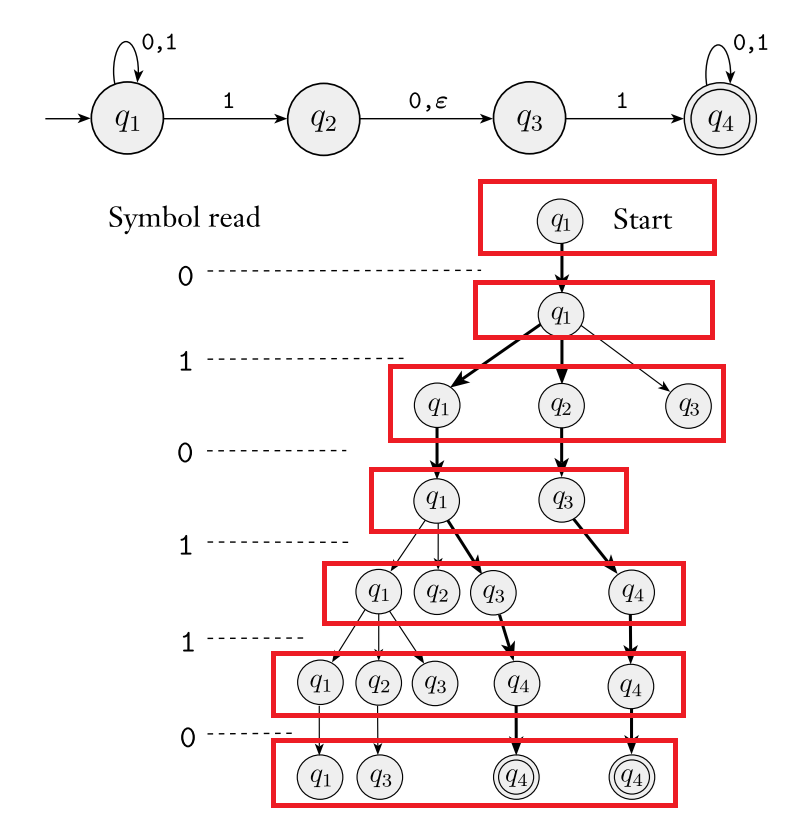

这学期（2025 春）在上《形式语言与计算复杂性》课程（COMP6106P01）。黄文超老师授课时细节讲述的非常严谨认真，我听课时也产生了一些有趣的（可能上课没有讲到的）直观想法（以及一些私货），所以写一些笔记作为记录。

<!-- more -->

## 绪论

### 课程概述

作为本文开头，还是对这门课程做一个概述。本门课程实际是计算理论的一个入门。计算理论关心的是，给定一个计算模型（比如我们的计算机），我们能够用这个模型解决什么问题，以及这些问题的解决方案的复杂性如何。

解决问题的复杂性可以用时间复杂度等手段描述，这就是 complexity 关心的事情。研究复杂度的好处我们已经在上学期的《算法设计与分析》课程学到。如果一个问题是 NPC：

- 那你应该知道它很难，可以不用花时间再去尝试设计一个多项式时间的算法了。
- 你可以借鉴已有的 NPC 问题的近似算法，设计一个实践中可接受的算法。

然而，并非所有的问题都可以用我们的电脑解决，一些问题在理论上就是不可计算的（无法设计一个算法能在有限时间内解决）。这就又带来两件事情：

- 我们的电脑对应的计算模型（图灵机），到底能解决什么问题？
- 其他的计算模型呢？有没有更弱或者更强的计算模型，使得解决的问题集合不同？分别能解决什么问题？

关心我们的电脑能解决什么问题很重要。本门课程先从一些更弱的计算模型（被形式化为自动机，如 DFA，PDA）开始，先研究这些自动机能解决什么问题，然后再研究图灵机。

### Terminology 与类型

定义了一些基本概念：

>  - Set
>  - Sequences and Tuples
>  - Functions and Relations
>  - Graphs
>  - Strings and Languages
>  - Boolean Logic

这里有趣的是它们基本都是构造性的。比如：

$$
G = (\{1, 2, 3, 4, 5\}, \{(1, 2),(2, 3),(3, 4),(4, 5),(5, 1)\})
$$

这件事情可以写成：

```typescript
type Node = number
type Edge = [Node, Node] // 表示 tuple
type Graph = [Set<Node>, Set<Edge>]

const nodes = new Set([1, 2, 3, 4, 5])
const edges = new Set([
  [1, 2],
  [2, 3],
  [3, 4],
  [4, 5],
  [5, 1]
])
const G: Graph = [nodes, edges]
console.log(G)
```

这里数学对象的定义和程序中的对象对应得很好。数学对象的类型在程序语言中也有对应的类型。

在后面的课程中，使用类型的观点来看待数学对象也会使得理解更加容易。这是因为我们后续会研究一些复杂的对象，比如“所有正则语言的集合”，然而某个正则语言本身又是一个字符串的集合。为了区分开这些不同层次的对象，**可以采用类型的方式来区分**。例如，某个正则语言就是一个 `Set<string>`，而“所有正则语言的集合”就是 `Set<Set<string>>`。

明确了这些对象的类型，我们就可以**更好地理解这些对象具备的操作**。还是以正则语言为例。既然正则语言是一个 `Set`，那它自然就具备集合的操作，比如并集、交集、补集等。在正则语言一节我们就要研究并集操作（其他操作也有其意义，比如 [Brzozowski derivative](https://en.wikipedia.org/wiki/Brzozowski_derivative)）。并且我们根据集合论的直觉就知道，两个正则语言的并集定义应该是：

```typescript
function union(L1: Set<string>, L2: Set<string>): Set<string> {
  return new Set([...L1, ...L2])
}
// union({'a', 'b'}, {'b', 'c'}) = {'a', 'b', 'c'}
console.log(union(new Set(['a', 'b']), new Set(['b', 'c'])))
```

> 本门课程之外，类型在编程中还有更多的作用，和更多数学上的对应。例如本文用来举例的 TypeScript 就支持 [Algebraic Data Types](https://en.wikipedia.org/wiki/Algebraic_data_type)，可以实现类型之间的并集、笛卡尔积等操作。此时可以把某个类型看成一类对象的集合。

## 正则语言

### 总结

研究自动机能解决什么问题，就是要研究自动机能接受什么语言。这一节我们研究了有限状态自动机。

- 我们把 DFA 能解决的问题（接受的语言）称为正则语言；
- 这样就把有限状态自动机能力的边界转换为了正则语言表达能力的边界；
- 我们定义了正则表达式，它从 $\{\}, \{\varepsilon\}, \{a\}\ (a \in \Sigma)$ 出发，通过正则表达式的运算（并、串接、闭包）递归定义：
  - 一方面证明正则表达式表达的语言都是正则语言；
  - 另一方面证明正则语言都可以用正则表达式表达；
  - 这就说明正则表达式和正则语言的等价。
- 结论：DFA 的能力和正则表达式的能力是等价的。

用正则表达式描述 DFA 的能力，好处是更加直观，也更加方便我们研究。例如，有了这个描述，我们要判断 DFA 能不能解决某个 decision problem，就只要判断这个问题的语言是不是正则语言，或者能不能用正则表达式描述。

> 这里的 decision problem 要求是判断某个 `string` 在不在一个特定的 `Set<string>` 中。虽然看起来约束很强，但往往我们都能将其他的 decision problem 归约到这种形式。而更一般地，其他 search problem 和 optimization problem 又常常可以归约到 decision problem。所以这里研究 decision problem 是很有意义的。

主线已经清晰，补充一些细节。

### 正则操作 - 并

正则操作就是正则表达式的构造过程（或者叫构造子）。现在要干的事情是：

> 说明正则表达式能够表达的语言都是正则语言；

递归证明，只要说明正则操作应用在正则语言上是封闭的。这就是证明封闭的动机。

并集操作对于语言如下定义：

$$
L_1 \cup L_2 = \{x \mid x \in L_1 \text{ or } x \in L_2\}
$$

证明的核心思路我们已经有了识别 $L_1$ 和 $L_2$ 的 DFA，那么我们可以让它们**同时运行**，只要有一个接受，那么 $x$ 就在 $L_1 \cup L_2$ 中。

因为要同时运行，所以新的 DFA 的状态要同时保存两个 DFA 的状态。这样的状态可以通过直积构造：$Q = Q_1 \times Q_2$，转移函数 $\delta((q_1, q_2), a) = (\delta_1(q_1, a), \delta_2(q_2, a))$ 等显然。

### 正则操作 - 连接和闭包

现在要证明连接和闭包操作在正则语言上也封闭：

$$
\begin{align*}
L_1 \cdot L_2 &= \{xy \mid x \in L_1, y \in L_2\}\\
L_1^* &= \{x_1x_2\cdots x_k \mid k \ge 0, x_i \in L_1\}
\end{align*}
$$

这里要开的支线就比较大了。我们不好直接构造出 DFA 来证明，因此采用的策略是引入一个比 DFA 更强的 NFA，证明已知 $L_1$ 和 $L_2$ 对应的 DFA（那它们自然也是 NFA），我们可以构造出 $L_1 \cdot L_2$ 和 $L_1^*$ 对应的 NFA，再把 NFA 转换到 DFA，就完成了构造。

这里定义好后需要注意一个记号的问题，那就是 $\{\}$ 和 $\{\varepsilon\}$ 的区别。$\{\}$ 表示空集，而 $\{\varepsilon\}$ 表示只有空串的集合。按照集合演算，自然可以理解下面的结果：

$$
\begin{align*}
\{1\}^*\{\varepsilon\} &= \{1\}^*\\
\{1\}^*\{\} &= \{\}\\
\{\}^* &= \{\varepsilon\}
\end{align*}
$$

### NFA to DFA

课程的算法把 NFA 分成两类，分别讨论了存在 $\varepsilon$-transition 和不存在 $\varepsilon$-transition 的情况。这里的观察是我们可以看图简单理解这个算法：



NFA 可以看成数个（进程？）同时在活跃。假设 NFA 有 $N$ 个状态。

注意到，某个时刻，如果两个 NFA 进程处在相同的状态，那么它们的后续演变是完全一致的，我们就可以把它们合并。那么图中的每一层只要用 `Set<State_of_NFA>` 就可以表示，这个 `Set` 是 NFA 的状态集的幂集的一个元素，取值个数显然是有限的，所以可以对应到 DFA 的状态。

可以想象，NFA 在运行过程中，其不确定性体现在每次可能会发生分裂。然而如何分裂却是确定的，所以我们可以用当前 NFA 所有能到达的状态来作为 DFA 的状态，并进行转移。

### DFA to Regexp

这里我们说明：

> 另一方面，说明所有正则语言都可以用正则表达式描述；

那只要给出 DFA 到正则表达式的转换算法就可以了。上课的算法是引入 GNFA，然后消除状态的算法。这里的观察是，我们可以不采用 GNFA。

> 完整的想法可以参考 [Brzozowski algebraic method](https://cs.stackexchange.com/a/2392)，下面给出一个直观的理解。

将 DFA 的所有状态标号为 $1, 2, \cdots, n$，那么我们可以令 `R[k][i][j]` 表示一个能判定所有从 $i$ 状态到 $j$ 状态，并且中间经过结点（不包括 $i$ 和 $j$）的下标最大为 $k$ 的正则表达式。

按照定义：

$$
R[0][i][j] = \bigcup_{a \in \Sigma, \delta(i, a) = j} a
$$

递推关系：

$$
R[k][i][j] = R[k-1][i][j] \cup (R[k-1][i][k] \cdot R[k-1][k][k]^{*} \cdot R[k-1][k][j])
$$

换言之，我们每次在 `R[k-1][i][j]` 的基础上，松弛新加入的状态机结点 $k$。

这样，最终的正则表达式：

$$
R = \bigcup_{j \in F} R[n][q_0][j]
$$

显然每一步都是正则表达式的并、串接、闭包操作，所以最终的结果也是正则表达式。

### 非正则语言

这一部分是想举例说明什么样的语言不是正则语言，并且证明。比如 $B = \{a^n b^n \mid n \ge 0\}$。

稍微思考一下这个问题会发现，这个语言的特点是 $a$ 和 $b$ 的数量是相等的。然而 DFA 状态是有限的，所以这里有个非常简单的证明：

假设存在一个能接受 $B$ 的 DFA，状态数为 $n$。我们投喂给它一个 $aaa...$ 的前缀。假设投喂完 $k$ 个 $a$ 后，DFA 的状态是 $q_k$。当 $k = n$ 时，连同初始状态 $q_0$，DFA 一共经过了 $n+1$ 个状态，那么必然存在两个状态相同，也就是存在 $i < j \leq n$，使得 $q_i = q_j$。

这就出现了矛盾：

- 因为 $q_i$ 由投喂 $i$ 个 $a$ 得到，所以再投喂 $i$ 个 $b$ 就应该转移到接受状态；
- 但是因为 $q_i = q_j$，所以再投喂 $i$ 个 $b$ 不足以转移到接受状态。

这就说明不存在接受 $B$ 的 DFA，所以 $B$ 不是正则语言。

### pumping lemma

> 上课的思路是先给出 pumping lemma 的结论，然后再证明。但这么做不太直观，所以这里展示怎么在不知道 pumping lemma 的情况下推导出它。

把上面所说的证明过程一般化：

假设 $A$ 是一个正则语言，它的 DFA 状态数为 $n$。则任意 $s \in A$，如果 $|s| \ge n$，则自动机在被投喂前 $n$ 个字符后经过了 $n+1$ 个状态。根据抽屉原理可设 $q_i = q_j (i < j \leq n)$。

$i$ 和 $j$ 作为字符串下标，我们把 $s$ 分成三部分：$s = xyz$：

- $x = s[0: i]$；
- $y = s[i: j]$；
- $z = s[j: n]$。

由 $s \in A$ 得 $\forall k \ge 0, xy^kz \in A$。

结论（pumping lemma）：如果 $A$ 是正则语言，它的 DFA 状态数为 $n$，则任意 $s \in A, |s| \ge n$，都有 $s$ 可以被分成三部分 $xyz$，满足 $|xy| \leq n$，$|y| \ge 1$，且 $\forall k \ge 0, xy^kz \in A$。

> $|xy| \leq n$ 和 $|y| \ge 1$ 等价于 $i < j \leq n$。

可以试着用 pumping lemma 来说明上一节的 $B$ 不是正则语言。只需要取出一个 $s = a^nb^n = xyz$，因为 $|xy| \leq n$，所以 $y$ 中只包含 $a$，那么 $xy^2z$ 中 $a$ 的数量会超过 $b$ 的数量，所以不在 $B$ 中，矛盾。

## 上下文无关语言

### 总结

在正则语言中，我们考虑了机器 DFA 和它接受的语言正则语言，并且把正则表达式和正则语言等价。

然而这一节，我们先介绍一种能生成语言的文法：上下文无关文法（CFG）。我们定义它能生成的语言就是上下文无关语言（CFL）。然后再给出机器 PDA，最后说明 PDA 能接受的语言和 CFL 的等价。

### Ambiguity

前面 CFG 的一些定义没什么问题，略过。

这里讨论了 CFG 的二义性问题，例如对于：

$$
S \to S + S \mid S \times S \mid a
$$

则 $a + a \times a$ 有两种解析方式。这里的解析方式指的是语法树的差别（根结点是作为一个乘法结点还是加法结点，这会带来语义上的不同），而无关推导时先展开哪个产生式，所以定义了最左推导的概念，明确二义性指的是语法树不唯一。

### Chomsky Normal Form

CNF（Chomsky Normal Form）是 CFG 的一个规范（暂译）形式。这一章暂时没用，但 Decidability 和 Time Complexity 的讨论会用到。它只允许下面的产生式：

$$
\begin{align*}
A &\to BC\ (A, B, C \in V, B \neq S, C \neq S)\\
A &\to a\ (a \in \Sigma) \\
S &\to \varepsilon
\end{align*}
$$


为了把任意的 CFG 规范到 CNF，需要对原来的产生式进行变换。需要特别注意，我们现在要对产生式本身操作，所以下文用 $u$ 和 $v$ 表示 **产生式中的字符串**，而非 CFG 的终结符。也就是说，对于一个产生式 $A \to abABab$，如果写成 $A \to uBv$，那么 $u = abA, v = ab$。

这里需要一个观察。对于 $A \to u$，$|u| \ge 2$，转换到 CNF 是 trivial 的。设 $|u|=k$，记 $u=u_1u_2\cdots u_k$，那么我们可以构造 $A \to u_1A_1, A_1 \to u_2A_2, \cdots, A_{k-2} \to u_{k-1}u_k$。如果 $u_i$ 是 **非终结符**，那对应的产生式自然符合 CNF；如果 $u_i$ 是 **终结符**，那么我们可以替换 $A_i \to U_iA_{i+1}, U_i \to u_i$，这样也符合 CNF。

那么我们只要特别处理 $|u|<2$ 的情况。分类，$|u|=0$ 就是 $\varepsilon$ 产生式，$|u|=1$ 且不符合 CNF 的情况就是 $A \to B$。所以要先消去这两类产生式。

> 注意产生式的形式化定义就是一个元组 $(\alpha, \beta)$，其中 $\alpha$ 是非终结符，$\beta$ 是字符串。$\beta \in (V \cup \Sigma)^{*}$，所以 $\beta$ 可以是空串，此时记作 $\alpha \to \varepsilon$。所以尽管 $\varepsilon \notin \Sigma$，但是 $\varepsilon$ 产生式是合法的。

具体细节：

- 起始变量 $S$ 不允许出现在右部。所以补充新的起始变量 $S' \to S$；
- 消除 $A \to \varepsilon$。我们想把这个产生式消除，就要把 $\varepsilon$ 传播掉。需要传播的产生式一定是 $A$ 在右侧。考虑 **所有** 的 $R \to uAv$：
  - 消除 $A \to \varepsilon$；
  - 若 $u$ 或 $v$ 不是空串，则 **增加** $R \to uv$；
  - 若 $u$ 和 $v$ 都是空串，则 **增加** $R \to \varepsilon$，除非 $R \to \varepsilon$ 已经被消除过；
  - 直到没有 $\varepsilon$ 产生式为止；
- 消除 $A \to B$。这次的思路是把 $B$ 短路掉。考虑 **所有** 的 $B \to u$：
  - 消除 $A \to B$；
  - **增加** $A \to u$，除非 $A \to u$ 已经被消除过（例如 $u = C$，但之前消除过 $A \to C$）；
  - 直到没有 $A \to B$ 产生式为止；
- 此时任意产生式 $A \to u$，$|u| \ge 2$。转换到 CNF 是 trivial 的。

### PDA

给 DFA 拓展上了栈。显然栈也要有一个字母表 $\Gamma$，这里的字母表是栈的字母表。

PDA 在状态转移的同时，还会对栈进行操作。

状态转移函数有两种记法：

- $\delta: Q \times (\Sigma \cup \{\varepsilon\}) \times \Gamma \to 2^{Q \times \Gamma^{*}}$
- $\delta: Q \times (\Sigma \cup \{\varepsilon\}) \times (\Gamma \cup \{\varepsilon\}) \to 2^{Q \times (\Gamma \cup \{\varepsilon\})}$

课本上是第二种，但实际上第一种更加自然。先讲解课本的形式：

- $\Sigma \cup \{\varepsilon\}$ 意味着某一时刻，可以选择读入一个字符，也可以不读入字符；
- $\Gamma \cup \{\varepsilon\}$ 意味着某一时刻，可以读取栈顶元素（新的状态是 $2^{Q \times (\Gamma \cup \{\varepsilon\})}$ 的子集，所以这里栈操作有两种：更新栈顶元素，栈顶元素出栈）；也可以不读取（同理此时栈操作有两种：不变，压栈）。

其中 $\Sigma \cup \{\varepsilon\}$ 带来的不确定性是我们后面会反复体会到的。然而 $\Gamma \cup \{\varepsilon\}$ 未必需要：

- 可以给栈一个初始的 $Z \in \Gamma$，这样就可以保证栈不为空；
- 不读取栈顶元素时的操作可以合并到读取时的操作中。这里的观察是，上述四种操作，我们都可以统一成将栈顶的 $A$ **弹出**，然后 **压入** $u \in \Gamma^{*}$。
  - 更新栈顶元素就是把 $A$ 弹出压入 $u=B$；
  - 栈顶元素出栈就是把 $A$ 弹出压入 $u=\varepsilon$。
  - 不读取时的栈顶元素不变，就是对任意 $A \in \Gamma$，把 $A$ 弹出压入 $u=A$；
  - 不读取时的栈顶元素压栈，就是对任意 $A \in \Gamma$，把 $A$ 弹出压入 $u=AB$（假设栈从左到右增长）。

所以你会发现这个书上记号确实 taste 不好。更新栈有更自然的表达方式。当然你也会发现更改记号后 PDA 看起来更强了一点，因为可以一次压入多个符号了。但显然同样的事情第一种记号也能做到，只是需要多次转移，所以能力上是等价的。

### PDA 和 CFG 的等价

说明等价性，一方面是给出 CFG，要构造一台 PDA。和编译原理的 LR 分析表很类似，只不过 PDA 更强，做起来更方便：

- 压入 $Z$；
- 压入 CFG 的起始变量 $S$；
- 重复 **弹出** 栈顶元素：
  - 若拿到 $A$，那么非确定性地替换成它所有的产生式 **压入**；
  - 若拿到 $a$，读取输入。若不匹配，就失败；否则继续。
- 如果已读入所有输入串，且栈为 $Z$，那么接受。

你可以发现用上文提到的改进记号表达起来很容易。当然考试你可能需要按照书上的记号写（）。

另一方面是给出 PDA，要构造出 CFG。注意本文 DFA2Re 的算法是给出了一个拓展，能给出 DFA 任意两个状态间的正则表达式。这里也是类似的，对于任意 $p, q \in Q$，我们指派一个变量 $A_{pq}$，我们希望它表示（也就是能派生且仅能派生出）从 $p$ 到 $q$（这里额外要求开始和结束时栈为空）的所有字符串。这样一来，变量 $A_{q_0, q_{\text{accept}}}$ 就是我们要的 CFG 的开始变量。

这样，思路就是：

- 构造出 $A_{pq}$ 满足的一系列产生式；
- 证明 $A_{pq}$ 派生的字符串都能让 PDA 从 $p$（空栈）到 $q$ 转移（空栈）。
- 证明如果一个字符串能让 PDA 从 $p$（空栈）到 $q$ 转移（空栈），那么它一定能由 $A_{pq}$ 派生。

构造如下：

- $A_{pp} \to \varepsilon$；
- $A_{pq} \to A_{pr}A_{rq}$；
- $A_{pq} \to aA_{rs}b$。

第一条是平凡的。后两条是从 $p$ 到 $q$ 的第一个入栈符号出栈时机考虑的。如果它中间就出栈了，意味着中间栈就空了——那么自然能拆分出子问题。如果它中间没出栈，那么我们用最后一条的形式表示。

构造完后可以进行等价性的证明。这里有很多细节问题，需要微调 PDA，我们就看个大概思路。

> 证明 $A_{pq}$ 派生的字符串都能让 PDA 从 $p$（空栈）到 $q$ 转移（空栈）。

归纳证明。如果是一步派生，显然只有 $\varepsilon$，是成立的。之后对派生次数（推导次数）做归纳。显然当推导次数 $k > 1$ 时，第一步推导要么是 $A_{pr}A_{rq}$，要么是 $aA_{rs}b$，都可以应用归纳假设。

> 证明如果一个字符串能让 PDA 从 $p$（空栈）到 $q$ 转移（空栈），那么它一定能由 $A_{pq}$ 派生。

归纳证明。这次是对计算次数归纳。如果 $0$ 步计算，那么就是 $\varepsilon$，是成立的。之后对计算次数（转移次数）做归纳。第一步计算（入栈）的符号要么中间就被弹出，要么直到最后才被弹出，都可以应用归纳假设。

所以你可以看出，要让上面的证明成立，必须对 PDA 做微调，每次操作要么入栈要么出栈。

### 非上下文无关语言

这里的直觉是，如果一个上下文无关语言能接受任意长度的字符串，那么在一定长度后，为了接受这个字符串，一定有某个产生式的推导过程中又推导了出了自己（递归）。

我们先对这个长度有个直觉的感受。对于没有递归的情况：

$$
\begin{align*}
A &\to BB\\
B &\to CC\\
C &\to DD\\
D &\to d
\end{align*}
$$

它的增长速度是 $2^n$。但显然，没有递归的话我们总是能把长度 bound 住。所以我们认为，存在一个 pumping length，对于长度超过 $p$ 的字符串，一定有某个产生式的推导过程中又推导了出了自己。当然这里不仅要递归，而且要求递归至少增加了某个字符，也就是 $R \to uRv, |uv| > 0$。

可以假设，中间递归的产生式类似 $R\to uRv \mid x$（递归可能不会直接出现，而是间接的，这里并不是严格的证明）。那么有最内部 $uxv$ 无递归，$|uxv| \leq p$。

把上面的思路整理一下就是 CFG 的 pumping lemma：

> 如果 $A$ 是一个上下文无关语言，那么存在一个 pumping length $p$，对于任意 $s \in A, |s| \ge p$，都存在 $s = uvxyz$，满足 $|vxy| \le p, |vy| > 0$，且 $\forall k \ge 0, uv^kxy^kz \in A$。

### DPDA、DCFL

这玩意其实就是 LR(0)。所以我又要再黑一遍书上的 PDA 记法了，根据书上的定义，需要下面四个转移函数结果只有一个不为空（否则有不确定性）：

$$
\delta(q, a, x), \delta(q, a, \varepsilon), \delta(q, \varepsilon, x), \delta(q, \varepsilon, \varepsilon)
$$

换一种记号的话，就完全等价于 LR(0) 分析的移进-规约冲突了。

## 丘奇-图灵论题

未完待续。
