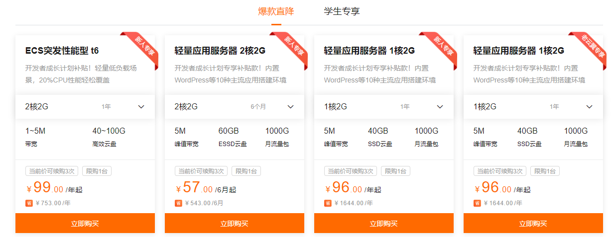
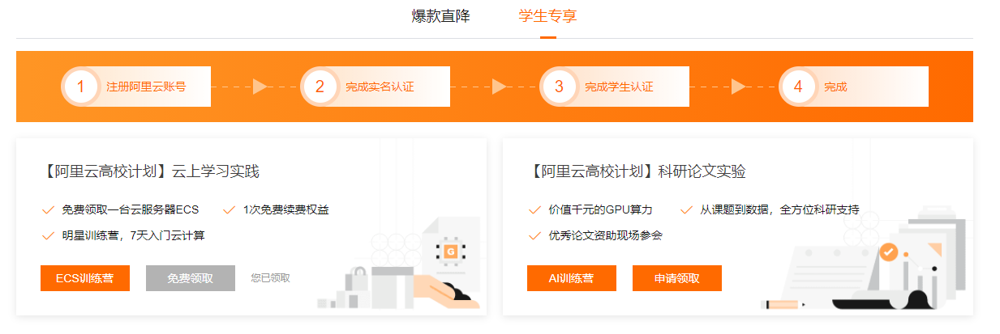
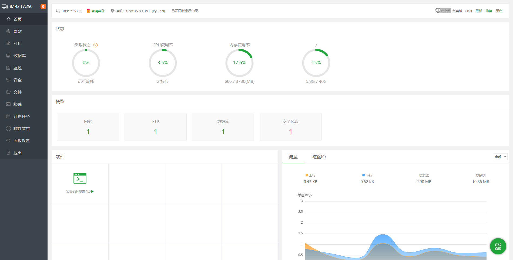
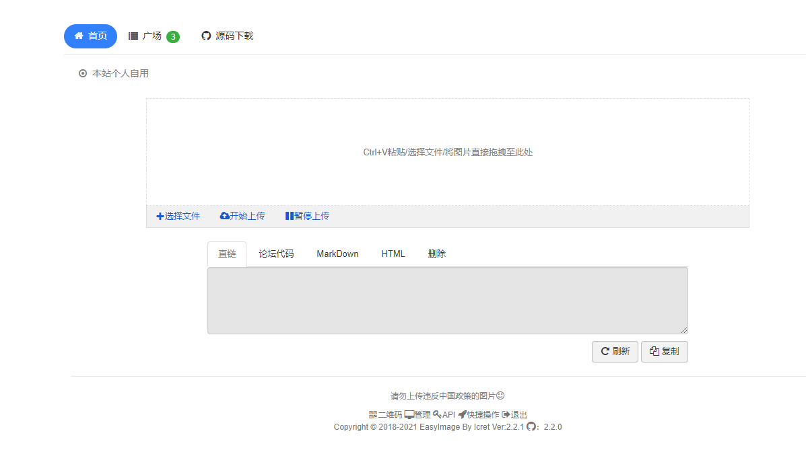

本篇博客将简单介绍从阿里云白嫖服务器以及搭建简单图床的过程。

## 阿里云学生优惠

这玩意以前是叫阿里云学生机 - 云翼计划的，不过现在被改名成了开发者成长计划~~（听上去套路满满~~

网页链接：[开发者成长计划 (aliyun.com)](https://developer.aliyun.com/plan/grow-up)

活动有两个部分：



此部分是给一些优惠价格，最便宜的服务器一年大概 100（其实个人普通使用最便宜的那种似乎就够了



第二部分的话看左边那个，完成一些小操作练习（都是些 linux 和服务器的基本操作）后即可白嫖两个月

<!-- more -->

快到期时可以参加一个考试，10 道选择至少对 9 道，就可以再白嫖四个月（据说去年疫情期间 6 + 6，现在这 2 + 4 属实拉

如果没有考过以及后续续费的话都是按照学生优惠，似乎一年 100+ ，还算合理

## 服务器管理

搞到了这样一台服务器之后看着光秃秃的命令行界面肯定会 ~~被水淹没不知所措~~

这个时候可以安装宝塔：

```bash
yum install -y wget && wget -O install.sh http://download.bt.cn/install/install_6.0.sh && bash install.sh
```

提示确认安装时输入 y，并回车。然后就等待安装完成，有点漫长

装完后宝塔的默认端口是 8888，进入阿里云管理界面把这个端口开放

然后进入：`http://{服务器IP}:8888/{8位宝塔提供的安全入口字符}`，输入宝塔命令行提示的账户密码，即可进入宝塔管理界面



后续配置部分参考：[宝塔面板 安装与使用教程*Yan 小铁匠-CSDN 博客*宝塔面板](https://blog.csdn.net/weixin_44535476/article/details/98218087)

安装软件的时候建议还是安装最新版，宝塔一键安装提供的版本并不是最新的。

## 简单图床搭建

[icret/EasyImages2.0: 新版简单强大的无数据库的图床 2.0 版 演示地址： (github.com)](https://github.com/icret/easyImages2.0)

如上所示，简单图床是一个开源的图床~~（GitHub 上有轮子那当然直接用~~

按照使用说明，更改`config/config.php`下的`domain,imgurl,password`

然后在宝塔系统里网站目录下点击添加站点，设置域名的时候就写上自己的 ip 就好了（如果你有域名可以用自己的域名，要注意国内域名需要备案

然后把本地的整个目录复制过去就行了。访问网页默认是 80 端口，需要在阿里云和宝塔的配置中开放这一端口。

如果选择别的端口，则在访问时最后需要加上端口号。



然后就可以愉悦的上传图片了 w

~~本文所有图片均存在这一图床~~ 现在搬迁到 Cloudflare 白嫖了
