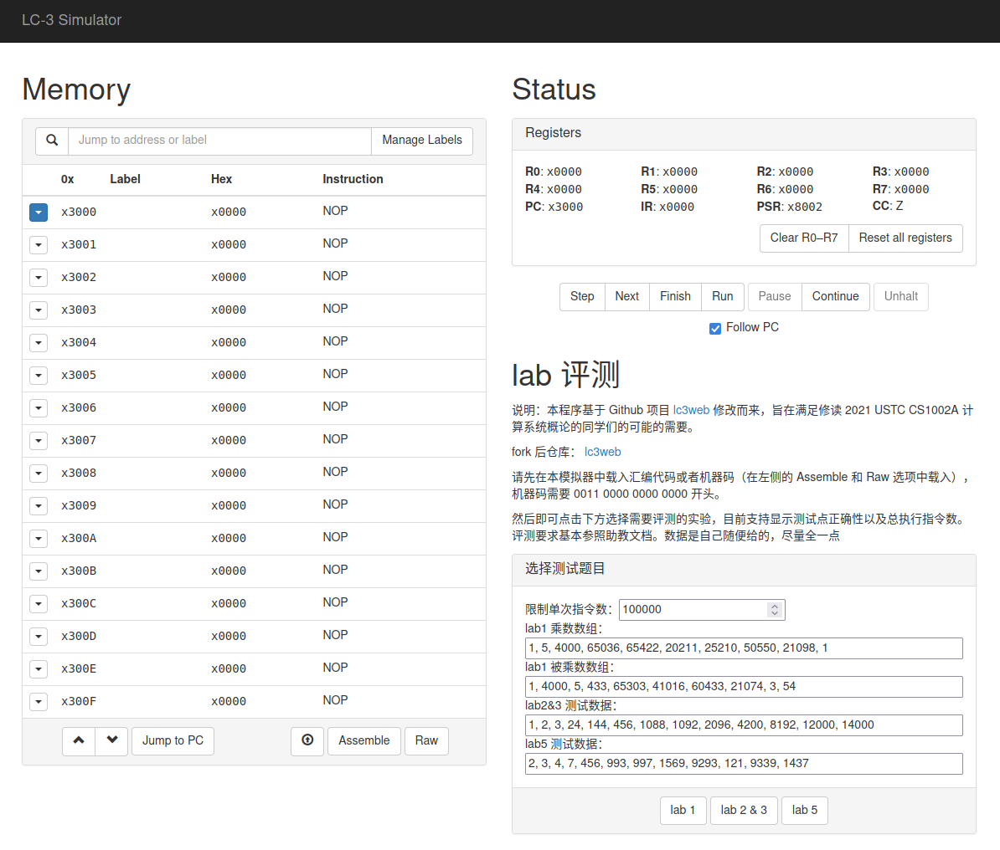

总算把各种期中混杂着复变期末全部结束了，~~摸鱼一会~~

本文将安利一个开源的纯 JS 的 lc-3 模拟器，并介绍自己改的一个 lc-3 评测姬



<!-- more -->

源项目地址：https://github.com/wchargin/lc3web

并有 github-page：https://wchargin.github.io/lc3web/

~~感觉比某大学某 ICS 课程主页安利的某模拟器好用~~

~~JavaScript 是世界上最好的语言~~

Web 版的好处就在于甚至不需要安装（好文明），真正的全平台通用

大概由以下这些这些 JS 文件组成：

```shell
js/
├── bootstrap.js
├── bootstrap.min.js
├── jquery-1.11.1.min.js
├── lc3_as.js
├── lc3_core.js
├── lc3_hexbin.js
├── lc3_os.js
├── lc3_ui.js
├── lc3_util.js
├── npm.js
└── Queue.js
```

上面三个是用到的库，主体逻辑是 `lc3_core.js` ，主体界面交互放在了 `lc3_os.js` ，其余是一些供这两个 JS 调用的函数

~~这命名简洁清晰爱了爱了~~

所以阅读源代码主要也就看上面提到的两个 JS 文件。

## lc-3 评测姬

### 开发动机

~~采用一次性 Judge 却不提供提前检验正确性工具的 lab 就好像只能提交一次的 acm, 没有灵魂~~

### 具体实现

#### 页面组件

不想破坏原来页面的美感（？），直接看着写就行了

```html
<div class="col-md-6">
  <h1>lab 评测</h1>
  <p>
    说明：本程序基于 GitHub 项目
    <a href="https://github.com/wchargin/lc3web">lc3web</a>
    修改而来，旨在满足修读 2021 USTC CS1002A 计算系统概论的同学们的可能的需要。
  </p>
  <p>fork 后仓库： <a href="https://github.com/liuly0322/lc3web">lc3web</a></p>
  <p>
    请先在本模拟器中载入汇编代码或者机器码（在左侧的 Assemble 和 Raw
    选项中载入），机器码需要 0011 0000 0000 0000 开头。
  </p>
  <p>
    然后即可点击下方选择需要评测的实验，目前支持显示测试点正确性以及总执行指令数。评测要求基本参照助教文档。数据是自己随便给的，尽量全一点
  </p>
  <div class="panel panel-default" id="bench-panel">
    <div class="panel-heading"><h3 class="panel-title">选择测试题目</h3></div>
    <div class="panel-body">
      限制单次指令数：<input
        type="number"
        id="cycleLimit"
        value="100000"
      /><br />
      lab1 乘数数组：
      <input
        style="width: 100%;"
        type="text"
        id="arr1"
        value="1, 5, 4000, 65036, 65422, 20211, 25210, 50550, 21098, 1"
      />
      lab1 被乘数数组：
      <input
        style="width: 100%;"
        type="text"
        id="arr2"
        value="1, 4000, 5, 433, 65303, 41016, 60433, 21074, 3, 54"
      />
      lab2&3 测试数据：
      <input
        style="width: 100%;"
        type="text"
        id="testcase1"
        value="1, 2, 3, 24, 144, 456, 1088, 1092, 2096, 4200, 8192, 12000, 14000"
      />
      lab5 测试数据：
      <input
        style="width: 100%;"
        type="text"
        id="testcase2"
        value="2, 3, 4, 7, 456, 993, 997, 1569, 9293, 121, 9339, 1437"
      />
    </div>
    <div class="panel-footer">
      <div class="row" id="scroll-container">
        <div class="col-xs-12">
          <button class="btn btn-default" type="button" onclick="bench1()">
            lab 1
          </button>
          <button class="btn btn-default" type="button" onclick="bench2()">
            lab 2 & 3
          </button>
          <button class="btn btn-default" type="button" onclick="bench3()">
            lab 5
          </button>
        </div>
      </div>
    </div>
  </div>
</div>
```

按照原来的格式写好组件，然后加点允许用户自由设置的输入框即可。评测分别采用三个函数 `bench1(), bench2(), bench3()`

主要是因为一共没几个实验，而且输入输出不固定（直接指定寄存器），所以就直接这样高耦合低内聚的写了（）

#### 脚本逻辑

不想破坏原来框架的美感，另开一个 `lc3_bench.js`

核心是判题逻辑：

在 bench 函数预先处理好寄存器数据后，就要运行判题逻辑了，需要：

1. 获取设置的单个 case 最多指令数
2. pc 归位 x3000
3. 总执行指令数清零

随后就逐条指令执行。终止标志是当前即将执行的指令是 Trap 或者是 x0000（与\_\_\_助教的判题逻辑相同）

```javascript
function benchTest(f) {
  const limit = document.querySelector("#cycleLimit").value;
  lc3.pc = 0x3000;
  lc3.totalInstruction = 0;
  var cnt = 0;
  while (true) {
    var op = lc3.decode(lc3.getMemory(lc3.pc));
    if ((op.raw >= 61440 && op.raw <= 61695) || op.raw === 0) {
      var str = f();
      break;
    }
    cnt++;
    if (cnt > limit) {
      alert("有测试样例超过单次最高执行指令数，请检查！");
      return;
    }
    lc3.nextInstruction();
  }
  return str;
}
```

当评测结束时，传入的回调函数用于处理结果（lc-3 模拟器是一个全局变量，回调函数通过读取这些全局变量的值判断结果是否正确）

下面是每个题目判题脚本的编写。以 lab2&3 为例：

```javascript
function bench2() {
  // r0 是给定的 n, 其余寄存器初始化为 0, 结果存在 r7,
  // 计算数列：f(0)=1,f(1)=1,f(2)=2,f(n)=f(n-1)+2*f(n-3) 的第 n 项

  // 设置批处理模式，不更新用户显示的界面（见 lc3_ui.js）
  window.batchMode = true;

  // 获取正确答案的函数（因为测试样例没有很多，直接每次 O(n) 算了）
  function fib(x) {
    var arr = [1, 1, 2];
    for (var i = 3; i <= x; i++) {
      arr[i] = (arr[i - 1] + 2 * arr[i - 3]) % 1024;
    }
    return arr[x];
  }

  // 获取用户填入的测试样例
  const testcase = document
    .querySelector("#testcase1")
    .value.replace(/\s*/g, "")
    .split(",")
    .map(Number);

  var str = ""; // 最终将显示的结果
  var sumInstruction = 0; // 总计命令数（用于计算平均值）

  for (var i = 0; i < testcase.length; i++) {
    // 每次测试先初始化寄存器
    window.lc3.r = [0, 0, 0, 0, 0, 0, 0, 0];
    window.lc3.r[0] = testcase[i];

    var ans = fib(testcase[i]); // 获取正确答案
    str += `测试数据 F(${testcase[i]}) = ${ans} `; // 理论答案
    str += benchTest(bench_res); // 实际测试
  }

  // 所有样例评测完毕
  str += "平均指令数 " + sumInstruction / testcase.length; // 显示平均指令
  alert(str); // 显示最终将显示的结果
  window.gExitBatchMode(); // 刷新界面，退出批处理模式
  return;

  // 判断结果正确性的函数
  function bench_res() {
    // 判断结果
    var lc3res = window.lc3.r[7];
    sumInstruction += window.lc3.totalInstruction;
    if (lc3res == ans) {
      return `你的回答正确，指令数 ${window.lc3.totalInstruction} \n`;
    } else {
      return `你的答案是 ${lc3res} \n`;
    }
  }
}
```

大概还可以抽象优化一下，摸了

Have fun playing

不知道下一届还需不需要用到这个（希望人没事）
