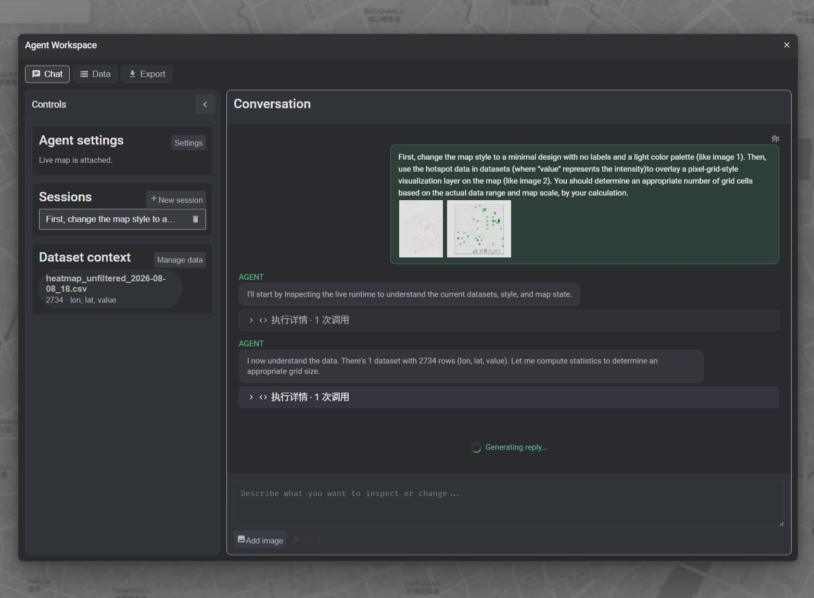
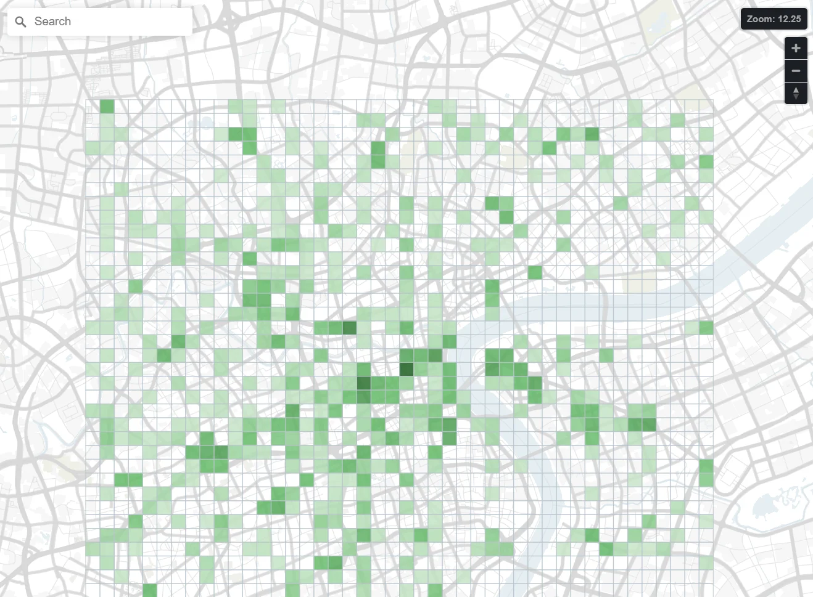

> 本文含有一定量的 AI 文字。

如果 Agent 本来就会写 JavaScript 修改网页环境，为什么还要让它一点点模拟人手操作？

这几天我搓了一个 [Maputnik-AI](https://github.com/liuly0322/Maputnik-AI)。它是地图样式编辑器 [Maputnik](https://github.com/maplibre/maputnik) 的一个实验性分支：导入一份 CSV，再告诉 Agent 想画成什么样，它就会直接修改眼前这张 MapLibre 地图。



<!-- more -->

比如让它把热点数据画成绿色方格，按数值调整深浅，同时简化底图，得到的是下面这张还能继续编辑的地图：



项目本身可以在 [在线 Demo](https://liuly.moe/Maputnik-AI/) 里玩（需要自备支持 Responses API 的 API Key），不过这篇文章主要不是安利项目，而是讲讲它背后的交互方式：直接让网页成为 Agent 可以探索、编程的环境。

## Browser Use

现在让 Agent 操作网页，最直接的办法当然是 Browser Use。Agent 看截图、DOM 或 accessibility tree，找到输入框和按钮，然后 click、type、scroll，再观察页面有没有发生预期的变化。

这套方式很通用。一个完全没为 Agent 做过适配的网站，也可以尝试操作。但对于复杂应用效果未必好。

比如用户说：

> 把所有道路图层的饱和度降低一点，隐藏次要标注，再用当前导入的数据做一个分级点图。

人通过界面完成这件事，需要在一长串图层里反复查找和修改。Browser Agent 如果模仿人，也得重复很多次“寻找图层—展开属性—修改数值—重新观察”这样的循环。

而且有些网页控件可能对原生的浏览器操作事件兼容性不好，比如 Maputnik 的图层是可以拖拽的，但不能直接模拟鼠标点下后立即移动到对应位置放开，而是需要一定延迟才能操作正确。

这种复杂性很多时候没有必要：Maputnik 内部有完整的 style object，MapLibre 已经提供了 `getStyle()`、`addLayer()`、`setPaintProperty()` 等 API。用户在界面里做的每一次修改，最后也落到这些对象上。

所以我们可以尝试直接在浏览器环境中修改这些对象。

## 暴露浏览器 JS 环境

项目给模型注册的核心 tool 其实只有一个：

```text
run_javascript({ code })
```

这段 JavaScript 执行时，可以直接访问：

```js
map        // 正在显示的 MapLibre Map
datasets   // 浏览器本地导入的 CSV 数据
```

`map` 就是 MapLibre 原生的实例，`map.getStyle()`、`map.setStyle()` 这些方法都能直接用。代码的返回值就是 tool 的结果。

于是 Agent 可以写这样的代码：

```js
const ds = datasets.get("<dataset id>");
const {columns, rows} = ds.data;
const valueIndex = columns.indexOf("value");
const values = rows.map(row => Number(row[valueIndex])).filter(v => v > 0);
const max = Math.max(...values, 1);

const nextStyle = map.getStyle();
for (const layer of nextStyle.layers) {
  if (layer.type === "symbol") {
    layer.layout = {...layer.layout, visibility: "none"};
  }
}

const sourceId = `agent-dataset:${ds.id}`;
nextStyle.sources[sourceId] = {
  type: "geojson",
  data: datasets.csv.toGeoJSON(ds, {
    type: "Point",
    coordinates: ["lon", "lat"],
  }),
};
nextStyle.layers.push({
  id: `${sourceId}-layer`,
  type: "circle",
  source: sourceId,
  metadata: {"maputnik:role": "overlay"},
  paint: {
    "circle-radius": [
      "interpolate", ["linear"],
      ["to-number", ["get", "value"]],
      0, 2,
      max, 12,
    ],
    "circle-color": "#238b45",
    "circle-opacity": 0.75,
  },
});
map.setStyle(nextStyle);

return {rows: rows.length, max};
```

筛选、求最大值、遍历图层、修改样式、创建数据图层，都在一次执行里完成。这就很方便：不需要再分别做成 `hide_label`、`get_next_layer`、`calculate_max`、`add_circle_layer`，让模型分多轮完成。虽然模型实际上可以一轮调用多个工具，但如果有数据依赖，能直接执行代码的组合性优势就体现出来了。

## MCP 和 PTC

Browser Use 只能在表现层猜应用内部发生了什么，MCP 或普通 tool calling 则让应用直接告诉 Agent：“我可以搜索、添加图层、修改颜色。”相比猜按钮，这已经可靠得多。Chrome 最近推进的 [WebMCP](https://developer.chrome.com/docs/ai/webmcp) 也是这个方向：网页可以用 JavaScript 主动声明 tools，让 Agent 理解每个操作的目的。

但对于操作空间很大的应用，枚举动作很快会遇到问题：是提供一个 `setLayerColor`，还是再提供一个 `setAllMatchingLayersColor`？筛选条件能不能嵌套？批量修改失败到一半怎么办？随着需求变复杂，tool schema 的维护也会更困难。

其实引入代码执行这个想法并不新鲜。Anthropic 叫它 programmatic tool calling（PTC）：模型不再一个个发 tool call，而是自己写一段代码，由代码去调用工具，中间结果直接进代码，只有最终结果回到上下文里。

Anthropic 的实现是给模型一个 code execution 容器：代码跑在容器里，代码里调用 tool 的时候容器暂停，tool 执行完把结果交还给正在运行的代码，而不是直接交回给模型。要用这套东西，需要在请求里声明 `code_execution_20260120`，并在自定义 tool 上标出 `allowed_callers`，表示这个 tool 允许被代码调用。

他们在 [Code execution with MCP](https://www.anthropic.com/engineering/code-execution-with-mcp) 中也讨论了类似的问题：当 tools 变多、调用链变长时，可以把它们呈现成代码 API，让 Agent 在执行环境中按需加载、组合和处理结果。这样不仅能写循环和控制流，中间数据也不必每一步都经过模型的上下文。

在浏览器里做这件事几乎是白送的：页面本来就是一个 JavaScript 环境，页面里的对象就活在这个环境里，不用造容器，也不用搭“暂停—执行—返回”这套链路，`new Function` 跑一段代码就好了。真正要做的只是把应用自己的对象和接口交给模型，`map` 和 `datasets` 本来就是这个页面里的 JavaScript 对象。Agent 拿到的是一个脚本环境加一套应用 API，而不是一堆枚举出来的 tool。

另一个好处是省 context。假如浏览器里有一万行 CSV，Agent 想筛选、分组后找出前十项，没必要先把一万行发给模型，程序可以直接在本地算完，只返回十行摘要。我还没有测过具体能省多少 token，但少传无关状态、少让中间结果穿过 context、少几轮模型调用，节省是直观的。

## 适用范围与风险

如果网页只是登录、填写表单、购买商品，那么 Browser Use 或几个定义清楚的 tools 已经很好用。给“加入购物车”套上循环和高阶函数，只会多出安全问题。

Programmable runtime 更适合那些对象很多、内部状态很多、操作组合几乎无法枚举的应用：GIS、设计工具、BI、IDE、科学模拟器。它们通常本来就有不错的底层 API，用户也经常提出开发者没有提前做成按钮的操作。

当然，直接执行模型生成的 JavaScript 非常危险。Maputnik-AI 现在就是用 `new Function` 在页面上下文中执行代码，没有沙箱，只适合作为可信模型、可信数据和可信环境下的 prototype。这一点倒是和 coding agent 面对的处境很像：都是直接执行模型写的代码，只能靠可信环境和事后审查来保证安全。

现代复杂网页都有两层：用户看到的 GUI（表现与交互），和程序对象模型与 API（数据与逻辑）。过去 scripting API 只有会编程的用户用得上，LLM 出现以后，自然语言也成了它的入口。

未来的 Agent 不一定只是在网页外面看截图、学着操作软件，它也可以进入网页正在运行的 runtime，拿到真实对象，写一小段程序，和人一起编辑同一个世界。
