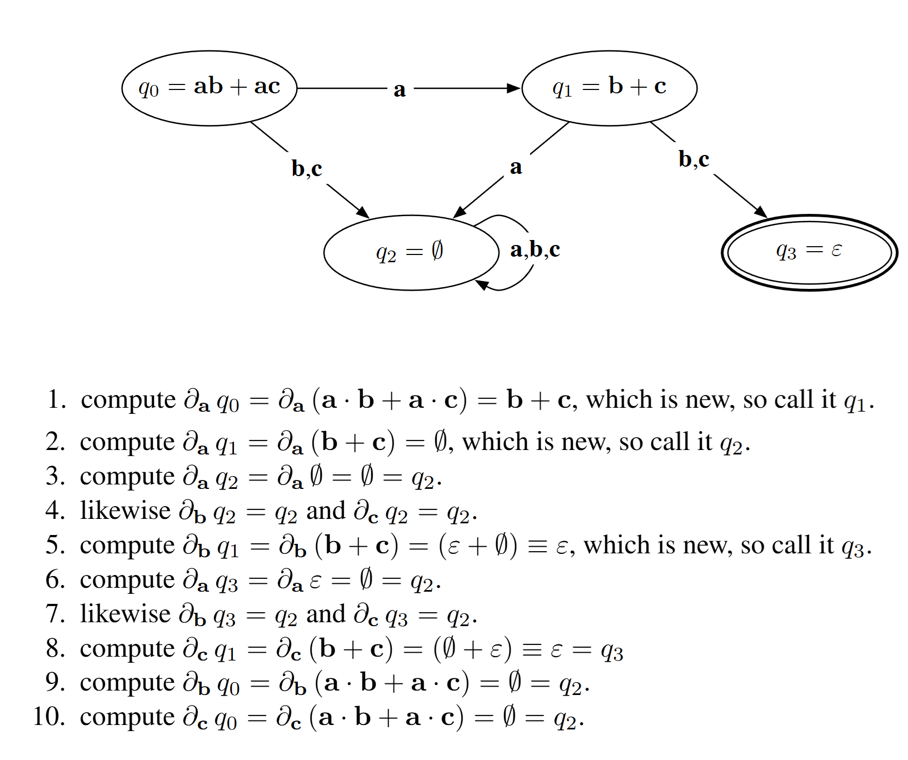
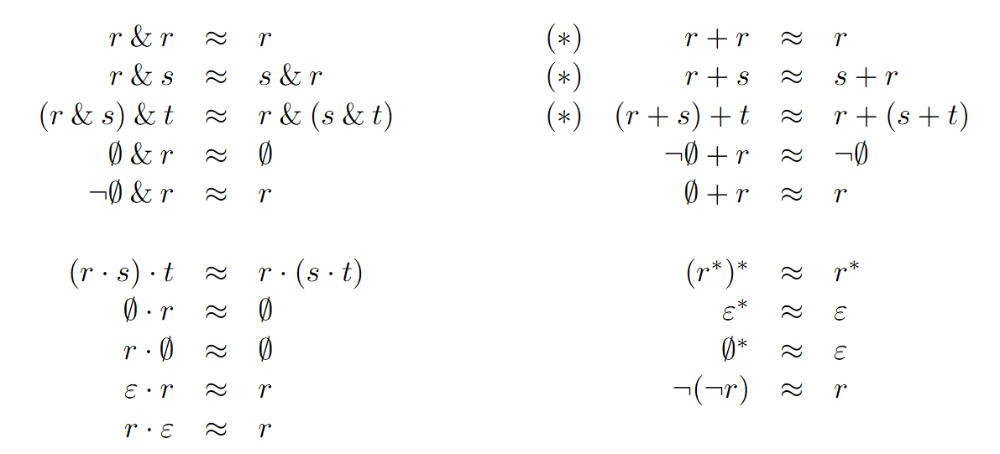

是的，正则表达式也可以有求导！这一技巧在生成正则表达式（或拓展正则表达式）对应的 DFA/scanner 时非常有用。本文作为学习笔记，记录了正则表达式求导的定义和作用。

参考：

- [Regular-expression derivatives reexamined](https://www.khoury.northeastern.edu/home/turon/re-deriv.pdf), Scott Owens, John Reppy, Aaron Turon, 2009

<!-- more -->

## 正则表达式

在编程上，正则表达式首先是一个 `(s: string) -> bool` 的函数，即判断字符串是否符合某种模式。我们把这件事形式化一下：

- 字母表 $\Sigma$
- 字母表上的字符 $a, b, c, \ldots$ 可以构成字符串，如 $abc, bca, \ldots$，字符串记作 $u, v, w, \ldots$
- 特别地，空字符串记作 $\varepsilon$，长度为 0
- $\Sigma$ 上所有长度有限的字符串构成的集合 $\Sigma^*$
- 一个 *语言* 是一个 $\Sigma^*$ 的子集，即 $L \subseteq \Sigma^*$

那么正则表达式的函数签名转换成数学语言：

- 给定一个正则表达式 $r$，它所有 *接受*（即返回 `true`，表示匹配）的字符串构成的语言记作 $L(r)$
- $L(r) = \{ s \in \Sigma^* \mid r(s) = \text{true} \}$

上面的 $L(r)$ 定义对所有语言都适用，也就是从数学上形式化了 `(s: string) -> bool` 这件事。那么正则语言又特殊在哪里呢？

这就需要了解正则表达式的构造过程。因为一个正则表达式对应一个正则语言，对应的正则语言也被构造。本文采用一种拓展正则表达式（增加了布尔运算）的定义，读者在下文中只需要将正则表达式理解成一般的代数表达式即可。

$$
\begin{align*}
L(\emptyset) &= \emptyset \\
L(\varepsilon) &= \{ \varepsilon \} \\
L(a) &= \{ a \} \\
L(r_1 \cdot r_2) &= \{ u\cdot v \mid u \in L(r_1), v \in L(r_2)\} \\
L(r^*) &= \{ u_1 \cdot u_2 \cdot \ldots \cdot u_n \mid n \ge 0, u_i \in L(r)\} \\
L(r_1 + r_2) &= L(r_1) \cup L(r_2) \\
L(r_1\ \&\ r_2) &= L(r_1) \cap L(r_2) \\
L(\lnot r_1) &= \Sigma^* - L(r_1)
\end{align*}
$$

等号左边是正则表达式，右边是对应的正则语言。$r_1 \cdot r_2$ 是字符串拼接；等号左侧的其他运算依次称为闭包、并、交、补；等号右侧的运算就是集合运算。

可以发现，正则语言必然从 $\emptyset, \{\varepsilon\}, \{a\}$ 出发，通过（集合的）拼接、闭包、并、交、补等操作递归构造出来。

## 语言的导数

正则表达式求导的核心思想是：对于一个正则表达式 $r$，我们可以定义一个 *导数*，表示 $r$ 在字符（串）$u$ 上的变化。这个变化是指，如果 $r$ 匹配的字符串中，第一个字符（串）是 $u$，那么求导后匹配的字符串是去掉第一个字符（串）后的剩余部分。这里的求导实际就是状态转移，我们希望通过求导得到所有可能的状态，从而构造出 DFA。

换言之，求导操作相当于尝试“消耗”一个字符后，求剩余部分需要满足的正则表达式。

为了形式化这件事，我们先定义语言的导数：对于语言 $L$ 和字符串 $u \in \Sigma^*$：

$$\partial_u L = \{ v \mid u\cdot v \in L \}$$

这个定义的意思是，$L$ 中所有以 $u$ 开头的字符串，去除 $u$ 后剩下的部分构成的集合。这个定义是可以对任意语言成立的。

举例说明，$S=\{apple,banana,apricot,cherry\}$，那么 $\partial_{ap} S = \{ple,ricot\}$。

我们让 $\partial_u$ 可以作用在正则表达式 $r$ 上，即：

$$
L(\partial_u r) = \partial_u L(r)
$$

（这里其实是个同构，但我们不深究这个问题，只要知道正则表达式的导数由语言的导数定义即可）

那么根据这个定义，我们来推导下正则表达式的求导吧。

## 正则表达式的导数

首先是对某个字符求导。这里空集表示不接受任何字符串的正则表达式（和接受空字符串的 $\varepsilon$ 不同），对应正则语言的 $\emptyset$。

（所以对正则表达式 $r, s$，如果 $r=\emptyset$，那么 $r \cdot s = \emptyset$，其他运算同理）

另外引入记号

$$
\nu  (r)= \begin{cases}
\varepsilon & if\ \varepsilon \in L(r) \\
\emptyset & otherwise.\end{cases}
$$

例如:

$$
\begin{align*}
\nu(a) &= \emptyset \\
\nu(a^*) &= \varepsilon \\
\end{align*}
$$

不难发现 $\nu$ 可以简单递归定义。那么可以验证正则表达式的导数（对字符）：

$$
\begin{align*}
\partial_a \varepsilon &= \emptyset \\
\partial_a a &= \varepsilon \\
\partial_a b &= \emptyset, \text{ if } a \ne b \\
\partial_a \emptyset &= \emptyset \\
\partial_a (r_1 \cdot r_2) &= \partial_a r_1 \cdot r_2 + \nu(r_1) \cdot \partial_a r_2 \\
\partial_a (r^*) &= \partial_a r \cdot r^* \\
\partial_a (r_1 + r_2) &= \partial_a r_1 + \partial_a r_2 \\
\partial_a (r_1\ \&\ r_2) &= \partial_a r_1\ \&\ \partial_a r_2\\
\partial_a (\lnot r) &= \lnot (\partial_a r)
\end{align*}
$$

对字符串求导是递归定义的：

$$
\begin{align*}
\partial_{\varepsilon} r &= r \\
\partial_{ua} r &= \partial_a (\partial_u r)
\end{align*}
$$

## DFA 构造

### 朴素算法

考虑字母表 $\Sigma = \{a, b, c\}$，正则表达式 $r = a\cdot b + a\cdot c$。

上图是完整的构造过程。概括来说，就是从原正则表达式对应的初始状态出发，对每个字符求导，得到下一个状态，直到没有新的状态产生。

这里状态（正则表达式）相等的定义是，两个正则表达式对应的语言相等。这个定义是合理的，因为我们的目标是构造 DFA，而 DFA 的状态是根据语言的不同而不同的。

单纯从状态转移的角度，我们可以看出这一定是最简 DFA，但是这个简单的算法也存在一些问题，足以让它不可用：

- Unicode 有超过 100 万个字符（code point），对每个字符求导是不实际的；
- 判定正则表达式相等复杂度甚至是 nonelementary 的（超过指数级）；
- 只能将一个正则表达式转换为 DFA

### 正则表达式弱相等

为了解决上述问题，我们引入 *正则表达式弱相等* 的概念。两个正则表达式 $r, s$ 弱相等，记作 $r \approx s$，我们希望判断弱相等的开销较低，从而把它用于状态检查和合并。

为了保证算法正确，我们仍然希望 $r \not= s \Rightarrow r \not\approx s$，即如果两个状态不相等，我们不会把它们合并。另一个方向则无所谓。

写成逆否命题就是：$r \approx s \Rightarrow r = s$。

一个直观的想法就是，我们定义一套规则，能快速判断 $r \approx s$。这里给出一套规则：

Brzozowski 证明了仅用 (*) 标记的规则就足以保证状态数有限。而根据实践，采用完整的规则集合，可以在实际应用中保证大多数时候都是最简 DFA。

一个实践中的做法是，对每个正则表达式，都保存它的 *标准形式*，即按照规则集合化简后的形式。这样，我们就可以用标准形式来判断弱相等。

这可以在构造函数中实现，示例：`mkNegate(r)` 会检查 $r$ 是否为 $¬s$，若是则返回 $s$（应用双重否定律 $¬¬s ≈ s$）。

为了使用交换律和结合律，则可以规定词法排序，例如对于 $r + s$ 还是 $s + r$，规定使用字典序。

其他有效的加速策略包括将正则表达式作为 key 映射到 DFA 状态等。

### 字符集

传统的 DFA 构造和基于求导的 DFA 构造都会遇到字母表太大，完整迭代效率太低的问题：一般情况状态数都远小于字母表大小（Unicode 字母表大小大于 100 万），所以我们希望能够对字母表进行压缩。这可以通过引入 *字符集合* 来实现。

简单来说就是基本字符不再是 $a, b, c$，而是某个集合。之后一些运算会相应地变成集合运算。

### 正则向量

原文是说，为了让 scanner generator 能并行处理多个正则表达式，我们可以引入 *正则向量* 的概念。正则向量是一个正则表达式的集合，我们可以对正则向量进行求导，得到一个新的正则向量。

$$
\partial_u (r_1, r_2, \ldots, r_n) = (\partial_u r_1, \partial_u r_2, \ldots, \partial_u r_n)
$$

接受状态的定义是，$r$ 中的某个正则表达式接受空字符串；反之，拒绝状态是所有正则表达式都拒绝。

但我感觉这里就是处理几个正则表达式并起来，好像实践中很少有并行这么干的情况。

## 总结

挺好玩。
