生成地图在我看来其实是一件非常 cool 的事情，从模拟经营类游戏的玩家，到铁道迷，再到 oc 世界观创作，谁不想把自己的大作美美的展示出来呢！

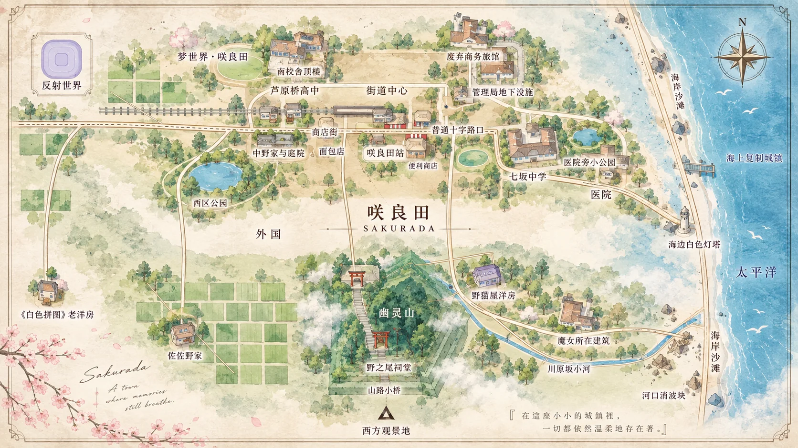

*GPT-Image-2 一次直出：只有一些小错误*

<!-- more -->

然而一张地图，除了要是一张漂漂亮亮的图，还得满足其最基本的要求：承载地理信息，最起码要保证相对位置的正确。即使不像真实地图那般要求严谨性，架空地图也得满足作者希望的位置约束，北方大陆一定要在北方！这就对地图的结构化和可编辑性提出了一定的要求。

现有的 GPT-Image 模型已经能很好的满足美观的要求，然而为了管理地理元素信息，我们有必要搭建一条从数据到最终成图的 pipeline。本文就以现有小说《重启咲良田》为例，介绍一种可能的尝试。

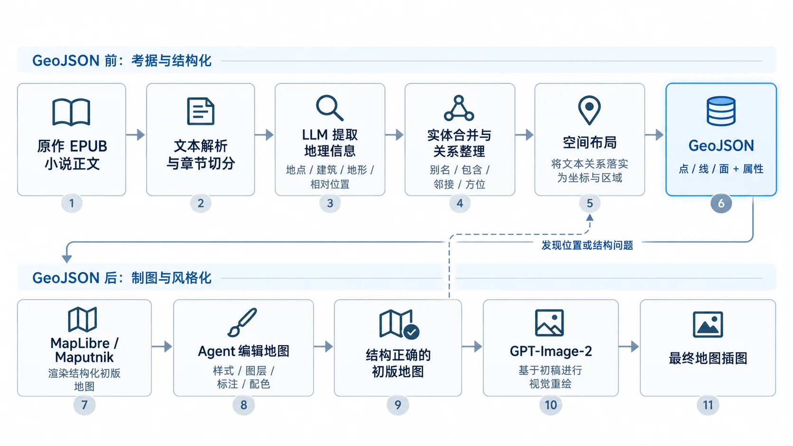

*工作 pipeline*

## 中间层：GeoJSON

我们先从腰部讲起。

GeoJSON 是一个相当 GIS（地理信息系统）的选择。GeoJSON 承载了点线面等几何信息——这正是我们最需要的。我们想要给每个建筑、地点一个具体的坐标，同时也可以给不同区域打上不同的标签。

当然从描述也可以看出，GeoJSON 其实相当枯燥：

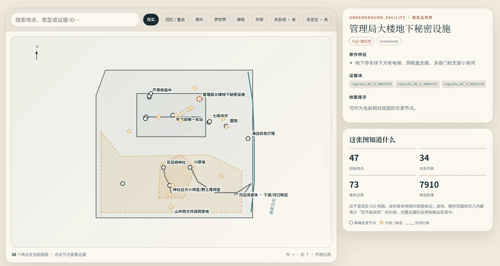

*GeoJSON 直接简单几何渲染*

但它同时也是相当好维护的格式。可以摘抄一段：

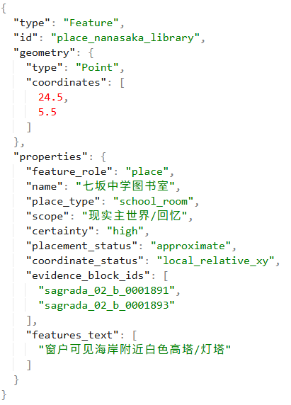

*七坂中学图书室的地理坐标和其他结构化信息*

JSON 是一种同时方便人类和 LLM 修改编辑的结构化格式，这里作为一条条实际坐标和区域的记录。可以说，GeoJSON 已经提供了地图所需要知道的一切信息，那么以此为分界，往前就是从文本提取 GeoJSON，往后就是从 GeoJSON 渲染地图。

那有人可能奇怪纯文本不是也好编辑吗？为什么不直接丢给 GPT-Image-2 一堆文本要求？说实话我也没试过，但是原因有两点：

1. 我们需要精确保存坐标信息；
2. 虽然纯文本也可以写坐标，但 GeoJSON 毕竟已经被格式好了，方便先渲染一版初稿，GPT-Image-2 在初稿基础上编辑，对不同元素的位置保持的就能非常好。

## 前端：EPUB 到 GeoJSON

说实话这部分一年前可能还能写点，现在倒是完全没有必要了，把小说七卷 EPUB 文件全塞进一个文件夹里，然后 Claude Code 启动：

> 我想画出重启咲良田中咲良田小镇的地图，但问题是，我需要首先收集原作中所有有关地理地形以及小镇建筑、布局的描述，我已经有 epub 小说文件，我希望你：尽可能全面的提取文字，收集各地点特征、关系，以及整体特征（一方面是地点关系，另一方面是地点特点），最好整理成结构化的数据方便我后续处理

然后一直敲继续，等他收集的差不多了说我要 GeoJSON 就行了。这个 prompt 并不是最优的，实际它畏手畏脚导致很多坐标不确定。嘛，但我们画个地图本来也不需要这么精准。。最后还得 prompt 一次让它大胆猜测。

这部分大概花了一个半小时，花了 9000 万 GPT-5.6 Luna 的 token，不过 Luna 这模型本来就便宜的跟不要钱似的，实际上也是，虽然 Claude Code 调了一些 Sol 的请求来规划，最后跑完五小时限额也没用到一半。

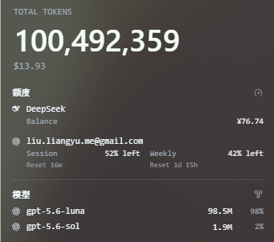

*订阅使用情况*

## 后端：初版渲染图

这部分其实还稍微有点 trick。上面我已经丢了一张 Claude Code 写出来的 GeoJSON 直接渲染出来的图了，说实话真的很丑，而且没有考虑标签和元素的遮挡关系。当然也可以让它优化一下这些问题，作为示意图肯定是可以构建出来的。

但这篇文章的饺子醋来了，我想打个广告，并不隆重的介绍一款内置 Agent 的 Web 地图编辑器：总之这是渲染出的效果，其实到这里整个地图生成的管线已经介绍完了，不想看广告的可以退出了。

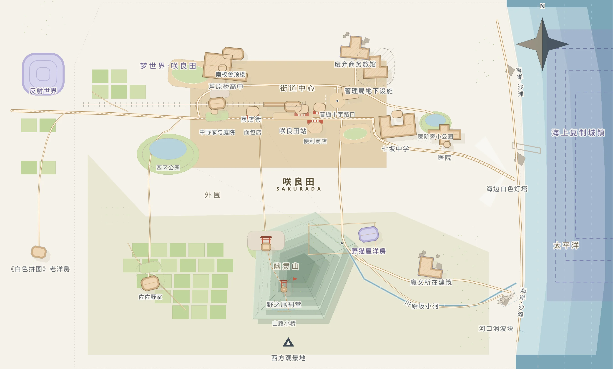

*初版渲染图*

没错因为这个是我前段时间自己搓的一个地图编辑器所以打个广告：总之这是使用起来的界面：

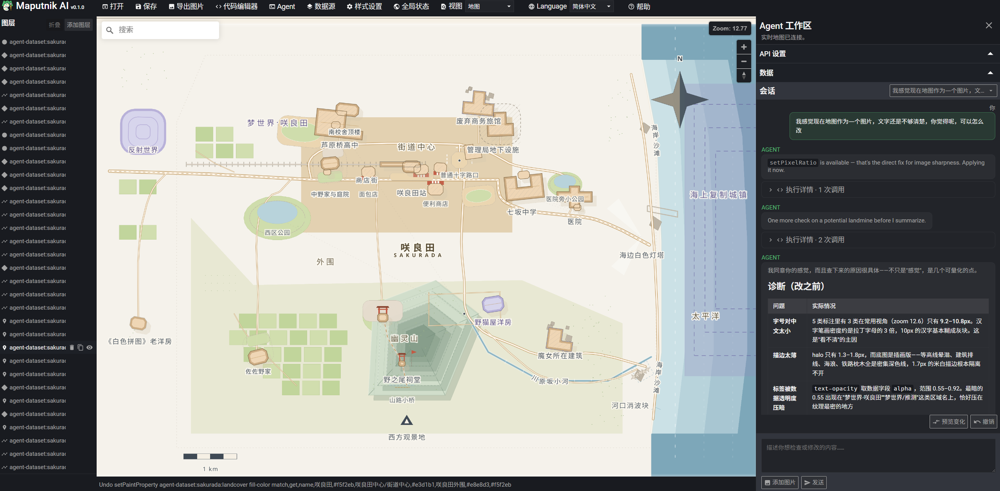

*Maputnik-AI 使用界面*

如果你有兴趣你可以去 GitHub 仓库：[liuly0322/Maputnik-AI](https://github.com/liuly0322/Maputnik-AI)。里面提供了代码和 GitHub Pages 部署的在线使用界面，不过需要你自备支持 Responses API 的 API Key。

它当然还有如下的使用场景：

1. 从零直接要求它构建一个架空地图；
2. 如果你在做 GIS 可视化（真的会有看这篇文章的人做这个吗？），你可以用它载入数据完成一些可视化工作，修改底图和叠加数据层；
3. ~~在地图上做一些鬼畜的事情（画动漫小人）。~~

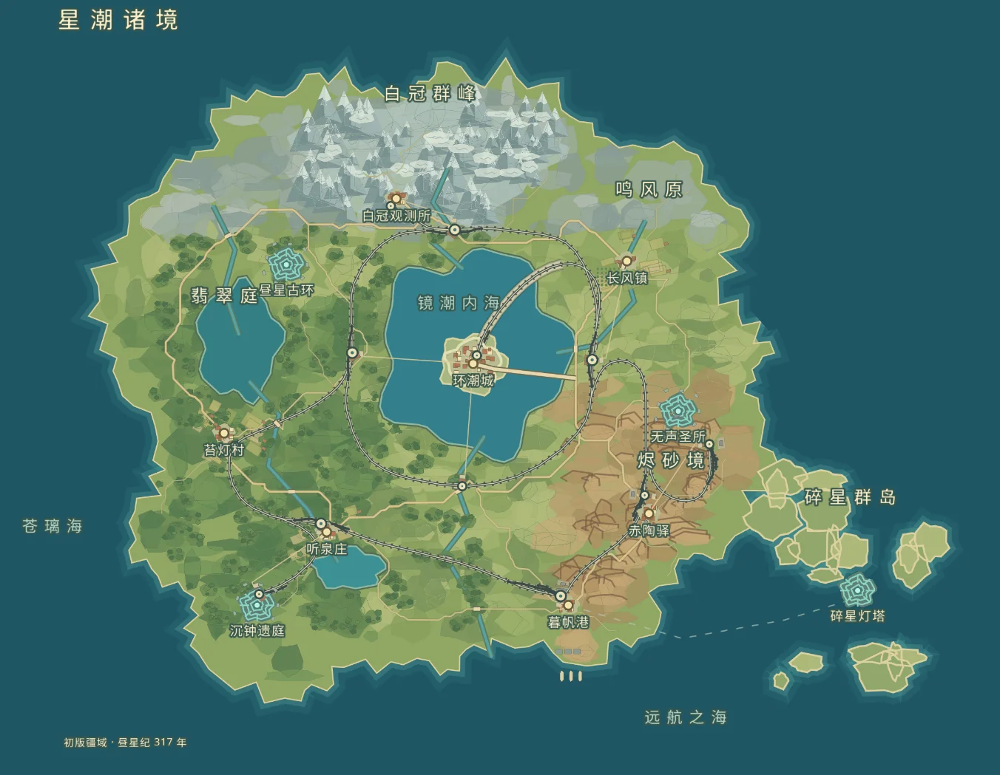

*“我想让你尝试按照原神地图的风格，构建你自己的幻想世界观”*

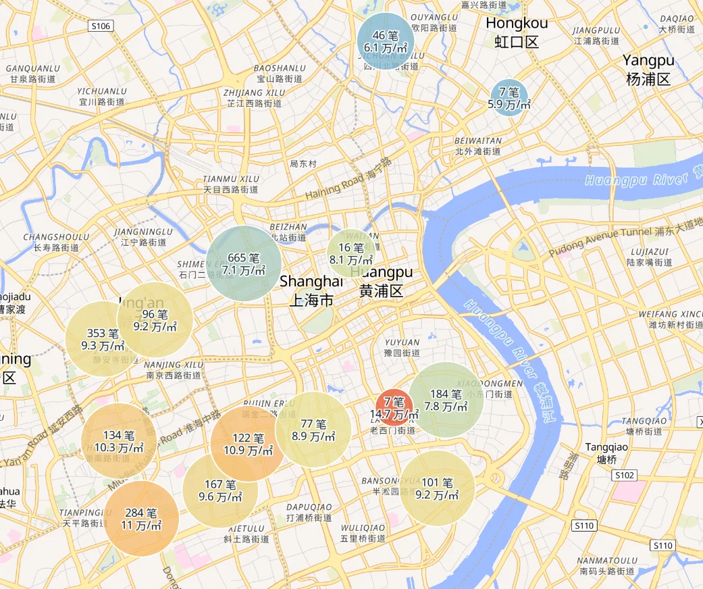

*“你自由发挥做我给你的数据集的可视化”*

*“画的更细致更像eva tv中的形象一点”……呃……*

说回正题，咲良田地图。

简单来说你可以把 GeoJSON 导入进去，然后对 Agent（这里我用的是 deepseek-flash，具体来说 DeepSeek-V4.1-Flash）发号施令：

> 我现在有一个 sakurada 的数据源，我想基于它，从零开始，构建重启咲良田的小镇地图，请你先审查这个数据源（审查格式，不要全部打印），然后按符合重启咲良田小说气质的方式画出地图。

> 我现在最想要的是图最好看，可以推测位置没关系的，但是我最希望的是能达到那种优秀的美术风格，类似游戏地图/插图的感觉，比如可能有较为细节漂亮的山川河流渲染，重要建筑的合理表示

> 我觉得路网不够真实，你觉得呢。建筑主要不要都是方块和圆圈吧，你能不能试试别的表现手法

> 我感觉现在地图作为一个图片，文字还是不够清楚，你觉得呢，可以怎么改

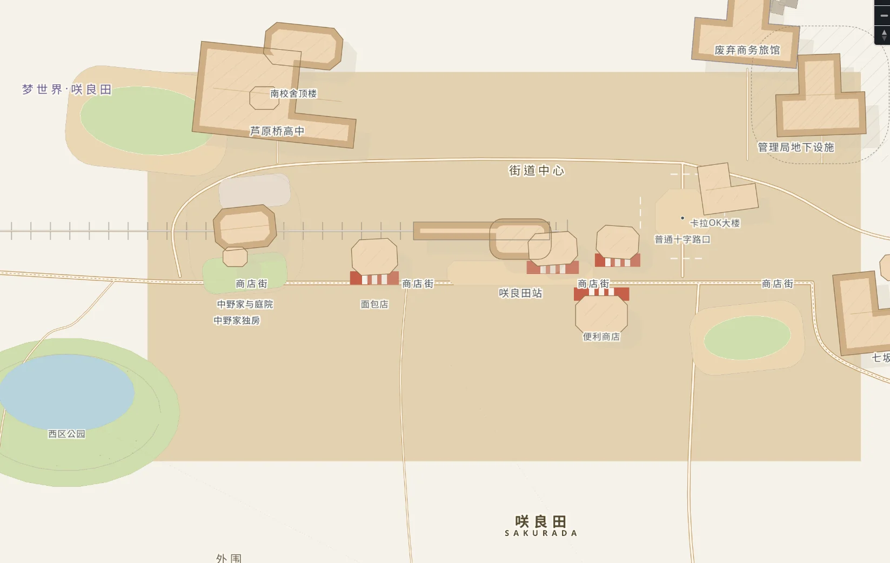

*嗯……总地图之前展示过了，这里来张放大后的看细节*

顺便一提它是支持图片输入的，我们可以随时截图当前状态作为参考丢给它让它思考。说起来 GPT-6-Astra 用 Blender MCP 里建模好像是让很多人眩晕瘫坐了，我还没有用 GPT-6-Astra 做过 3D 建模，但不得不说 DeepSeek-V4.1-Flash 做地图编辑任务的性能就已经很超出我的意料了。

总之最后一步就最简单了。直接把示意图丢给 GPT-Image-2，我们就得到最后的咲良田地图了。

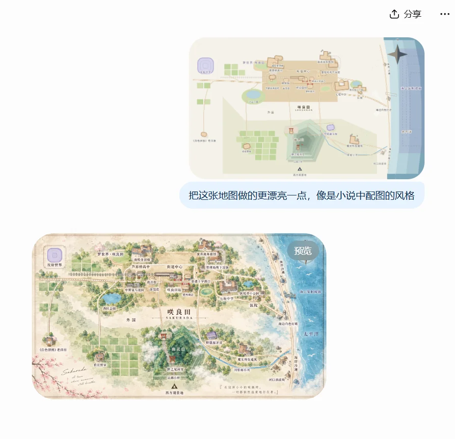

*收工！*

可喜可贺，可喜可贺。

来源：[Bilibili 动态](https://www.bilibili.com/opus/1249142129434820614)
