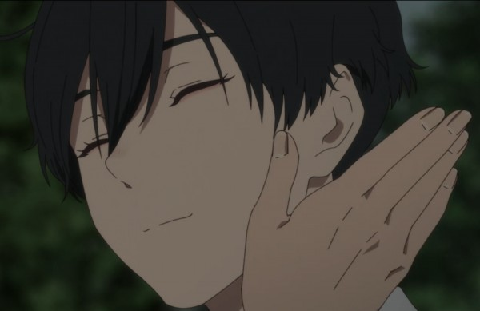
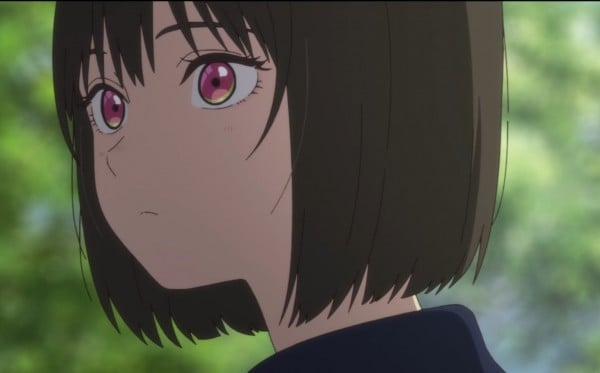
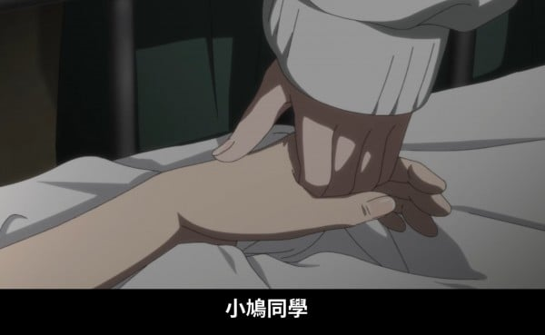

本文是对米泽穗信《小市民系列》的书评。以后 Bangumi 个人写的比较满意的 ACGN 评论也会放在这个博客上。本文假定读者已经阅读过《小市民系列》或观看过改编的两季动画。

> <完结作是“尾声，也是序章”>

自《秋季限定糖渍栗子事件》出版以来，已经十五年过去。米泽穂信的青春推理小说“小市民”系列四部曲终于在《冬季限定夹心巧克力事件》画上了句号。音乐中的尾声是高潮后的余韵。《秋》中，小鸠和小佐内的自我认知的故事已经完结。《冬》一方面是《秋》中狐狼成长与关系性之余韵，另一方面又是对小市民起源故事的补完。本文就以小鸠的成长为线，感受《小市民》系列的魅力。

<!-- more -->

## 序章

> 正在作梦的我看著梦中那个得意忘形的我，心情非常苦涩。不知是不是这种心情影响了梦境，有一个人从不断欢呼的观众之中走出来。
>   
> 那是谁呢？会对我说这种话的人，我想得出好几个。他，或是她，笑咪咪地说：
>   
> 「真的很厉害。精彩的推理，缜密的论证。可是，那个，嗯，该怎么说呢，虽然有些难以启齿，但我还是直说吧。
>   
> 你真的很惹人厌耶。」
>   
> 真是的，这个梦未免太吓人了。醒来以后，我的心脏还是怦怦地跳个不停，我简直担心自己会不会因此得到心脏病。

**小市民故事的缘起从《春》开头小鸠做的梦中便有所暗示**。正如原文，是一个相当具有米泽风味的苦涩故事。自以为无所不能的少年想要影响与改造世界，我想这也是大家都曾做过的梦吧，“像我这样的人，认真起来一定可以做出些什么！”

但是少年在一腔热血、满腹激情和冲劲的同时，也是不成熟的，缺乏对世界认知的。少年可以考试考到高分；少年可以推理出学校内事件的“犯人”……局限在校园场景内的少年可以做到很多事情。但是在更大的社会乃至世界尺度内，**有太多的事情少年做不到**。

其他米泽的作品里也有这样的情节。少年无法挽回奔向危险故土的少女（《再见，妖精》）；即使少年能找到失踪的少女也只能默默陪伴在哭泣的她的身边（《迟来的翅膀》）……

对小鸠来说，他的这份故事在《冬》中得到了补完。初中时的小鸠沉迷在推理的乐趣和发现真相的快感中，丝毫不顾后果的调查日坂祥太郎的交通事故，然而结果却是破坏了日坂姐弟二人恢复幸福家庭的契机。小鸠什么也没做到，只不过是伤害了日坂君。

**少年的黄金时代结束了，苦涩感涌上心头**。

这种少年阶段自负的全能感的丧失，对中二感的破坏，对世界系的反叛是米泽作品苦涩味道的源头。虽然说“少年有很多事做不到”不等于说“少年什么事都做不到”，但总归还是让作品的基调带上了一份灰色的阴影。

少年陷入了成长的迷茫：为什么世界这么灰暗荒芜，为什么我这样无力渺小？

## 迷茫的小市民

> 于是我再次选择了逃避，屏蔽了这起事件的一切后续消息。视而不见，听而不闻。对于整起事件，我所知的内容仅仅是那天下午读到的晚报简讯。更没有在逮捕犯人后跟日坂君谈起过这件事。日坂君在事故之后也是寡言少语，和任何人都不怎么说话。

**黄金时代结束后，少年的第一选择是逃避。小市民的故事开始了**。

> 我发誓上高中后要自我封印自己这愚蠢的癖好。我们和彼此约定要互帮互助，共同恪守小市民的行为规范。

然而「小市民」这个词既体现出狐狼对自己的低估，又太傲慢。这不是狐狼找到的最终答案。小市民们还需要经历高中三年的磨砺才最终评估出了自己是个怎么样的人。这中间就是《春》《夏》《秋》的故事。期间狐狼二人一直在尝试扮演「小市民」，但是现实没有这么顺利。

《夏》中，二人发现了隐藏在彼此「小市民」互惠关系下的谎言。因为他们彼此理解、彼此依赖，所以狐狼在一起时无法放弃自己的本性，无法成为「小市民」。

《秋》中，二人分开了。然而这样就能成为「小市民」了吗？答案也是否定的。越是尝试正常生活，狐狼二人越是感到这和自己本性的相抵触。小鸠觉得与仲丸的交往愈发压抑，小佐内觉得瓜野真是无趣。

分类讨论完毕，结论：**狐狼二人无法成为「小市民」。狐狼二人虽然并非全能，但也不是无能**。虽然逛街约会也很美好，但我果然还是更想把连续纵火案的推理经过都说给你听。

## 尾声

> 我们口中的「小市民」是用来和周围人们相处的口号，是为了避免再次受到孤立的场面话。就像是投降的白旗，用来告诉别人「我一无是处，请放过我吧」。
>   
> 这句口号说了三年，我终于明白了。如果我真的想和别人和平共处，根本不需要用这种话来抹杀自己的本性。我越是挥舞白旗，心中越会萌生出反叛和厌恶，而且会越来越轻视别人。
>   
> 不是这样的。我真正需要的并不是披上「小市民」的羊皮。
>   
> 只要有一个理解我的人就足够了。

我无意进行比较，只是感到庆幸，米泽穂信让故事有了一个温柔的结局（看完《再见，妖精》实在是郁闷……）。

**《秋》的结尾，少年迎来了他的后黄金时代。狐狼找到了彼此的唯一理解者**。

> 「发现她在校刊社的周遭蠢动时，我就猜到她打算报复某人了。」
>   
> 「我早就知道你一定看得出来。」

**在全能与无能之间，狐狸与狼发现了只有彼此才能看得见的绚丽风景，找到了独属于二人的世界。就算世界灰暗不讲理也无所谓，就算我能做到的事情有限也无所谓，因为我已经抓住了让世界变成彩色的你**。

「至少对现在的我来说……你是不可或缺的。」

*今晚真的很热。感觉比刚才更热了*。

我承认我无法任由自己心意改变世界，既然如此我要找出我和世界的和谐相处之道。到这里还是传统青春成长故事的理论。但《小市民》美妙的地方就在于狐狼二人共同构建了他们与世界的和谐。他们可以互相理解并包容对方的异质，并携手走向、开创属于自己的未来。

> 《冬季》卷中小鸠在现在的时间轴上应该一次也没有使用“小市民”这个词。因为这个词对他来说，已经不再需要了。

《冬》是狐狼二人对「小市民」的告别与前行。**自我认知已经完成的狐狼二人在高三疯狂撒糖qwq**。看完《冬》后的读者一定能感受到小佐内始终对在医院的小鸠的担心牵挂和爱。这一部分附录中第三篇文章摘抄了很多原文段落，好磕。

结语：在米泽穗信笔下，小市民不是终点，而是一条通往真正自我的过渡地带。在告别幻想万能的同时，狐狼也终于拥抱了真实的温柔。我们这样的少年虽然做不到拯救世界，但也能找到生活下去的理由啊！

## 附录

一些比较喜欢的分析及参考文章：

1. [后世界系的瓶颈 - 北窓](https://book.douban.com/review/6650934/)
2. [从《冰菓》说开去——与世界系抗争的米泽穗信 - 巴甫洛夫的忌日](https://www.gcores.com/articles/106434)
3. [在百无聊赖日常中，为你创造名为“迷宫”的居所：'小市民'系列主人公成长向浅析——以《冬季限定法式巧克力事件》为中心](https://book.douban.com/review/15919822/)
4. [专访：米泽穗信谈【小市民】系列完结——青春之谜的金字塔](https://www.bilibili.com/opus/939796276931723302)
