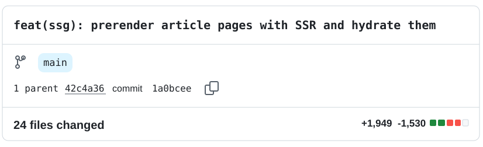
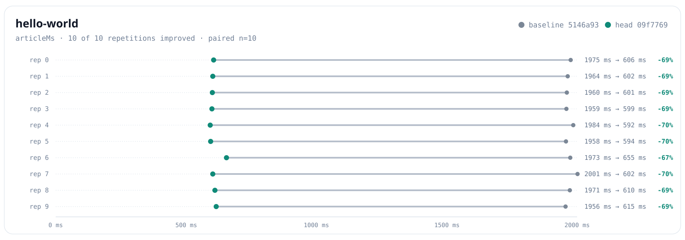
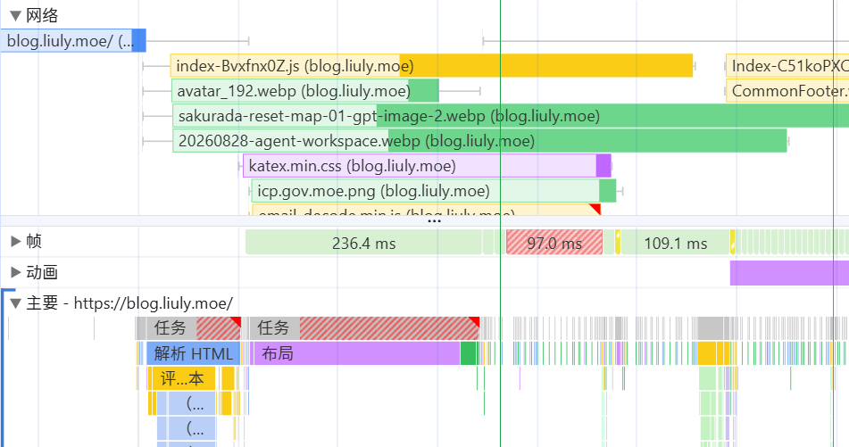

嗯……没错，我最近又开始折腾这个博客了，上次折腾大概还是在两年前。一直以来累积了一些想法，比如有关注 Astro 这种很适合博客做全站 SSG（Static Site Generation，静态站点生成）的框架，但一直也舍不得现在 Vue 的 SPA（Single Page Application，单页应用）架构：没错我真的会在这个博客里用侧边栏的播放器听歌（虽然 VIP 歌曲自从某天我的 Cookie 过期而且我懒得更新后就只能试听 30 秒了）。所以我也希望保留路由切换时的 SPA 体验。

<!-- more -->

完全迁移到 Astro 也不是没有办法，`ClientRouter` 可以拦截站内链接的点击事件，然后在后台请求页面数据并渲染到 DOM 上，但毕竟这样要大改我博客的架构。而 Vue 生态呢？用 Nuxt.js 也可以解决我的需求，但总觉得绑定框架带来的约定太多太重，于是就一直搁置下来。

## SSG

然而今日（2026-09-26）在 AI 的帮助下，给博客做 SSG 已经是一件很简单的事情了：

```
commit 1a0bceeb3255ad106179c456b8c1c61a60218e0d
Author: liuly <me@liuly.moe>
Date:   Tue Sep 22 22:44:48 2026 +0800

    feat(ssg): prerender article pages with vite SSR and hydrate them

commit 42c4a3619a60e01ef07488aba6a74ebca1302157
Author: liuly <me@liuly.moe>
Date:   Tue Sep 22 19:39:12 2026 +0800

    perf: remove naive-ui dependency
```

所以现实时间也只花了三个小时，就得到了：



其实本文标题写的 60% 收益几乎全部来自于 SSG。

完全基于 Vite 的构建流程，下面我们梳理几个关键概念和思路：

首先回顾一下本博客网站的起点，SPA。在 SPA 架构中，所有的页面都可以从入口页面加载到（反过来说，也必须走这条入口）。比起普通网页，它更像是一个应用的心智模型。

举个例子，如果你访问 `/posts/shrink-load-time`，那么浏览器需要请求的仍然是入口页面 `/index.html`。在 GitHub Pages 之类缺少 SPA fallback 的纯静态托管上，常见做法是利用 404.html 和 JavaScript 把路由带回入口页面；而 Cloudflare Pages 这类平台可以直接把没有匹配到静态文件的请求交给 SPA 的入口页面。

SPA 当然是有好处的：想象一个网页有一个顶栏，分别有「首页」、「文章」、「关于」三个栏目。当首页加载完成后，我们再去跳转其他页面，很可能网页上只有一部分需要变化：对应 Vue 的 `router-view` 组件的内容。这样我们在点击跳转时就不需要请求新网页的全部内容，而是只要请求变化的部分就可以了。

> 所以我的侧边栏的播放器可以随着页面切换一直活着 (*ﾉωﾉ)

但网页为了享受到一个入口能加载全站的动态性好处，就会在静态性上失去优势。还是举 `/posts/shrink-load-time` 这个例子。不同的客户端浏览器访问这个页面，都会重复：加载入口页面、请求文章数据、渲染文章内容的完全相同的流程。然而既然这部分计算是完全相同的，为什么不在构建时就把它计算好呢？这就是 SSR（Server Side Rendering，服务端渲染）的提供给我们的能力：给定一个 URL，我们可以在构建时而不是客户端浏览器上计算好 `router-view` 的内容，或者，计算好当前整个 Vue app 挂载在的 DOM 树节点的 HTML 内容字符串。

接下来就是怎么利用这一字符串。很容易发现我们之前 `posts/shrink-load-time.html` 并不存在，因为我们需要它从初始页面状态重新在客户端上渲染。但反过来说，我们现在已经有了该页面渲染后的状态了，自然可以将 `index.html` 拷贝一份，命名为 `posts/shrink-load-time.html`，然后将渲染后的 HTML 内容字符串写入到该文件的 Vue app 应该挂载的 DOM 节点中。可以发现这就是**提前将页面应有的状态**计算了出来。

但是依然有些细节问题需要处理。但按照上面的观念来看其实很清晰，就是我们的 DOM 字符串虽然计算出来，但这只是取巧得到了**最终状态的一部分**（DOM 树）。

1. 整个应用还有其他部分需要同步：JS 和 CSS 资源的解析；
2. 服务端的计算和客户端并不能完全同构。涉及到一些浏览器特有的 API，比如更改页面标题，无法在服务端执行。

### JS 和 CSS 资源

我们只是计算完了页面的 DOM 树，但页面的动态功能仍然需要 JS 绑定实现。同时，CSS 资源也需要加载才能保证页面的样式正确。这一过程在 SPA 应用中是这样的（考虑路由切换以展示页面专属的资源）：

1. 浏览器请求入口页面 `/index.html`，并加载**入口** JS 和 CSS 资源。入口资源相当于整个应用公有共用的资源，所有页面都需要加载它们。
2. JS 执行，并根据路由参数去请求当前页面专属的 JS 和 CSS 资源。
3. 所有资源加载完成后，实际渲染出页面。

其中入口资源因为所有页面都要加载，所以我们也是在 `posts/shrink-load-time.html` 中保持和原来一样的一份即可。后续我们切换到其他界面时这些资源自然能被用上。

但问题出在 SPA 应用在切换到某个路由页面的时候，也会去请求它对应的 JS 和 CSS 资源。我们在构建时计算了该页面的 DOM 树，但并没有声明应该去请求它的 JS 和 CSS 资源。但是显然一个 URL 需要什么资源也是可以计算出来的。所以这里需要注意的就是一个额外工作。我们在 `posts/shrink-load-time.html` 的 `<head>` 中可以「声明」它依赖的 JS 和 CSS 资源。

> 上面用了「声明」这一暧昧的词，因为这些资源并不一定需要在这里执行。在下面一节会介绍页面专属的 JS 和 CSS 资源最终也会被重新请求加载。但是由于 CSS 资源会阻塞当前页面的渲染，所以一般还是会插入在这里的 `<head>` 中，让它先加载并应用；而 JS 资源则是加上 `<link rel="modulepreload">` 来提前让浏览器去请求它们，这样等真正动态加载它们时可以直接利用请求好的模块了。

如果你感兴趣，这是 Vite 的实现方式：

1. 构建客户端代码时，Vite 允许指定 `{ ssrManifest: true }`，这样在构建时就会生成一个 `ssr-manifest.json` 文件，里面包含了每个模块到其依赖的 JS 和 CSS 资源的映射关系；
2. SSR 渲染时 Vue 会记录本次页面实际使用过的模块。SSG 阶段将这些模块和 manifest 对照，就能得到当前页面需要提前加载的 JS、CSS 等资源，然后将它们插入到 `<head>` 中。

### 非同构

然后就是另一个问题：虽然我们梦想一份代码在服务端执行完就代替了浏览器执行，但实际上很难做到。

原因其实也很直观，那就是服务端在计算最终 HTML 的过程中，也改变了脚本中变量的状态。因此初始状态的客户端脚本自然不适合直接接着渲染好的 HTML 执行。我们需要在客户端重新执行一遍 JS 代码，然后才来让它接管服务端已经计算好的页面 DOM。

这后面的接管的过程是 Vue 适配好的，所以我们不需要担心。

但这里还有个问题，就是有些代码只能在客户端执行：

最直观的例子就是浏览器 API。比如原来我们可以很自然地写 `window.location`、`localStorage`，或者通过 `document.title` 修改页面标题；但 SSG 时运行这段代码的是 Node.js，压根就没有 `window` 和 `document`。

当然这个问题并不大，我们可以用 `import.meta.env.SSR` 或者 `typeof window === 'undefined'` 来做 guard，也可以把那些客户端专属的 Vue 挂载好后再执行的逻辑放到 `onMounted` 钩子里。

### useFetch

还有个有趣的问题是，虽然重算大部分时候不是问题，JS 的执行并不慢。但是 `fetch` 请求是一个特例。

假设文章页面原本的逻辑是在组件初始化时根据路由参数 `fetch` 对应的文章内容。那么 SSR 时为了渲染出 HTML，这个请求已经执行过一次了；等页面到了客户端，JavaScript 又会从头执行一遍，于是同一个请求还会再发一次。网络请求造成的浪费可比重算一小段 JS 代码要大得多。

解决方法也很直接：把 SSR 时得到的数据状态一起序列化到生成的 HTML 中。比如写进一个 `<script>` 标签，挂到某个全局变量上。客户端启动时先检查这份服务端留下来的状态，如果已经存在，就直接拿它作为初始数据，而不是重新 `fetch`。

当然如果用的是 Nuxt.js，它已经把上面的逻辑封装成一个 `useFetch` 了。这个函数在客户端执行的时候会先检查当前是否有服务端渲染时留下来的数据，如果有就直接返回它，否则才会去发起请求。

上面这一段段论证我们都可以看出：对于应用所处的**最终状态**，服务端交给客户端的一棵已经渲染好的 DOM 树只是**最终状态的一小部分**。客户端用相同的状态重新运行，才能顺利地接管眼前这份 HTML，而不是把它当成一份无关的静态页面重新计算。

这个「客户端重新运行，并接管服务端已经生成好的 HTML」的过程，也就是下面要说的水合。

### 水合

你可能早就听说过水合这个不明觉厉的词。但经过上面的分析，我相信下面的定义很容易让你了解它的意思了：

> 定义：在服务端渲染（SSR）中，指将服务器生成的静态 HTML 页面「激活」为客户端完全可交互的动态应用的过程。

对于我们的 SSG 后的 SPA 应用来说，就是我们上面说的**状态同步**的过程嘛！当然本文是从 SPA 的角度来分析的。但我们也说了 SPA 的心智模型是一个更像「应用」的网页。

另一方面，我们也可以从静态 HTML 出发，该定义对应陈述的就是：考虑一个静态 HTML 页面，包含（首屏、不考虑动态内容）渲染所需的完整的 DOM 树结构和 CSS 样式，那么它的首屏就足以渲染出来。为了达到这一效果，要求就只是：在页面加载完成前，JavaScript 不应该阻塞页面的渲染（不应该有希望显示的 DOM 元素或者 CSS 样式依赖 JS 的加载和运行）。JS 只作为附加在静态页面上的组件，以实现页面的动态交互功能。

这里也能得到一个很好的分析。看首屏速度，最重点关注的只是：

1. 希望显示的 HTML 节点已经存在于文档中（已经由 SSG 保证）；
2. 阻塞渲染的 CSS 已经加载完成。

因为只要它们都准备好，页面就可以显示出来了。这里没有 JS 的事情。

这个观点在下面进一步优化博客加载速度时就会有很大的帮助。

> 当然你可能会想那也不一定啊，要是一个网站有很多模板化的内容呢？这个时候完整的 HTML 可能很大，就不如让 JS 计算划算了。但这里的 trade-off 大多数时候还是很明显的，为了渲染某段内容所需要引入的 JS（比如几百 KB 级别的依赖）往往都比最终渲染出来的 HTML（常常在几十 KB 量级）大很多。

## Benchmark

工欲善其事，必先利其器。和 LLM 许愿一下你想在 test 目录下有一个限流 200 KiB/s、CPU 四倍节流的测试环境，然后你就可以跑测试对比前后收益了。



*我懒得做消融了，这还叠加了后文其他一些优化的收益，不过反正这也不是发论文。*

最后大概 600ms 内能完成文章的加载和渲染，和之前的 2s 相比，确实是很大的提升。

## 其他优化

- 内联入口 CSS，再减少一次网络请求；
- 不用组件库了。缺什么组件直接和 LLM 许愿就行了，省得引入一个组件库的体积；
- 图片转换成 WebP 格式，减少图片体积；
- 我总念叨的我可爱的小播放器：

```typescript
onMounted(async () => {
  const url = `xxxxxxxxxxxxxxxxx`
  const [createPlayer, , audios] = await Promise.all([
    import('aplayer-ts').then(({ default: createPlayer }) => createPlayer),
    import('~/styles/aplayer-theme.css'),
    fetch(url).then(response => response.json()),
  ])

  instance = createPlayer()
  instance.init({……})
  playerReady.value = true
})
```

现已完全异步。完全不阻塞页面了。

这里可以展开的是内联入口 CSS。



这是一条限流下的性能测试时间线。

说实话上面两条首屏渲染的要求一总结，这里倒有点第一性原理的味道了。可以看到流程图就是很清晰的请求 `index.html`（这里把文档和内联的 CSS 资源都获取到了），然后立即就可以解析、布局。这个时候才 0.6s 左右。与此同时首页的 JS 资源还在加载中，它完全没有阻塞首屏的渲染。之后它请求好后才开始水合页面。

收工！
