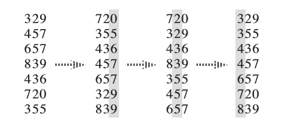

本文将简要介绍各种排序算法。

## 简介

> **排序算法**（英语：Sorting algorithm）是一种将一组特定的数据按某种顺序进行排列的算法。

## 性质

### 稳定性

定义：如果一个排序算法能保证两个相等的数，经过排序之后，其在序列的前后位置顺序不变，那么这个排序算法就具有稳定性。

当要排序的内容是一个复杂对象的多个数字属性，且其原本的初始顺序存在意义时，排序算法的稳定性将会发挥作用。

<!-- more -->

例如：

> 公司想根据“能力”和“资历”（以进入公司先后顺序为标准）作为本次提拔的参考，假设 A 和 B 能力相当，如果是稳定性排序，则第一次根据“能力”排序之后，就不需要第二次根据“资历”排序了，因为“资历”排序就是员工插入员工表的顺序。如果是不稳定排序，则需要第二次排序，会增加系统开销。

这种情况还是比较常见的。在后文介绍基数排序时也可以看到这一性质的应用。

基数排序、计数排序、插入排序、冒泡排序、归并排序等是稳定排序。

选择排序、堆排序、快速排序、希尔排序等不是稳定排序。

### 时间复杂度

假设需要排序的数据有 $n$ 个。可以给出一个结论：基于比较的排序算法具有时间复杂度的下限： $O(n\log n)$ 。

这里说一个排序算法基于比较，是指排序过程中，需要通过数据两两比较大小，决定他们的顺序。

一个直观的证明是这样的：在 $n$ 个数字未排序之前，它们互相的大小关系一共有 $n!$ 种可能。我们称这些可能的全体为一个状态空间，最理想的情况，每次比较都可以使状态空间剩余的状态数减半（这里可以类比给定一个整数在一个区间内，猜测这个整数是什么的问题（允许询问整数是不是在某一区间），最好的决策应该是每次二分查找（这里直接运用了这个经验结论，当然这是可以被证明的，不过这与本文关系不大），而不是询问长度为总长 $\frac{1}{3}$ 的区间）。

在这种策略下，一共需要比较 $\log_2(n!)$ 次。根据斯特林公式（阶乘的近似估计式）， $n!=\sqrt{2\pi n}(\frac{n}{e})^n$ ，故 $\log_2(n!)=\Theta(n\log n)$ ，这也就是基于比较的排序算法的（平均）复杂度下限。一些基于比较的排序算法的时间复杂度可以在特殊情况下达到 $O(n)$ 这一天然下限，比如对于一个已经排列好的序列采用冒泡排序（实现细节见下文）。但这从一个决策角度而言并不是高明的：比如说，对于一个排序好的数组 `a[n]` ，这里下标从 $1$ 到 $n$ ，在前 $n-2$ 次比较后，我们可以得知： $a[1]\le a[2] \le \cdots \le a[n-1]$ ，就得知的信息而言，此时状态空间还剩余 $n$ 种可能（ $a[n]$ 可以在任意位置），但此时冒泡排序的策略相当于在赌 $a[n]$ 位于最后一位，所以仅仅对于这个特例，冒泡排序会有比较好的时间复杂度表现（恰好赌对了）（前 $n-2$ 次比较过程中也是类似的，不过不像最后一次这么直观）。

下面将介绍一些常用或经典的排序算法。

## 基础排序算法

这里将介绍比较常见的几种排序算法：冒泡排序，选择排序，插入排序，快速排序和归并排序。

### 冒泡排序

> 冒泡排序（英语：Bubble sort）是一种简单的排序算法。由于在算法的执行过程中，较小的元素像是气泡般慢慢「浮」到数列的顶端，故叫做冒泡排序。

#### 原理

冒泡排序是最直观的基于比较的排序算法。策略是依次比较两个相邻的元素，如果逆序就交换。当整个序列中没有逆序的元素（没有发生交换），那么排序就完成了。否则重新遍历这一序列。

#### 实现

```cpp
void bubble_sort(int* a, int n) {
	for (bool sorted = false; sorted = !sorted; n--)
		for (int i = 1; i < n; i++)
			if (a[i - 1] > a[i]) {
				swap(a[i - 1], a[i]);
				sorted = false;
			}
}
```

~~所以说 cpp 真的好自由~~

这里通过 `sorted` 记录本次遍历是否完成排序。

每次遍历后会依次从后确定最大的数、第二大的数，此后就不需要再比较这些数了，所以这个过程中有 `n--`

#### 性质

冒泡排序是一种稳定的排序算法。

平均和最坏时间复杂度均为 $O(n^2)$ ，最优时间复杂度（序列已经有序时）为 $O(n)$ 。

### 选择排序

#### 原理

每次找出第 $i$ 小的元素，再与数组第 $i$ 位交换。

#### 实现

```cpp
void selection_sort(int* a, int n) {
  for (int i = 0; i < n - 1; i++) {
    int ith = i;
    for (int j = i + 1; j < n; ++j) {
      if (a[j] < a[ith]) {
        ith = j;
      }
    }
    swap(a[i], a[ith]);
  }
}
```

#### 性质

由于随意的交换元素，选择排序不是一种稳定的排序算法。

最优时间复杂度、平均时间复杂度和最坏时间复杂度均为 $O(n^2)$ 。

### 插入排序

> 插入排序（英语：Insertion sort）是一种简单直观的排序算法。它的工作原理为将待排列元素划分为“已排序”和“未排序”两部分，每次从“未排序的”元素中选择一个插入到“已排序的”元素中的正确位置。

#### 实现

```cpp
void insertion_sort(int* a, int n) {
    for (int i = 1; i < n; i++) {
        int key = a[i];
        int j = i - 1;
        while (j >= 0 && a[j] > key) {
            a[j + 1] = a[j];
            j--;
        }
        a[j + 1] = key;
    }
}
```

#### 性质

插入排序是一种稳定的排序算法。

平均和最坏时间复杂度均为 $O(n^2)$ ，最优时间复杂度（序列已经有序时）为 $O(n)$ 。

### 快速排序

#### 原理

每次选择一个数作为基准，通过交换使得数组前半部分小于（等于）这个数，后半部分大于（等于）这个数，随后分别对这两部分快速排序，数组就排序完了。

可以看到，这一过程很适合用递归编写。递归中止条件是当前仅一个数。

#### 实现

```cpp
void quick_sort(int* num, int length) {
	if (length <= 1) return;
	int i = 0, j = length - 1, mark = num[length / 2];
	while (i <= j) {
		while (num[i] < mark) i++;
		while (num[j] > mark) j--;
		if (i > j) break;
		swap(num[i], num[j]); i++; j--;
	}
	quick_sort(num, j + 1);
	quick_sort(num + i, length - i);
	return;
}
```

具体实现有很多种方式，但实质相同，都是将数列划分为两部分（保证相对大小关系），再快速排序这两部分。

本实现的 `mark` 即为每次的基准数，这里选取了每次数组的中间项，以避免特殊数据情况（如升序序列或降序序列）的干扰。

#### 性质

快速排序不是一种稳定的排序算法。

最优时间复杂度和平均时间复杂度为 $O(n\log n)$ ，最坏时间复杂度视实际情况可能退化到 $O(n^2)$ 。

#### 应用

快速排序这种分治的思想在解决别的问题时也可以用到。如：[P1923 求第 k 小的数 - 洛谷](https://www.luogu.com.cn/problem/P1923)

将快速排序的函数稍作改变：

```cpp
#include <iostream>
#include <cstdio>
using namespace std;
int nth_num(int* num, int length, int target) {
	if (length <= 1) return num[0];
	int i = 0, j = length - 1, mark = num[length - 1];
	while (i <= j) {
		while (num[i] < mark) i++;
		while (num[j] > mark) j--;
		if (i > j) break;
		swap(num[i], num[j]); i++; j--;
	}
	if (target <= j + 1) {
		return nth_num(num, j + 1, target);
	} else if (target > i) {
		return nth_num(num + i, length - i, target - i);
	}
	return num[target - 1];
}
int main() {
	int n, k, a[50] = { 0 };
	cin >> n >> k;
	for (int i = 0; i < n; i++) {
		scanf("%d", &a[i]);
	}
	cout << nth_num(a, n, k + 1);
}
```

通过分治，每次把问题的规模缩减到原来的一半，在这一半中继续找所求的数。时间复杂度 $O(n)$ 。

### 归并排序

#### 原理

与快速排序类似，归并排序也采用了分治的思想。具体来说，归并排序先将数列划分为两部分，再分别对两部分归并排序，得到两个有序的数列，最后再合并两个数列即可。

不难发现，归并排序同样也很适合用递归实现。终止条件同样是当前仅有一个数。

#### 实现

```cpp
void merge_sort(int* num, int length) {
	static int t[100000];	//需要重复使用
	if (length <= 1) return;
	int mid = length / 2;
	merge_sort(num, mid);	//下标从 0 到 mid - 1
	merge_sort(num + mid, length - mid);
	int left = 0, right = mid, ans = 0;
	while (ans < length) {
		if (left >= mid || (right < length && num[left] > num[right])) {
			t[ans++] = num[right++];
            // res += mid - left;
		} else {
			t[ans++] = num[left++];
		}
	}
	for (int i = 0; i < length; i++) num[i] = t[i];
}
```

#### 性质

归并排序是一种稳定的排序算法。

最优时间复杂度、平均时间复杂度和最坏时间复杂度均为 $O(n\log n)$ 。

#### 应用

可以用于统计数组的逆序数。所谓逆序数，就是指一个数组中满足 $i<j$ 且 $a[i]>a[j]$ 的数对 $(i,j)$ 的组数。

事实上，原代码里注释的 `res += mid - left;` 就是在统计逆序数。原理如下：

由于归并排序划分的两部分的数彼此之间不改变位置，所以总的逆序数相当于：左半部分逆序数 + 右半部分逆序数 + 左右部分之间逆序对数。

其中，左半部分逆序数和右半部分逆序数自然是原问题的子问题，所以交给递归即可。

剩下的就在于如何统计左右部分之间的逆序对数。在合并左右两个有序数列过程中，如果整个数列有序，没有逆序数，那么应该一直是左半部分填入 `t` 数组；反之，在统计逆序数时，只需要考虑那些“提前”填入的右半部分数字即可。对于这些数而言，它们都各自会和尚未填入的左半部分数形成逆序。左半部分数一共有 `mid` 个，已经填入 `left` 个，那么自然只需要 `res += mid - left;` 即可。

这种统计逆序数的方式的复杂度与原归并排序相同，均为 $O(n\log n)$ 。

## 不基于比较的排序算法

这里将介绍计数排序，基数排序，桶排序这些不基于比较的排序算法。这些排序算法的时间复杂度不受基于比较的排序算法的下限 $O(n\log n)$ 的限制，但一般会牺牲更多的空间。

### 计数排序

#### 原理

计数排序的基本思路是统计每个数出现的次数，再根据这一信息还原出正确的排序。

具体实现上，为了统计每个数出现的次数，需要开一个大小为需要统计的数组的值域的数组，初始置值为 0，然后统计每个数出现的次数，最后再还原即可。

#### 实现

```cpp
int f[1000] = { 0 };	//值域
for (int i = 0; i < n; i++) {
    int t;
    cin >> t;
    f[t]++;
}
for (int i = 0; i < 1000; i++) {
    for (int j = 0; j < f[i]; j++) {
        cout << i << ' ';
    }
}
```

这是最直观的 "计数" 排序，但不是一般意义上的计数排序。一般意义上的计数排序需要满足能对具有多个属性的对象排序，所以在最后还原的步骤会有所差别。

具体来说，还需要对 `f` 数组求前缀和，这样一来 `f[i]` 的意义就变成了值为 `i` 的数最后能排到多少位（如果存在的话），接下来倒着对对象数组遍历，根据对象所对应的值的 `f[i]` 值，决定这个对象排在 `f[i]` 位。之后 `f[i]--` ，等待下一个对象。之所以倒着对数组遍历，是为了使计数排序具有稳定性。

于是可以写出对应的代码：

```cpp
int cnt[W] = {0};	//W 是值域
void counting_sort(int* a, int n, int w) {	//当前个数，当前值域
  int t[N];	//暂存排序结果，N 是最大个数
  for (int i = 0; i < n; ++i) ++cnt[a[i]];	//计数
  for (int i = 1; i < w; ++i) cnt[i] += cnt[i - 1];	//前缀和
  for (int i = n - 1; i >= 0; --i) t[--cnt[a[i]]] = a[i];	//倒序遍历
  for (int i = 0; i < n; ++i) a[i] = t[i];	//复制
}
```

#### 性质

计数排序是一种稳定的排序算法。

计数排序的时间复杂度为 $O(n+w)$ 。其中 $w$ 是值域大小。

#### MAP

这里介绍一下通过 `stl` 中 `map` 计数实现排序的算法。

不过由于 `map` 查找效率是 $O(\log n)$ 的，所以时间复杂度至少是 $O(n\log n)$ ，感觉最大的好处是~~写起来特别简单~~（逃）

```cpp
map<int, int> f;
for (int i = 0; i < n; i++) {
    int t;
    cin >> t;
    f[t]++;
}
for (auto i = f.begin(); i != f.end(); i++) {
    for (int j = 0; j < i->second; j++) {
        cout << i->first << ' ';
    }
}
```

### 基数排序

#### 原理



为了理解基数排序，可以先在脑中模拟一下字典序：apple 和 absent 开头都是 a，因此都会排在 banana 前面，而 apple 和 absent 之间则需要进一步比较第二位，b 在 p 前面，所以 absent 也就排在 apple 前面。对这个过程进行分析，我们会发现，就决定单词间顺序而言，各个字母的重要程度由第一个字母向最后一个字母递降。那么，假设我们有一种 **稳定** 的排序算法，以每个字母为依据，从最后一个字母一直到第一个字母，每次都进行一遍稳定排序，最终结果自然是一个排好序的数列。（因为若两个单词第一位不同，那么显然第一位小的在前面，符合要求；若第一位相同，则由 **内部排序稳定性** ，第二位小的单词在前面，以此类推）。

而基数排序，就是在将待排序数据拆分成一个个“关键字” ，然后依上面所说的字典序的原理排序。

很显然，如果待排序数据是正整数，拆分是容易进行的：按照某一进制下的位数进行拆分即可。但对于负整数，基数排序就无法直接进行排序了。这个时候可以考虑做个转换，比如假设数据值域是 $[-a,a]$ ，可以先考虑把数据统一加上 $a$ ，映射到 $[0,2a]$ ，再进行排序。

下面以正整数排序为例，给出基数排序的一个示例。

#### 实现

```cpp
struct NUMBER {	//int 四个字节，不妨用 4 个 char 存储一个 int
    unsigned char key[4];
};
void radix_sort(int* a, int n) {	//注意：此实现仅排序正整数
    NUMBER* num = new NUMBER[n];
    NUMBER* temp = new NUMBER[n];
    for (int i = 0; i < n; i++) {
        for (int j = 0; j < 4; j++) {
            if (a[i]) {
                num[i].key[j] = a[i] & 255;
                a[i] >>= 8;
            }
            else {
                num[i].key[j] = 0;
            }
        }
    }
    //依次对四个位置进行计数排序
    int cnt[256];
    for (int i = 0; i < 4; i++) {
        memset(cnt, 0, sizeof(cnt));
        for (int j = 0; j < n; j++)
            cnt[num[j].key[i]]++;  //计数
        for (int j = 1; j < 256; j++)
            cnt[j] += cnt[j - 1];  //前缀和
        for (int j = n - 1; j >= 0; j--)
            temp[--cnt[num[j].key[i]]] = num[j];  //倒序遍历
        for (int j = 0; j < n; j++)
            num[j] = temp[j];  //复制
    }
    for (int i = 0; i < n; i++) {	//还原到原数组
        a[i] = num[i].key[0] + (num[i].key[1] << 8) +
            (num[i].key[2] << 16) + (num[i].key[3] << 24);
    }
    delete[] num;
    delete[] temp;
}
```

此处内部排序选用计数排序完成。由上文，这是一种稳定的排序算法。

#### 性质

基数排序是一种稳定的排序算法。

考虑以计数排序为内部排序算法的基数排序实现，此时假设待排序元素被拆分成了 $k$ 个部分，每个部分值域为 $\omega_i$ ， $1 \le i \le k$ ，那么基数排序的时间复杂度为 $O(kn+\sum\limits_{i=1}^n\omega_i)$ ，空间复杂度为 $O(k+n)$ 。可以看出，当每一部分值域比较小时，基数排序时间复杂度近似为 $O(n)$ ，优于基于比较的排序算法：根据实际测试，以上的具体实现中对正整数排序的案例， $n=10^5$ 规模时，基数排序所需时间几乎只有快速排序需要时间的一半。当然代价是需要消耗一些额外的存储空间。

若是每一部分的值域很大，则此时可以考虑直接使用快速排序等算法，基本无需考虑基数排序了。

### 桶排序

#### 原理

> 桶排序（英文：Bucket sort）是排序算法的一种，适用于待排序数据值域较大但分布比较均匀的情况。

当需要排序的数据分布比较均匀时，可以预先根据待排序数据的值域划分出若干个（假设有 $k$ 个）桶，先把每个元素放入对应的桶中，再在每个桶的内部进行排序，最后合并。

这样做的好处是，入桶操作基本可以看成 $O(n)$ 的，而在那之后，只是每个桶内部的数据排序，桶与桶之间的数据不需要比较（排序）。

桶内部的排序有多种选择方式：可以选择插入排序，此时桶排序的平均时间复杂度为 $O(n+n^2/k)$ 。视 $k$ 为自变量，可知 $k$ 应尽可能大，则时间复杂度可以接近 $O(n)$ 。最理想情况，每个桶内恰好只有一个元素，这个时候桶排序所做的事情就退化成了计数排序。

当然内部也可以选取别的排序算法，比如假设选取快速排序，则时间复杂度 $k\cdot O(\frac{n}{k}\log\frac{n}{k})=O(n\log\frac{n}{k})$ ，同理当 $k$ 足够大时，时间复杂度可以看作 $O(n)$ 。

#### 实现

```cpp
const int N = 10000, w = 1000000000;
void bucket_sort(int* a, int n) {
    vector<int> bucket[N];
    int bucket_size = w / N + 1;
    for (int i = 0; i < n; i++) {
        bucket[a[i] / bucket_size].push_back(a[i]);
    }
    int p = 0;
    for (int i = 0; i < N; ++i) {
        sort(bucket[i].begin(), bucket[i].end());
        for (int j = 0; j < bucket[i].size(); j++) {
            a[p++] = bucket[i][j];
        }
    }
}
```

其中 `N` 代表桶的总数，`w` 代表数据值域。

#### 性质

> 如果使用稳定的内层排序，并且将元素插入桶中时不改变元素间的相对顺序，那么桶排序就是一种稳定的排序算法。

复杂度由具体内部排序算法实现决定。当桶足够多时，一般有最优复杂度和平均复杂度 $O(n)$ 。最坏复杂度是内部排序算法的最坏复杂度（假设所有数据都进入了同一个桶内）。

## 其他排序算法

事实上除了上述列出的八种排序算法，还有一些排序算法也比较常见。

### 希尔排序

希尔排序是插入排序算法的改进。插入排序算法在对几乎已经排好序的数据操作时，效率很高，所以希尔排序主旨是要尽量在实行插入排序之前使数列几乎有序。

具体实现可以参考[希尔排序 | 菜鸟教程 (runoob.com)](https://www.runoob.com/data-structures/shell-sort.html)

### 堆排序

简单来说就是二叉堆不断取堆顶（

和数据结构关系比较大，本文仅介绍一些堆排序的特点：

和快速排序相同，堆排序也是一种不稳定的排序算法。

但堆排序的最优时间复杂度、平均时间复杂度、最坏时间复杂度均为 $O(n\log n)$ ，不会像快速排序那样受到特殊数据的针对。

此外，堆排序还有一个好处就是能比较方便的取出数组的前 $k$ 大元素或前 $k$ 小元素，而不需要完成整个排序。

但比较平均时间的话，堆排序普遍慢于快速排序，堆排序会产生一些重复的 / 无意义的比较，这可以联系文章开头一点信息论的内容，我们希望每次比较都提供尽可能多的信息，所以比如说假设已经比较过了 $a<b,b<c$ ，我们就不会希望再比较 $a$ 和 $c$ 。

> 毫无疑问，对快速排序，病态的比较从来都不会发生，因为 b 就是递归中的那个中柱 pivot，b 的位置确定之后，a 和 c 所在的区间各自去排序，所以 a 和 c 再也不会做比较了。 [为什么在平均情况下快速排序比堆排序要优秀？ - 圆珠笔的回答](https://www.zhihu.com/question/23873747/answer/327295185)

从比较次数的意义上来说，快速排序会更为优秀。

此外还有 cache 的因素，参考：[为什么在平均情况下快速排序比堆排序要优秀？ - qinzp 的回答](https://www.zhihu.com/question/23873747/answer/327295185)
