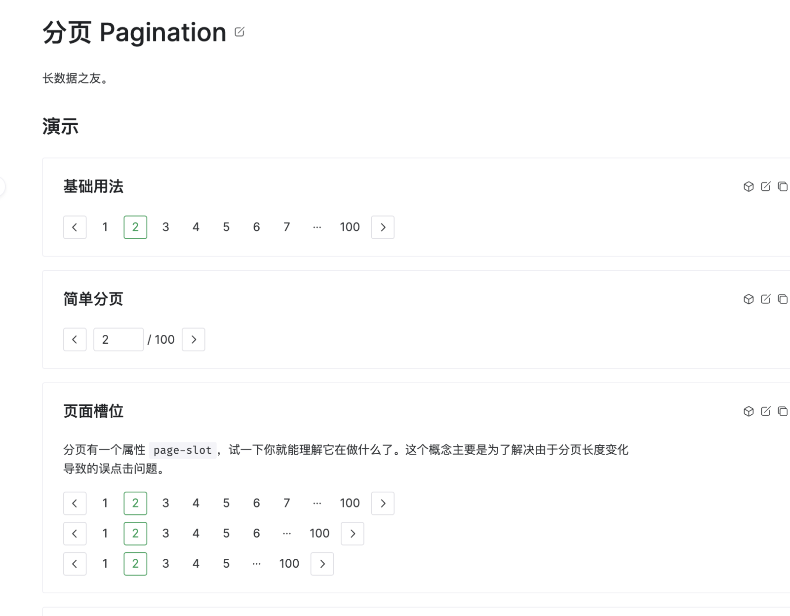

整理自前段时间做的一个技术分享。还是承接两个月前我写的打包体积优化的文章，最后留了一个小坑：

> ESM 时期这类项目应该是有机会有后续进展的，因为对 ESM 模块而言，静态的导入导出声明使得可以更简单的获取到模块的精确调用模型。值得期待。

其实这里说的不太准确，ESM 的好处主要是限制了顶层变量的作用域，再配合模块导入导出声明才能达到追踪变量使用的效果。总之后面自己尝试填了一点这方面的坑，给 Rollup 提的 [PR](https://github.com/rollup/rollup/pull/5443) 也是在干这件事，这个链接里有 Rollup 的 maintainer（[@lukastaegert](https://github.com/lukastaegert)）整理的这个 PR 的作用和合并过程（其实还挺折磨的，因为一开始没太看懂 Rollup 的算法思想）。

所以本篇文章补一下这个 PR 实现背后的部分理论基础，主要是部分求值，和在 JavaScript 打包体积优化的应用。关于 Tree-Shaking 算法细节，和算法中比较重要的，变量的状态的格（代数结构里的格）表示，可能会另开一篇（写在毕设里了，不过未必会整理到博客上），也可能咕咕咕（

<!-- more -->

> POPL '86 [“Compilers and staging transformations”](https://dl.acm.org/doi/abs/10.1145/512644.512652):
>
> 计算通常可以分为多个阶段，这些阶段通过执行频率或数据可用性来区分。预计算 和 循环不变代码外提(Frequency Reduction) 涉及在程序的不同阶段完成计算，以便尽早完成计算（因此后续步骤需要更少的时间）并且尽可能不要重复计算（以减少总体时间）。

TL;DR: 编译期和运行时只是程序执行的不同的阶段，编译的过程也是一个**部分执行**程序的过程。熟知 Linux 上编译安装某个程序的常见步骤：

```shell
./configure
make
make install
```

`./configure` 命令用于编译前配置一些选项，例如是否包含某个功能。考虑一段简单的矩阵乘法例子：

```c
#include <stdio.h>

#define ROWS 3
#define COLS 3

void matrix_multiply(int A[ROWS][COLS], int B[COLS][ROWS], int result[ROWS][ROWS]) {
    for (int i = 0; i < ROWS; i++) {
        for (int j = 0; j < ROWS; j++) {
            result[i][j] = 0;
            for (int k = 0; k < COLS; k++) {
                result[i][j] += A[i][k] * B[k][j];
            }
        }
    }
}
```

如果 `./configure` 配置了 `ROWS` 和 `COLS` 为常量，那么 `make` 时编译器就可以进行更针对的优化，例如当 `ROWS` 和 `COLS` 较小时循环展开。在这个例子中，`ROWS` 和 `COLS` 不仅是**配置**，也可以看成程序的**输入**，只是这部分输入在编译期已经确定，或者说被特化。

## 部分求值器

这一部分说明通过程序编译期输入进行程序优化的潜力。

我们把程序的输入分为两部分，一部分是运行时才知道的输入，一部分是编译期就可以知道的输入。

$$\verb|INPUT| = \verb|INPUT|_{compiletime} \cup \verb|INPUT|_{runtime}$$

存在一个部分求值器，接收一个程序和该程序的编译期输入，据此输出另一个优化后的程序。

$$P(\verb|program|, \verb|INPUT|_{compiletime}) = \verb|program_optimized|$$

优化前后程序功能等价。

$$\verb|program|(\verb|INPUT|_{runtime}) = \verb|program_optimized|(\verb|INPUT|_{runtime})$$

假设我们现在有一个语言的解释器 Interpreter 和它要执行的一段脚本 script。解释器本身也是一个程序，它接收脚本 script 和 执行脚本时用户的输入 这两个输入。这两个输入处在不同的阶段，我们把前者看成编译期输入：

$$P(\verb|Interpreter|, \verb|script|) = \verb|program_optimized|$$

当然需要保证对运行时输入表现相同：

$$\verb|Interpreter|(\verb|INPUT|_{runtime}) = \verb|program_optimized|(\verb|INPUT|_{runtime})$$

等式左边是用解释器执行这段脚本，接收执行脚本时用户输入。它等价于等式右边的另一个优化后的程序接收执行脚本时用户的输入。相当于我们得到了一个脚本编译后的程序。也就是 **只需要实现一个语言的解释器，它的编译器自然存在**。然而通用的效果良好的部分求值器难以实现，因此还没有实用的“给定一个语言的解释器，得到一个该语言的**高效**的编译器”的方法。但换言之，只要我们将尽可能多的计算提前到编译期，就能提高运行时的性能。如现在模版引擎常常将模版解析部分放在编译期。

这里未必需要严格的「编译期」，「运行时」的概念，只要能将 **计算的阶段（Staging）** 提前即可。例如 SSG (Static Site Generation) 和 SSR (Server Side Render) 都是提前渲染了页面，但是 SSG 是在「编译期」，SSR 是服务器实时完成。

### 实际应用

什么东东能接收一个程序和（一段时间）输入数据，输出一个更高效的程序？

- JIT 编译器
- PGO

PGO 听上去不是很部分求值，但其实挺 staging 的。

## Tree-Shaking 算法

第三方库，如 jQuery，lodash，vue-router 等，可以完全被放到运行时加载（比如以 CDN 形式提供）。然而，随着 ES6 模块机制的提出和打包工具的 Tree-Shaking 优化算法的发展，现在一般会有一个打包的步骤以减小体积。打包也是一种形式的编译，Tree-Shaking 就是在编译期特化（只保留使用到的函数/类/对象）代码，伪代码：

```javascript
const included = new Set();
let needTreeShakingPass = true;
// 迭代直到算法收敛
// 算法收敛意味着一轮迭代中，所有结点的状态都不变，且没有新的结点被包含
While (changed) {
    needTreeShakingPass = false;
    markTopLevelSideEffectNodesIncluded(graph, included);
    for (const node of included) {
        // 更新结点状态。例如 if (a) {} 中，如果 a 在上一轮迭代中被标记为有修改，那就要置这里的条件值为 UNKNOWN
        const isNodeStateUpdated = UpdateNodeState(node);
        // 结点状态更新可能会带来新的结点被包含。
        // 若 if (a) {} 中 a 的值从 false 变为 UNKNOWN，就要新包含 块语句 结点
        const isNewNodeIncluded = MarkNodeUsedByCurrentNodeIncluded(node, included);
        if (isNodeStateUpdated || isNewNodeIncluded) {
            needTreeShakingPass = true;
        }
    }
}
```

Tree-Shaking 实现还有一些细节，例如每个表达式的值都会在判断副作用阶段就被首先尽可能的求出；表达式的值只有已知到未知的变化路径，最多变化一次，以保证算法收敛等，这里不再展开。

## 特化第三方库函数

然而，Tree-Shaking 算法只能精确到是否包含**某个函数/类/对象**，无法做到对内部属性的精确分析。一部分原因也是因为 JavaScript 中这些都是一等对象（first-class objects），由于 JavaScript 的动态特性很难追踪它们的所有使用。所以 UglifyJS 等工具一般也没办法对类的方法重命名，或者去除对象的某个没有被使用到的属性。但有的时候在包含某个函数/类/对象的粒度并不足够我们使用。例如，Vue 很多第三方组件库都提供了丰富的配置选项，但一个 Vue 组件是整体作为一个对象，因此我们打包时只能选择包含或不包含某个组件，无法部分包含：



上图是 Naive UI 的[分页组件](https://www.naiveui.com/zh-CN/os-theme/components/pagination)，即使我们只需要使用「简单分页」这一功能，也不得不去包含一大堆无用的渲染代码。如果某个第三方函数/类/对象的体积成为了打包产物体积的瓶颈，有以下几种可能的解决方法

### 拆分单独的函数/功能对象

暴露不同的函数好理解（直接不同功能提供不同函数），也可以选择暴露不同的对象以方便组合 e.g.

```javascript
export PluginA;
export PluginB;

export SomeLibraryFunction() {
  // ...
  const self = {
    // 实际执行
    run() {
      // ...
    }
    installPlugin(plugin) {
      // ...
      return self;
    }
  };
  return self;
}

// 用户调用
SomeLibraryFunction().installPlugin(PluginA).run();
```

此时 PluginB 因为没有被使用，自然不会被包含。

### 打包工具静态分析

除了本文一开始提到的 PR，Rollup 当前还有另一个 [PR](https://github.com/rollup/rollup/pull/5420) 在推进，是关于消除对象的未使用属性的（2018 年被[提出](https://github.com/rollup/rollup/issues/2201)，一直未得到解决）。

### Babel 插件

对 Vue 组件而言，暂时没有一个通用的静态分析工具自动替换所有已知调用参数（需要处理默认参数等问题）。然而，对于体积瓶颈的组件选项我们可以简单使用 babel 转译，来帮助打包时消除无用分支（其实也可以自己维护一份删除了不需要分支的组件，但这样可能不利于后续功能需求变更）。最后可以达到的效果是作为 Rollup/其他打包工具的插件提供，可以在配置文件中手动指定已知属性的值：

```typescript
// 让插件把组件 setup 函数内的 props.disabled 和 render 函数内的 this.disabled 等都替换成 false
// 则对应逻辑分支会被消除
PartialEvaluator({
  components: {
    Tag: {
      disabled: false,
      checkable: false,
      closable: false,
    },
  },
})
```

比如若引入了一个第三方 Tag 组件，只需要样式而不需要使用它提供的「关闭 Tag」，「选择 Tag」，「禁用 Tag」等功能，就如上配置。
