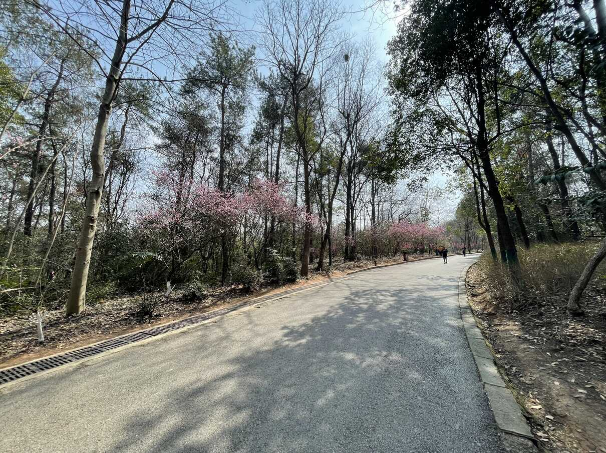

大学前我一向是有些讨厌写游记的，现在想来那时写的游记往往都是「作业性质」，被迫应付每周的作文任务。往往这类游记还得编出一个中心思想，例如工业游需要编一个「以后好好学习报效祖国」，文化游要编一个「从古人身上，我领悟到了什么精神」，诸如此类。那时的旅游常常也不是完全出于自己的意愿：虽然不能说是被迫的，但总归还是被家长，学校安排的，我个人还是比较喜欢宅在家（~~从小就开始宅了~~）。

上了大学后，自己的自由时间一下子多了起来。正值早春时节，加上基本考完了延期到本学期初的期末考试（虽然还有一门，但是在两天之后），于是临时给自己拟定了一个「爬大蜀山」的计划，并以这篇「不需要中心思想的游记」简单记录我的忙里偷闲。

<!-- more -->

## 准备

去大蜀山是在 3 月 2 日晚临时拟定的。此时匿名群里已经有很多同学都考完了期末考试，而正值新冠疫情后放开的第一个春天，能看到很多人分享自己去外地的旅行。我也有点按捺不住心中的思绪，临时起意一个人去爬山。

*图：《向山进发》，好看捏*

大蜀山离科大很近，于是也不需要做什么特殊的准备。3 月 3 日早起考算法之前去罗森买了个饭团，就当是中午在山上吃的便当了。

## 向山进发

3 月 3 日 10:30 考完算法，和同学简单对了对答案后就踏上了旅途。步行上路，就当是远足了。

*图：谷歌导航给出的预估步行时间*

天气比较好，在金大地 1912 街区就可以远远望见大蜀山了。之前只在晚上来过这里，倒是没有发现。

*图：路过公交站台的广告，联想到 CS 的就业形势，令人感叹*

大蜀山脚下有一片小湖。作为合肥人，之前也来过几次大蜀山了，但都是直接乘车前往大蜀山森林公园景区入口，每每错过了这一景色。

*图：大蜀山脚下的小湖，波光粼粼*

之后就到了大蜀山烈士陵园。去大蜀山入口的分岔路并没有路牌指引。不过跟着感觉走就可以了。中间路过一个林业学校，不知道里面的学生会不会天天爬大蜀山。

## 登山

正是梅花盛开的时节。环山公路两旁的梅花很是惹眼。

这次上山过程我试着走了一些小路。小心翼翼地寻找下一个石子做为落脚点，并注意踩着松软的泥土会打滑。说起来我之前是有些恐高的，但不知是不是因为在学校体育课上体验了两次攀岩，现在好像没这么害怕了（~~已经没什么好怕的了~~）。

行至半程时吃了午饭（~~虽然我还是一个人~~）。

.JPG)

在山上吃饭果然会有种别样的氛围。

登山步道是通往山顶最快的道路。

.JPG)

爬山过程中要注意体力的分配捏，匀速前进。

山顶的景色倒有点平平无奇了，只是拍了张回望黄山路的照片。

中间的道路就是黄山路，已经看不见中科大力。图片可能看不太出来，这里海拔已经接近山顶了。

之后就是愉悦的下山过程，一边下山一边外放《向山进发》的各季 op/ed，兴尽而归。下山后又顺便去合肥唯一一家 cinity 影厅看了《流浪地球 2》，后吃完晚饭，再回宿舍，不表。
